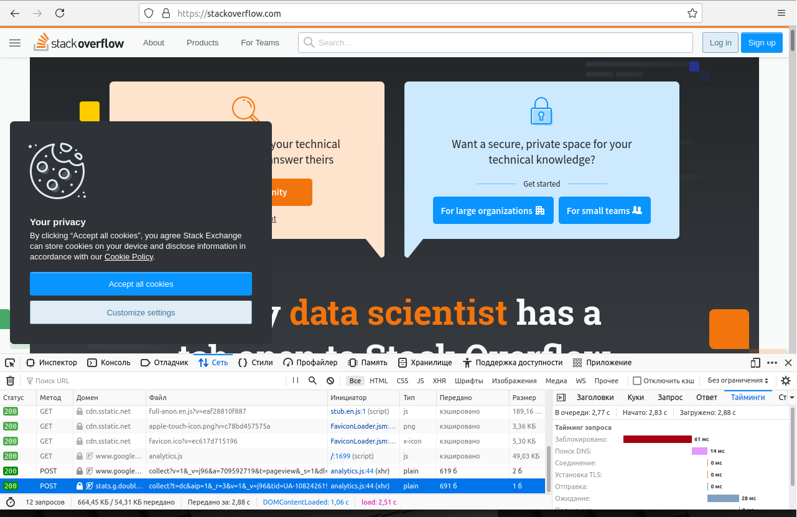

### Домашнее задание к занятию "3.6. Компьютерные сети, лекция 1"

#### 1. Работа c HTTP через телнет.
- Подключитесь утилитой телнет к сайту stackoverflow.com telnet stackoverflow.com 80
- отправьте HTTP запрос
```shell
GET /questions HTTP/1.0
HOST: stackoverflow.com
[press enter]
[press enter]
```
- В ответе укажите полученный HTTP код, что он означает?  

```shell
$ telnet stackoverflow.com 80
Trying 151.101.129.69...
Connected to stackoverflow.com.
Escape character is '^]'.
GET /questions HTTP/1.0
HOST: stackoverflow.com

HTTP/1.1 301 Moved Permanently
cache-control: no-cache, no-store, must-revalidate
location: https://stackoverflow.com/questions
x-request-guid: 6b722bf1-5548-4c23-8783-e7dd3eac8a43
feature-policy: microphone 'none'; speaker 'none'
content-security-policy: upgrade-insecure-requests; frame-ancestors 'self' https://stackexchange.com
Accept-Ranges: bytes
Date: Fri, 26 Nov 2021 15:19:58 GMT
Via: 1.1 varnish
Connection: close
X-Served-By: cache-fra19171-FRA
X-Cache: MISS
X-Cache-Hits: 0
X-Timer: S1637939998.255844,VS0,VE92
Vary: Fastly-SSL
X-DNS-Prefetch-Control: off
Set-Cookie: prov=3b058312-43f7-622e-8757-90187bed30db; domain=.stackoverflow.com; expires=Fri, 01-Jan-2055 00:00:00 GMT; path=/; HttpOnly

Connection closed by foreign host.
```
Код 301 - редирект с HTTP на HTTPS протокол того же url

#### 2. Повторите задание 1 в браузере, используя консоль разработчика F12.
- откройте вкладку Network
- отправьте запрос http://stackoverflow.com
- найдите первый ответ HTTP сервера, откройте вкладку Headers
- укажите в ответе полученный HTTP код.
```
accept-ranges	bytes
cache-control	 private
content-encoding	gzip
content-security-policy	upgrade-insecure-requests; frame-ancestors 'self' https://stackexchange.com
content-type	text/html; charset=utf-8
date	Tue, 30 Nov 2021 09:43:26 GMT
feature-policy	microphone 'none'; speaker 'none'
strict-transport-security	max-age=15552000
vary	Accept-Encoding,Fastly-SSL
via	1.1 varnish
x-cache	MISS
x-cache-hits	0
x-dns-prefetch-control	off
X-Firefox-Spdy	h2
x-frame-options	SAMEORIGIN
x-request-guid	9aab9af6-7a86-481a-b332-08aa5910f2ca
x-served-by 	cache-bma1632-BMA
x-timer	S1638265406.108613,VS0,VE105

```
- проверьте время загрузки страницы, какой запрос обрабатывался дольше всего?
```
Последний запрос обрабатывался дольше всех (61+14+28 мс)
```
- приложите скриншот консоли браузера в ответ.  




#### 3. Какой IP адрес у вас в интернете?

```shell
$ wget -qO- ipinfo.io/ip
195.46.167.xxx
```

#### 4. Какому провайдеру принадлежит ваш IP адрес? Какой автономной системе AS? Воспользуйтесь утилитой whois

```shell
$ whois 195.46.167.xxx 
VympelKom broadband internet
AS3216

```

#### 5. Через какие сети проходит пакет, отправленный с вашего компьютера на адрес 8.8.8.8? Через какие AS? Воспользуйтесь утилитой traceroute

```shell
$ traceroute -An -I 8.8.8.8
traceroute to 8.8.8.8 (8.8.8.8), 30 hops max, 60 byte packets
 1  192.168.233.2 [*]  0.215 ms  0.120 ms  0.077 ms
 2  192.9.200.146 [AS19905]  2.686 ms  2.647 ms  2.595 ms
 3  195.46.167.185 [AS3216]  2.554 ms  2.491 ms  2.453 ms
 4  87.229.204.6 [AS3216]  3.835 ms  3.856 ms  4.037 ms
 5  79.104.235.207 [AS3216]  11.365 ms  11.899 ms  11.927 ms
 6  195.68.176.50 [AS3216]  12.863 ms  11.410 ms  11.372 ms
 7  108.170.250.129 [AS15169]  11.658 ms  11.538 ms  11.718 ms
 8  108.170.250.146 [AS15169]  11.384 ms * *
 9  * * *
10  216.239.57.222 [AS15169]  26.569 ms  27.127 ms  27.080 ms
11  209.85.254.135 [AS15169]  31.659 ms  32.379 ms  29.918 ms
12  * * *
13  * * *
14  * * *
15  * * *
16  * * *
17  * * *
18  * * *
19  * * *
20  * * *
21  8.8.8.8 [AS15169]  25.645 ms * *
 
```

#### 6. Повторите задание 5 в утилите mtr. На каком участке наибольшая задержка - delay?

```shell
$ mtr 8.8.8.8 -znrc 1
Start: 2021-11-30T13:22:52+0000
HOST: vagrant                     Loss%   Snt   Last   Avg  Best  Wrst StDev
  1. AS???    192.168.233.2        0.0%     12    0.3   0.4   0.2   0.5    0.1
  2. AS23520  192.9.200.146        0.0%     12    1.0   2.0   1.0   10.7   2.8
  3. AS3216   195.46.167.185       0.0%     12    1.5   2.4   1.3   11.4   2.8
  4. AS3216   87.299.204.6         0.0%     12    2.0   3.5   2.0   12.8   3.4
  5. AS???    79.104.235.207        0.0%     12   10.8   13.0  10.5  25.0   5.2
  6. AS3216   195.68.176.50        0.0%     12   11.1   13.6  11.1  31.7   6.0
  7. AS15169  108.170.250.129      0.0%     12   11.5   13.4  11.5  27.0   4.4
  8. AS15169  108.170.250.146      0.0%     12   11.9   21.1  11.1  73.6   17.8
  9. AS15169  209.85.249.158      36.4%    11   24.8   24.9  24.6  25.6   0.3
 10. AS15169  216.239.57.222       0.0%     11   25.1   27.5  25.0  42.7   5.2
 11. AS15169  209.85.254.135       0.0%     11   30.8   32.0  29.9  46.2   4.7
```
Наибольшая задержка на 11 хоте

#### 7. Какие DNS сервера отвечают за доменное имя dns.google? Какие A записи? воспользуйтесь утилитой dig

```shell
$ dig +short NS dns.google
ns4.zdns.google.
ns2.zdns.google.
ns1.zdns.google.
ns3.zdns.google.
```
NS записи

```shell
$ dig +short A dns.google
8.8.4.4
8.8.8.8
```
A записи

#### 8. Проверьте PTR записи для IP адресов из задания 7. Какое доменное имя привязано к IP? воспользуйтесь утилитой dig

```shell
$ for ip in `dig +short A dns.google`; do dig -x $ip | grep ^[0-9].*in-addr; done
8.8.8.8.in-addr.arpa.	18561	IN	PTR	dns.google.
4.4.8.8.in-addr.arpa.	21274	IN	PTR	dns.google.
```
dns.google
