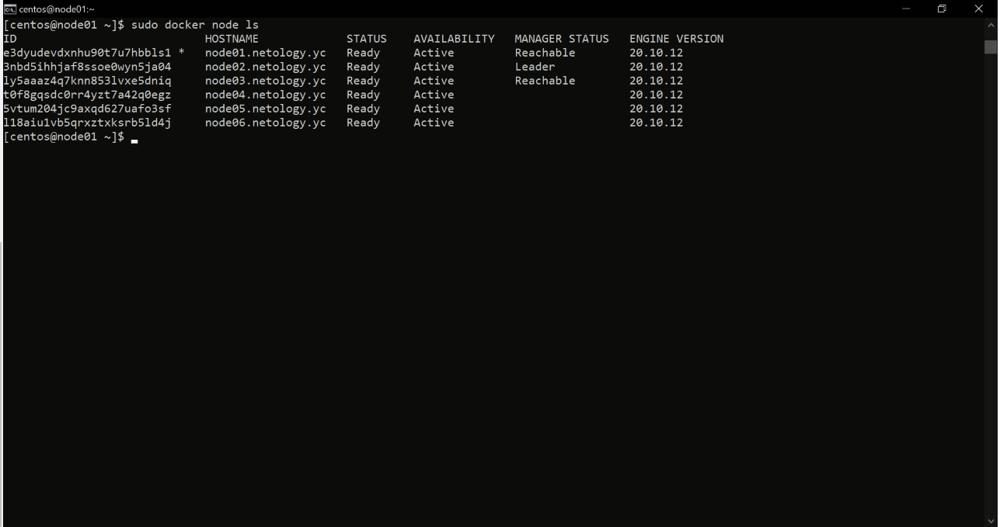
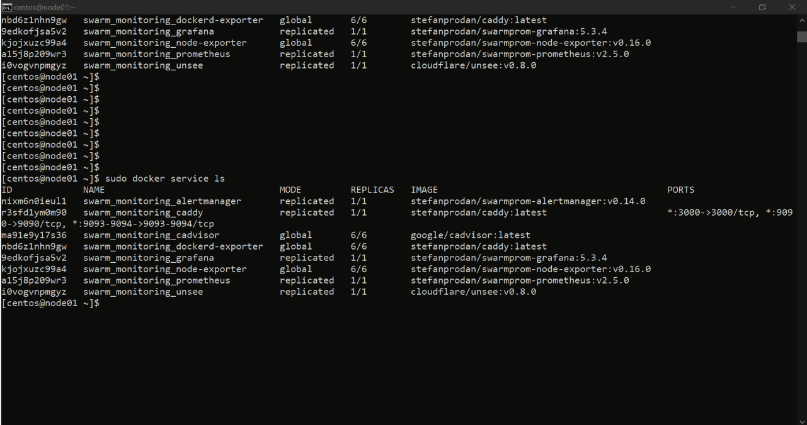

# Домашнее задание к занятию "5.5. Оркестрация кластером Docker контейнеров на примере Docker Swarm"

## Как сдавать задания

Обязательными к выполнению являются задачи без указания звездочки. Их выполнение необходимо для получения зачета и диплома о профессиональной переподготовке.

Задачи со звездочкой (*) являются дополнительными задачами и/или задачами повышенной сложности. Они не являются обязательными к выполнению, но помогут вам глубже понять тему.

Домашнее задание выполните в файле readme.md в github репозитории. В личном кабинете отправьте на проверку ссылку на .md-файл в вашем репозитории.

Любые вопросы по решению задач задавайте в чате учебной группы.

---

## Задача 1

Дайте письменые ответы на следующие вопросы:

- В чём отличие режимов работы сервисов в Docker Swarm кластере: replication и global?
```
Режим работы replication предполагает запуск сервиса с несколькими идентичными задачами
Режим работы global запускает сервис с одной задачей на каждой ноде. Хорошими кандидатами на роль глобальных сервисов являются агенты мониторинга, антивирусные сканеры и тд
```

- Какой алгоритм выбора лидера используется в Docker Swarm кластере?
```
Используется алгоритм поддержания распределенного консенсуса — Raft.
Нода может иметь одно из 3 состояний:
Follower,
Candidate,
Leader.
По умолчанию все ноды имеют статус follower.
Если follower не получают известий от лидера они становятся кандидатами
Кандидаты запрашивают голоса у других узлов.
Узлы отвечают своими голосами
Кандидаты становятся лидерами если получат большинство голосов узлов


```

- Что такое Overlay Network?
```
Cеть которую могут использовать докер контейнеры на разных физических хостах, при условии что все физичиеские хосты принадлежат одной сети
Overlay-сеть использует технологию vxlan, которая инкапсулирует layer 2 фреймы в layer 4 пакеты (UDP/IP). 
При помощи этого действия Docker создает виртуальные сети поверх существующих связей между хостами, которые могут оказаться внутри одной подсети.
Любые точки, которые являются частью этой виртуальной сети, выглядят друг для друга так, будто они связаны поверх свича и не заботятся об устройстве основной физической сети.
```


## Задача 2

Создать ваш первый Docker Swarm кластер в Яндекс.Облаке

Для получения зачета, вам необходимо предоставить скриншот из терминала (консоли), с выводом команды:
```
docker node ls
```


## Задача 3

Создать ваш первый, готовый к боевой эксплуатации кластер мониторинга, состоящий из стека микросервисов.

Для получения зачета, вам необходимо предоставить скриншот из терминала (консоли), с выводом команды:
```
docker service ls
```



## Задача 4 (*)

Выполнить на лидере Docker Swarm кластера команду (указанную ниже) и дать письменное описание её функционала, что она делает и зачем она нужна:
```
# см.документацию: https://docs.docker.com/engine/swarm/swarm_manager_locking/
docker swarm update --autolock=true
```

```
[root@node01 centos]# docker swarm update --autolock=true
Swarm updated.
To unlock a swarm manager after it restarts, run the `docker swarm unlock`
command and provide the following key:

    SWMKEY-1-jdmAd4iA1uKKia5ktlKKFaWVNDwVheLJJwNfjJ/zUzs

Please remember to store this key in a password manager, since without it you

[root@node01 centos]# docker node ls
ID                            HOSTNAME             STATUS    AVAILABILITY   MANAGER STATUS   ENGINE VERSION
r2pqi1q9r8xbg774tms3gqyhe *   node01.netology.yc   Ready     Active         Leader           20.10.12
0056t0fo61opr0siha0uw7joj     node02.netology.yc   Ready     Active         Reachable        20.10.12
rugyg5xudawixp39wr9eovo70     node03.netology.yc   Ready     Active         Reachable        20.10.12
m1p9yv15oqyxcnpwleq6olbm2     node04.netology.yc   Ready     Active                          20.10.12
xbiuc96wde3to09qcs6f35t29     node05.netology.yc   Ready     Active                          20.10.12
2fda8qmc05zhftr32aouqx3wq     node06.netology.yc   Ready     Active                          20.10.12

[root@node01 centos]# docker node promote node06.netology.yc
Node node06.netology.yc promoted to a manager in the swarm.

при перезапуске ноды мы получаем отказ в получении информации. 

[root@node01 centos]# docker node ls
Error response from daemon: Swarm is encrypted and needs to be unlocked before it can be used. Please use "docker swarm unlock" to unlock it.


Для работы необходимо разблокировать командой `docker swarm unlock` и ввести token
```
