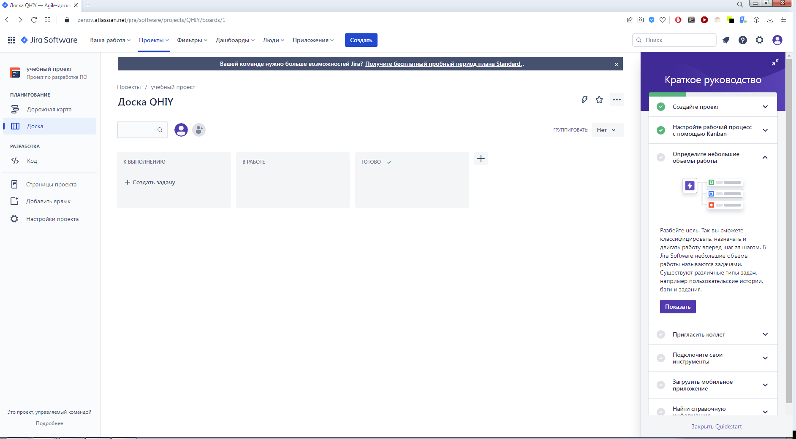
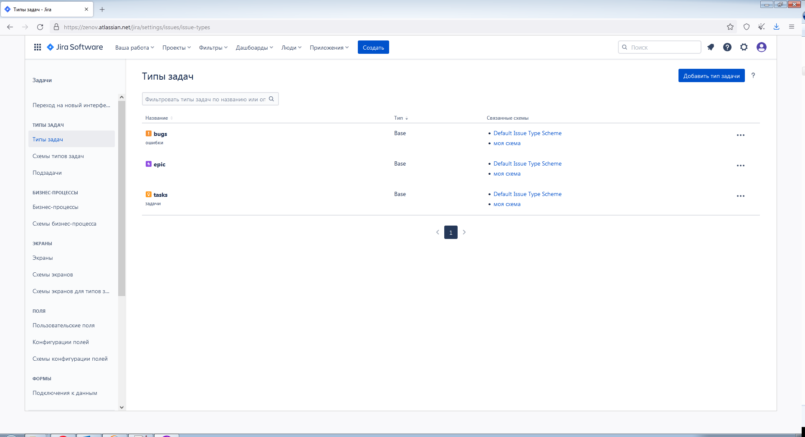
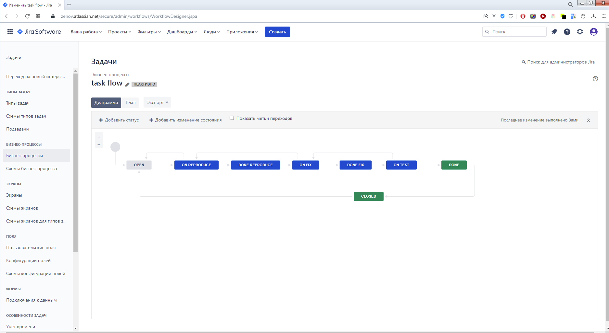
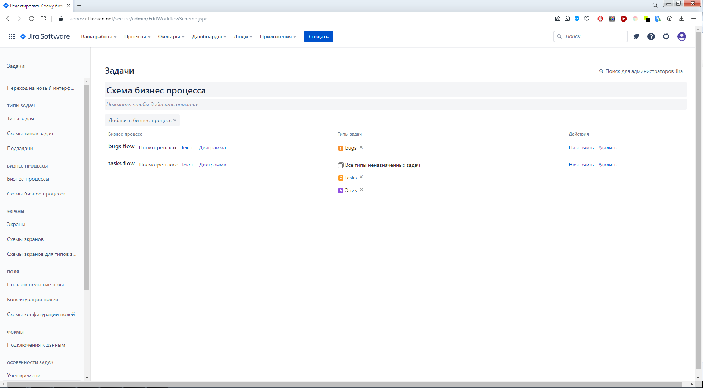

# Домашнее задание к занятию "09.01 Жизненный цикл ПО"

## Подготовка к выполнению
1. Получить бесплатную [JIRA](https://www.atlassian.com/ru/software/jira/free)
2. Настроить её для своей "команды разработки"
3. Создать доски kanban и scrum

## Основная часть
В рамках основной части необходимо создать собственные workflow для двух типов задач: bug и остальные типы задач. Задачи типа bug должны проходить следующий жизненный цикл:
1. Open -> On reproduce
2. On reproduce <-> Open, Done reproduce
3. Done reproduce -> On fix
4. On fix <-> On reproduce, Done fix
5. Done fix -> On test
6. On test <-> On fix, Done
7. Done <-> Closed, Open

Остальные задачи должны проходить по упрощённому workflow:
1. Open -> On develop
2. On develop <-> Open, Done develop
3. Done develop -> On test
4. On test <-> On develop, Done
5. Done <-> Closed, Open

Создать задачу с типом bug, попытаться провести его по всему workflow до Done. Создать задачу с типом epic, к ней привязать несколько задач с типом task, провести их по всему workflow до Done. При проведении обеих задач по статусам использовать kanban. Вернуть задачи в статус Open.
Перейти в scrum, запланировать новый спринт, состоящий из задач эпика и одного бага, стартовать спринт, провести задачи до состояния Closed. Закрыть спринт.

Если всё отработало в рамках ожидания - выгрузить схемы workflow для импорта в XML. Файлы с workflow приложить к решению задания.

---

### Как оформить ДЗ?

Выполненное домашнее задание пришлите ссылкой на .md-файл в вашем репозитории.

---

### Ответ

Для выполнения использовал VPN. Порядок выполнения следующий: 

После регистрации Jira предложила создать проект. 

Идем в настройки (шестерёнка в правом углу) -> Задачи. Попадаем на страницу с Типами задач. 

Далее переходим в раздел Бизнес-процессы и создаём процессы:

Экпортируем схемы процессов в xml 

Переходим схемы бизнес-процессов, создаем схему и привяззываем типы задач к соответсующим бизнес-процессам.

Далее возникли ошибки, которые решить не смог =(
При создании нового проекта "По какой-то причине нужный результат не был достигнут. Нажмите «Создать», чтобы попробовать еще раз."
При создании доски - Ошибка. Внутренняя ошибка сервера.
При создании задачи - Что-то пошло не так. Произошла ошибка. Обновите страницу и повторите попытку.

---

