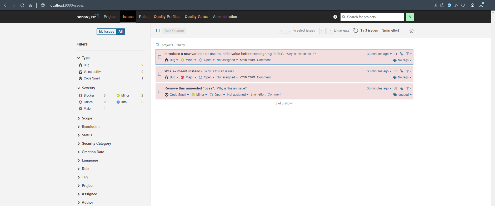
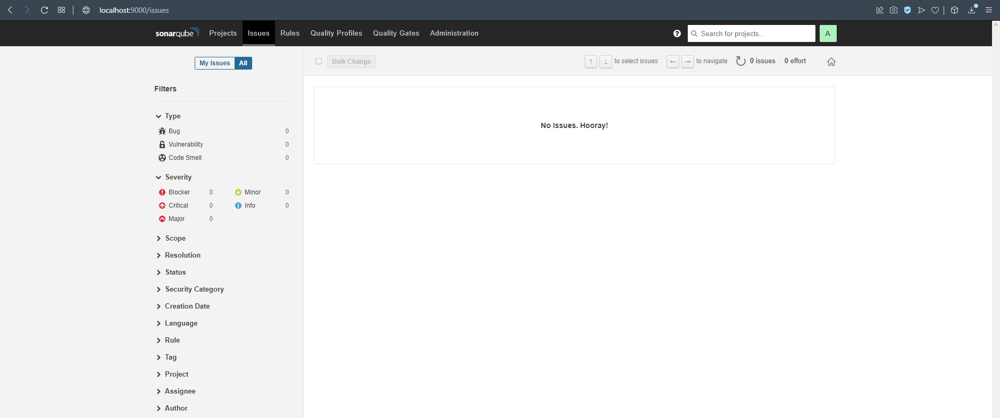
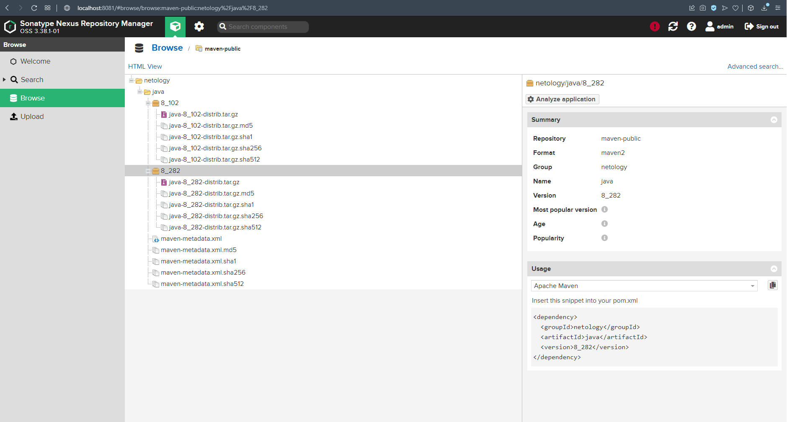

# Домашнее задание к занятию "09.02 CI\CD"

## Знакомоство с SonarQube

### Подготовка к выполнению

1. Выполняем `docker pull sonarqube:8.7-community`
2. Выполняем `docker run -d --name sonarqube -e SONAR_ES_BOOTSTRAP_CHECKS_DISABLE=true -p 9000:9000 sonarqube:8.7-community`
3. Ждём запуск, смотрим логи через `docker logs -f sonarqube`
4. Проверяем готовность сервиса через [браузер](http://localhost:9000)
5. Заходим под admin\admin, меняем пароль на свой

В целом, в [этой статье](https://docs.sonarqube.org/latest/setup/install-server/) описаны все варианты установки, включая и docker, но так как нам он нужен разово, то достаточно того набора действий, который я указал выше.

### Основная часть

1. Создаём новый проект, название произвольное
2. Скачиваем пакет sonar-scanner, который нам предлагает скачать сам sonarqube
3. Делаем так, чтобы binary был доступен через вызов в shell (или меняем переменную PATH или любой другой удобный вам способ)
4. Проверяем `sonar-scanner --version`
``` bash
root@test1:/home/vagrant/9.2/sonar-scanner-4.7.0.2747-linux# sonar-scanner --version
INFO: Scanner configuration file: /home/vagrant/9.2/sonar-scanner-4.7.0.2747-linux/conf/sonar-scanner.properties
INFO: Project root configuration file: NONE
INFO: SonarScanner 4.7.0.2747
INFO: Java 11.0.14.1 Eclipse Adoptium (64-bit)
INFO: Linux 5.4.0-80-generic amd64
```

5. Запускаем анализатор против кода из директории [example](./example) с дополнительным ключом `-Dsonar.coverage.exclusions=fail.py`

``` bash
root@test1:/home/vagrant/9.2# sonar-scanner   -Dsonar.projectKey=pj   -Dsonar.sources=.   -Dsonar.host.url=http://localhost:9000   -Dsonar.login=d82039f380741073ea6e7924a22bb9cb1b792ff5 -Dsonar.coverage.exclusions=fail.py
INFO: Scanner configuration file: /home/vagrant/9.2/sonar-scanner-4.7.0.2747-linux/conf/sonar-scanner.properties
INFO: Project root configuration file: NONE
INFO: SonarScanner 4.7.0.2747
INFO: Java 11.0.14.1 Eclipse Adoptium (64-bit)
INFO: Linux 5.4.0-80-generic amd64
INFO: User cache: /root/.sonar/cache
INFO: Scanner configuration file: /home/vagrant/9.2/sonar-scanner-4.7.0.2747-linux/conf/sonar-scanner.properties
INFO: Project root configuration file: NONE
INFO: Analyzing on SonarQube server 8.7.1
INFO: Default locale: "en_US", source code encoding: "UTF-8" (analysis is platform dependent)
INFO: Load global settings
INFO: Load global settings (done) | time=129ms
INFO: Server id: BF41A1F2-AYB6MIJ9xshhMaBnlDIE
INFO: User cache: /root/.sonar/cache
INFO: Load/download plugins
INFO: Load plugins index
INFO: Load plugins index (done) | time=51ms
INFO: Load/download plugins (done) | time=202ms
INFO: Process project properties
INFO: Process project properties (done) | time=9ms
INFO: Execute project builders
INFO: Execute project builders (done) | time=3ms
INFO: Project key: pj
INFO: Base dir: /home/vagrant/9.2
INFO: Working dir: /home/vagrant/9.2/.scannerwork
INFO: Load project settings for component key: 'pj'
INFO: Load project settings for component key: 'pj' (done) | time=28ms
INFO: Load quality profiles
INFO: Load quality profiles (done) | time=97ms
INFO: Load active rules
INFO: Load active rules (done) | time=2458ms
WARN: SCM provider autodetection failed. Please use "sonar.scm.provider" to define SCM of your project, or disable the SCM Sensor in the project settings.
INFO: Indexing files...
INFO: Project configuration:
INFO:   Excluded sources for coverage: fail.py
INFO: 269 files indexed
INFO: Quality profile for py: Sonar way
INFO: ------------- Run sensors on module pj
INFO: Load metrics repository
INFO: Load metrics repository (done) | time=50ms
INFO: Sensor Python Sensor [python]
INFO: Starting global symbols computation
INFO: 1 source files to be analyzed
INFO: Load project repositories
INFO: Load project repositories (done) | time=26ms
INFO: Starting rules execution
INFO: 1 source files to be analyzed
INFO: 1/1 source files have been analyzed
INFO: 1/1 source files have been analyzed
INFO: Sensor Python Sensor [python] (done) | time=8697ms
INFO: Sensor Cobertura Sensor for Python coverage [python]
INFO: Sensor Cobertura Sensor for Python coverage [python] (done) | time=20ms
INFO: Sensor PythonXUnitSensor [python]
INFO: Sensor PythonXUnitSensor [python] (done) | time=4ms
INFO: Sensor CSS Rules [cssfamily]
INFO: No CSS, PHP, HTML or VueJS files are found in the project. CSS analysis is skipped.
INFO: Sensor CSS Rules [cssfamily] (done) | time=3ms
INFO: Sensor JaCoCo XML Report Importer [jacoco]
INFO: 'sonar.coverage.jacoco.xmlReportPaths' is not defined. Using default locations: target/site/jacoco/jacoco.xml,target/site/jacoco-it/jacoco.xml,build/reports/jacoco/test/jacocoTestReport.xml
INFO: No report imported, no coverage information will be imported by JaCoCo XML Report Importer
INFO: Sensor JaCoCo XML Report Importer [jacoco] (done) | time=6ms
INFO: Sensor C# Properties [csharp]
INFO: Sensor C# Properties [csharp] (done) | time=1ms
INFO: Sensor JavaXmlSensor [java]
INFO: Sensor JavaXmlSensor [java] (done) | time=18ms
INFO: Sensor HTML [web]
INFO: Sensor HTML [web] (done) | time=7ms
INFO: Sensor VB.NET Properties [vbnet]
INFO: Sensor VB.NET Properties [vbnet] (done) | time=2ms
INFO: ------------- Run sensors on project
INFO: Sensor Zero Coverage Sensor
INFO: Sensor Zero Coverage Sensor (done) | time=6ms
INFO: SCM Publisher No SCM system was detected. You can use the 'sonar.scm.provider' property to explicitly specify it.
INFO: CPD Executor Calculating CPD for 1 file
INFO: CPD Executor CPD calculation finished (done) | time=16ms
INFO: Analysis report generated in 136ms, dir size=91 KB
INFO: Analysis report compressed in 21ms, zip size=12 KB
INFO: Analysis report uploaded in 85ms
INFO: ANALYSIS SUCCESSFUL, you can browse http://localhost:9000/dashboard?id=pj
INFO: Note that you will be able to access the updated dashboard once the server has processed the submitted analysis report
INFO: More about the report processing at http://localhost:9000/api/ce/task?id=AYB6ULQsxshhMaBnlIHR
INFO: Analysis total time: 13.919 s
INFO: ------------------------------------------------------------------------
INFO: EXECUTION SUCCESS
INFO: ------------------------------------------------------------------------
INFO: Total time: 15.424s
INFO: Final Memory: 7M/27M
INFO: ------------------------------------------------------------------------
root@test1:/home/vagrant/9.2#
```
6. Смотрим результат в интерфейсе

7. Исправляем ошибки, которые он выявил(включая warnings)
``` bash 
root@test1:/home/vagrant/9.2# cat fail.py
def increment(index=0):
    index += 1
    return index
def get_square(numb):
    return numb*numb
def print_numb(numb):
    print("Number is {}".format(numb))

index = 0
while (index < 10):
    index = increment(index)
    print(get_square(index))
```
8. Запускаем анализатор повторно - проверяем, что QG пройдены успешно

9. Делаем скриншот успешного прохождения анализа, прикладываем к решению ДЗ


## Знакомство с Nexus

### Подготовка к выполнению

1. Выполняем `docker pull sonatype/nexus3`
2. Выполняем `docker run -d -p 8081:8081 --name nexus sonatype/nexus3`
3. Ждём запуск, смотрим логи через `docker logs -f nexus`
4. Проверяем готовность сервиса через [бразуер](http://localhost:8081)
5. Узнаём пароль от admin через `docker exec -it nexus /bin/bash`
6. Подключаемся под админом, меняем пароль, сохраняем анонимный доступ


``` bash
#пароль хранится тут
cat /nexus-data/admin.password
c8a23fe2-a9ac-49df-9fed-7afd78303e3b

```


### Основная часть

1. В репозиторий `maven-public` загружаем артефакт с GAV параметрами:
   1. groupId: netology
   2. artifactId: java
   3. version: 8_282
   4. classifier: distrib
   5. type: tar.gz
2. В него же загружаем такой же артефакт, но с version: 8_102
3. Проверяем, что все файлы загрузились успешно

4. В ответе присылаем файл `maven-metadata.xml` для этого артефекта

[maven-metadata.xml](maven-metadata.xml)

### Знакомство с Maven

### Подготовка к выполнению

1. Скачиваем дистрибутив с [maven](https://maven.apache.org/download.cgi)
2. Разархивируем, делаем так, чтобы binary был доступен через вызов в shell (или меняем переменную PATH или любой другой удобный вам способ)
3. Проверяем `mvn --version`
``` bash
root@test1:/home/vagrant/9.2/apache-maven-3.8.5# mvn -v
Apache Maven 3.8.5 (3599d3414f046de2324203b78ddcf9b5e4388aa0)
Maven home: /home/vagrant/9.2/apache-maven-3.8.5
Java version: 11.0.15, vendor: Private Build, runtime: /usr/lib/jvm/java-11-openjdk-amd64
Default locale: en_US, platform encoding: UTF-8
OS name: "linux", version: "5.4.0-80-generic", arch: "amd64", family: "unix"
```

4. Забираем директорию [mvn](./mvn) с pom

### Основная часть

1. Меняем в `pom.xml` блок с зависимостями под наш артефакт из первого пункта задания для Nexus (java с версией 8_282)
2. Запускаем команду `mvn package` в директории с `pom.xml`, ожидаем успешного окончания

```

[INFO] Building jar: /home/vagrant/9.2/target/simple-app-1.0-SNAPSHOT.jar
[INFO] ------------------------------------------------------------------------
[INFO] BUILD SUCCESS
[INFO] ------------------------------------------------------------------------
[INFO] Total time:  33.734 s
[INFO] Finished at: 2022-05-01T13:33:00+03:00
[INFO] ------------------------------------------------------------------------
```
3. Проверяем директорию `~/.m2/repository/`, находим наш артефакт
``` bash
root@test1:/home/vagrant/9.2# cd ~/.m2/repository/
root@test1:~/.m2/repository# ll
total 48
drwxr-xr-x 12 root root 4096 May  1 13:32 ./
drwxr-xr-x  3 root root 4096 May  1 13:32 ../
drwxr-xr-x  3 root root 4096 May  1 13:32 backport-util-concurrent/
drwxr-xr-x  3 root root 4096 May  1 13:32 classworlds/
drwxr-xr-x  3 root root 4096 May  1 13:32 com/
drwxr-xr-x  3 root root 4096 May  1 13:32 commons-cli/
drwxr-xr-x  3 root root 4096 May  1 13:32 commons-lang/
drwxr-xr-x  3 root root 4096 May  1 13:32 commons-logging/
drwxr-xr-x  3 root root 4096 May  1 13:32 junit/
drwxr-xr-x  3 root root 4096 May  1 13:32 log4j/
drwxr-xr-x  3 root root 4096 May  1 13:32 netology/
drwxr-xr-x  6 root root 4096 May  1 13:32 org/
root@test1:~/.m2/repository#

root@test1:~/.m2/repository# tree netology/
netology/
└── java
    └── 8_282
        ├── java-8_282-distrib.tar.gz
        ├── java-8_282-distrib.tar.gz.sha1
        ├── java-8_282.pom.lastUpdated
        └── _remote.repositories

2 directories, 4 files
```

4. В ответе присылаем исправленный файл `pom.xml`

[pom.xml](pom.xml)
