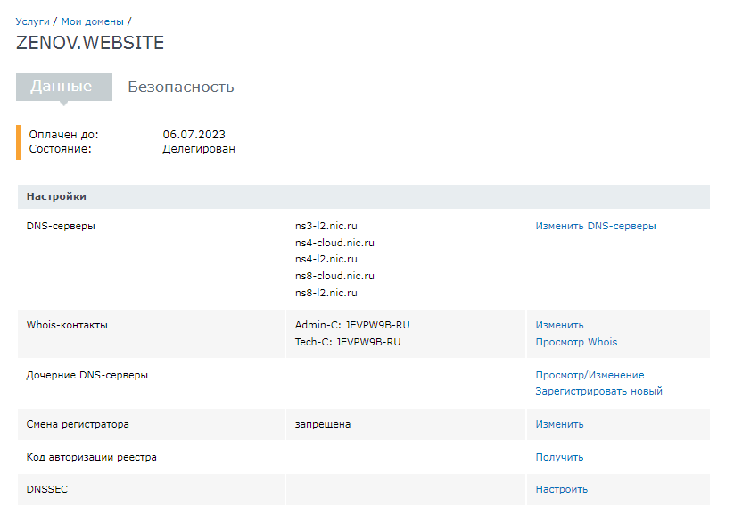

# Дипломный практикум в YandexCloud

Проверка версий ПО
```
andrew@andrew-virtual-machine:~$ terraform --version
Terraform v1.2.2
on linux_amd64

Your version of Terraform is out of date! The latest version
is 1.2.4. You can update by downloading from https://www.terraform.io/downloads.html
andrew@andrew-virtual-machine:~$ ansible --version
ansible [core 2.12.6]
  config file = /etc/ansible/ansible.cfg
  configured module search path = ['/home/andrew/.ansible/plugins/modules', '/usr/share/ansible/plugins/modules']
  ansible python module location = /usr/lib/python3/dist-packages/ansible
  ansible collection location = /home/andrew/.ansible/collections:/usr/share/ansible/collections
  executable location = /usr/bin/ansible
  python version = 3.8.10 (default, Mar 15 2022, 12:22:08) [GCC 9.4.0]
  jinja version = 2.10.1
  libyaml = True
```

### Регистрация доменного имени

Зарегистрирован домен [zenov.website](https://zenov.website) на регистраторе [nic.ru](https://nic.ru)



Настроено управление DNS на сайте регистратора


### Создание инфраструктуры при помощи terraform

Характеристики серверов:
Main Server:
  - Имя сервера: `zenov.website`
  - Характеристики: 2vCPU, 2 RAM, External address (Public) и Internal address.
MySQL Cluster:
  - Имена серверов: `db01.zenov.website` и `db02.zenov.website`
  - Характеристики: 4vCPU, 4 RAM, Internal address.
Gitlab и Gitlab-runner:
  - Имя сервера: `gitlab.zenov.website` и `runner.zenov.website`
  - Характеристики: 4vCPU, 4 RAM, Internal address.
 WordPress Server: 
  - Имя сервера: `app.zenov.website`
  - Характеристики: 4vCPU, 4 RAM, Internal address.

[Описание инфраструктуры](terraform/README.md)

Сервисный аккаунт был создан [ранее](https://github.com/ZenovAndrew/devops-netology/blob/main/homeworks/7.3/README.md), в качестве backend выбран альтернативный вариант S3 bucket в созданном YC аккаунте
Настроены workspaces: stage и prod
```
andrew@andrew-virtual-machine:~/homeworks/diplom/diplom/terraform$ terraform workspace list
  default
* prod
  stage
```


Созданы VPC с подсетями в разных зонах доступности
Проверяем что можем выполнить  `terraform apply` 

Перед выполнением команды необходимо выполнить экспорт переменных: 
```
export TF_VAR_yc_token=A****************
export AWS_ACCESS_KEY_ID=Y************** 
export AWS_SECRET_ACCESS_KEY=Y**********
```
<details>
<summary> terraform apply </summary>

```
Terraform used the selected providers to generate the following execution plan. Resource actions are indicated with the
following symbols:
  + create

Terraform will perform the following actions:

  # yandex_compute_instance.app will be created
  + resource "yandex_compute_instance" "app" {
      + created_at                = (known after apply)
      + folder_id                 = (known after apply)
      + fqdn                      = (known after apply)
      + hostname                  = "app.zenov.website"
      + id                        = (known after apply)
      + metadata                  = {
          + "user-data" = <<-EOT
                #cloud-config
                users:
                  - name: andrew
                    groups: sudo
                    shell: /bin/bash
                    sudo: ['ALL=(ALL) NOPASSWD:ALL']
                    ssh_authorized_keys:
                      - ssh-rsa AAAAB3NzaC1yc2EAAAADAQABAAABgQDQm69+iEnosXa0TN4aletMHGMHydIJvxYLPrIwdmvse+VvkwJLPuOvSzLMTZoNX3rAcwYtJfYmoS+MJXqeYybWV76W9eB86S1mD0fxz292AwsJXhOiiZKOsP/Pc5KeRQ6AxGtjj+FgJnF1eDTxqjBp/Bj8iEt88ZbPX1AKO64bXrdxLAbF3GUmTnFibepIRqrUZG+ZwKKSQSjXEFhs6xRnKLo1Gb59ynJjAZ8dLfxQ9WGfVojSmSqyOF9I2UYnC9dzQLw5xRePTFDzti+rQQUPkllOzRhAbtmxHcNyxV9reUSNY5TSpMxo288lscIzB013x0IYwPHmWwXuFVcyahCkCMrRaQoaU8ASLRgIrhdfWZcRIqlDbaLsE+hoPOyNZTDhfKSAF0rih2Bwd+I9DCMLHOdweIMUmQapNuMZYP824o3rAZepxJfFnxQw+c4NV8fapnt6PKagHdeV6wjtAq8S2CFi1Ajk8ecf9jGPk1ruLrbadyTS5ZoW6pAZuqr8Dcc= andrew@andrew-virtual-machine
                      - ssh-rsa AAAAB3NzaC1yc2EAAAADAQABAAABgQCj5UzFyvrMCF00SKNFRu6bLlLMNaCapR+H4u4oG53Qrt9o/FSpgyYBDt5gXvT9tysWZLK27YscINJT44Qjhz3FA7mruCCPobSuxkpdTPuWIlJM4DPgZ1o0ybl6TyfMV6DlCKCZwUh4KKNBMkvFJCyP1DlPMYqaFn63WStZQNJd0Mt/SvBBzOK3uKN9PB+Dul07gZkAgKOzvmpNo6UXZNxvNxX8jqefs3D3dw6LIvxRrngPAgSC3wECPI/bTZ/lwbBuVBEKH2HdjnpVQZePJJb4HNrMLekgMouD6c52pVI4rONYKiNfjEeGXq/NKiotKSMywWmmNZmL45IW3fxBZDjThMSAouAjTiaw6raqnl9t+ee8pDkYU9Dz6MrznLPrDTI3h8LksGPLIW3lk8kusZGlIfPqN26ita8Gqvvkg/89e775iuWBGfOykOYJXtCMOWmt5IKkptnGuhgbsoY6rDLVdDmFgZl3ie7PZWrL2VuJIYlP7B7smP1BIfMi+UzSIOU= vagrant@test1
                      - ssh-rsa AAAAB3NzaC1yc2EAAAADAQABAAACAQC+o4rze5au8yVAf9+PbI3vqmoxtmZepCOORDWYdDQI4PTrqo7Hj7SN5htXdp8d/srd2VL0hIrmBKhUs153idBGQ6mzWWPO+OAhc3hy/9dLCM+4VKMTWJg8Dw+OKh6E+FAaI/aM0jKhNfOzJG3a+1Bb4Slrm/pWkz2BCyD3DZcpX57GTF5FebyssmjaPu6RDLUGbU4KmchNkKorbObJ3SrQnC2yktt6jClzSnzT1VtP3d+Lr5SKmaUUwn69WpvmIAz41JRVXvaBZnmSBITGSwyp5dZYdWeIQxCWcUEMOFjiYE2/ELR4hjXDH9CrBseRtvpFrS2G7Z0iqBYKButQsYEdW9BC11VyXhaeN9xFrDYgcJMqEPCmb+WD6DAQWxNJlhPiuJKPlEJkcyb4LjO+gexXBCSbju5Gs6yJwTFtcl1SZgB8ZYK0uxV0Nlk8yPWwuJjMB2P47Lthi+xKdRGDDfUyj5JWupZu6DmcKse9QgU1TbUrcY7lpW/IIQX/87LGBTw0k9Z6gLl40hYZyTVnrpFWW4yF7rQ8Rif3QqMZECeWGkwYMm7bDqQ+e5onZeaDuribBbVn+vdGL5vbiKrDudPYKfEM43x3GZ1kDmHRHLEy2A7d+/EgWhxqmuneonUVj4wBwxpL7zwF8hOuRoYt2InLpVhFuWJ29uyJhf4k5qtTwQ== zenovay@krug2000.ru
            EOT
        }
      + name                      = "app"
      + network_acceleration_type = "standard"
      + platform_id               = "standard-v1"
      + service_account_id        = (known after apply)
      + status                    = (known after apply)
      + zone                      = (known after apply)

      + boot_disk {
          + auto_delete = true
          + device_name = (known after apply)
          + disk_id     = (known after apply)
          + mode        = (known after apply)

          + initialize_params {
              + block_size  = (known after apply)
              + description = (known after apply)
              + image_id    = "fd81u2vhv3mc49l1ccbb"
              + name        = (known after apply)
              + size        = 10
              + snapshot_id = (known after apply)
              + type        = "network-hdd"
            }
        }

      + network_interface {
          + index              = (known after apply)
          + ip_address         = (known after apply)
          + ipv4               = true
          + ipv6               = (known after apply)
          + ipv6_address       = (known after apply)
          + mac_address        = (known after apply)
          + nat                = false
          + nat_ip_address     = (known after apply)
          + nat_ip_version     = (known after apply)
          + security_group_ids = (known after apply)
          + subnet_id          = (known after apply)
        }

      + placement_policy {
          + host_affinity_rules = (known after apply)
          + placement_group_id  = (known after apply)
        }

      + resources {
          + core_fraction = 100
          + cores         = 4
          + memory        = 4
        }

      + scheduling_policy {
          + preemptible = (known after apply)
        }
    }

  # yandex_compute_instance.db01 will be created
  + resource "yandex_compute_instance" "db01" {
      + created_at                = (known after apply)
      + folder_id                 = (known after apply)
      + fqdn                      = (known after apply)
      + hostname                  = "db01.zenov.website"
      + id                        = (known after apply)
      + metadata                  = {
          + "user-data" = <<-EOT
                #cloud-config
                users:
                  - name: andrew
                    groups: sudo
                    shell: /bin/bash
                    sudo: ['ALL=(ALL) NOPASSWD:ALL']
                    ssh_authorized_keys:
                      - ssh-rsa AAAAB3NzaC1yc2EAAAADAQABAAABgQDQm69+iEnosXa0TN4aletMHGMHydIJvxYLPrIwdmvse+VvkwJLPuOvSzLMTZoNX3rAcwYtJfYmoS+MJXqeYybWV76W9eB86S1mD0fxz292AwsJXhOiiZKOsP/Pc5KeRQ6AxGtjj+FgJnF1eDTxqjBp/Bj8iEt88ZbPX1AKO64bXrdxLAbF3GUmTnFibepIRqrUZG+ZwKKSQSjXEFhs6xRnKLo1Gb59ynJjAZ8dLfxQ9WGfVojSmSqyOF9I2UYnC9dzQLw5xRePTFDzti+rQQUPkllOzRhAbtmxHcNyxV9reUSNY5TSpMxo288lscIzB013x0IYwPHmWwXuFVcyahCkCMrRaQoaU8ASLRgIrhdfWZcRIqlDbaLsE+hoPOyNZTDhfKSAF0rih2Bwd+I9DCMLHOdweIMUmQapNuMZYP824o3rAZepxJfFnxQw+c4NV8fapnt6PKagHdeV6wjtAq8S2CFi1Ajk8ecf9jGPk1ruLrbadyTS5ZoW6pAZuqr8Dcc= andrew@andrew-virtual-machine
                      - ssh-rsa AAAAB3NzaC1yc2EAAAADAQABAAABgQCj5UzFyvrMCF00SKNFRu6bLlLMNaCapR+H4u4oG53Qrt9o/FSpgyYBDt5gXvT9tysWZLK27YscINJT44Qjhz3FA7mruCCPobSuxkpdTPuWIlJM4DPgZ1o0ybl6TyfMV6DlCKCZwUh4KKNBMkvFJCyP1DlPMYqaFn63WStZQNJd0Mt/SvBBzOK3uKN9PB+Dul07gZkAgKOzvmpNo6UXZNxvNxX8jqefs3D3dw6LIvxRrngPAgSC3wECPI/bTZ/lwbBuVBEKH2HdjnpVQZePJJb4HNrMLekgMouD6c52pVI4rONYKiNfjEeGXq/NKiotKSMywWmmNZmL45IW3fxBZDjThMSAouAjTiaw6raqnl9t+ee8pDkYU9Dz6MrznLPrDTI3h8LksGPLIW3lk8kusZGlIfPqN26ita8Gqvvkg/89e775iuWBGfOykOYJXtCMOWmt5IKkptnGuhgbsoY6rDLVdDmFgZl3ie7PZWrL2VuJIYlP7B7smP1BIfMi+UzSIOU= vagrant@test1
                      - ssh-rsa AAAAB3NzaC1yc2EAAAADAQABAAACAQC+o4rze5au8yVAf9+PbI3vqmoxtmZepCOORDWYdDQI4PTrqo7Hj7SN5htXdp8d/srd2VL0hIrmBKhUs153idBGQ6mzWWPO+OAhc3hy/9dLCM+4VKMTWJg8Dw+OKh6E+FAaI/aM0jKhNfOzJG3a+1Bb4Slrm/pWkz2BCyD3DZcpX57GTF5FebyssmjaPu6RDLUGbU4KmchNkKorbObJ3SrQnC2yktt6jClzSnzT1VtP3d+Lr5SKmaUUwn69WpvmIAz41JRVXvaBZnmSBITGSwyp5dZYdWeIQxCWcUEMOFjiYE2/ELR4hjXDH9CrBseRtvpFrS2G7Z0iqBYKButQsYEdW9BC11VyXhaeN9xFrDYgcJMqEPCmb+WD6DAQWxNJlhPiuJKPlEJkcyb4LjO+gexXBCSbju5Gs6yJwTFtcl1SZgB8ZYK0uxV0Nlk8yPWwuJjMB2P47Lthi+xKdRGDDfUyj5JWupZu6DmcKse9QgU1TbUrcY7lpW/IIQX/87LGBTw0k9Z6gLl40hYZyTVnrpFWW4yF7rQ8Rif3QqMZECeWGkwYMm7bDqQ+e5onZeaDuribBbVn+vdGL5vbiKrDudPYKfEM43x3GZ1kDmHRHLEy2A7d+/EgWhxqmuneonUVj4wBwxpL7zwF8hOuRoYt2InLpVhFuWJ29uyJhf4k5qtTwQ== zenovay@krug2000.ru
            EOT
        }
      + name                      = "db01"
      + network_acceleration_type = "standard"
      + platform_id               = "standard-v1"
      + service_account_id        = (known after apply)
      + status                    = (known after apply)
      + zone                      = (known after apply)

      + boot_disk {
          + auto_delete = true
          + device_name = (known after apply)
          + disk_id     = (known after apply)
          + mode        = (known after apply)

          + initialize_params {
              + block_size  = (known after apply)
              + description = (known after apply)
              + image_id    = "fd81u2vhv3mc49l1ccbb"
              + name        = (known after apply)
              + size        = 10
              + snapshot_id = (known after apply)
              + type        = "network-hdd"
            }
        }

      + network_interface {
          + index              = (known after apply)
          + ip_address         = (known after apply)
          + ipv4               = true
          + ipv6               = (known after apply)
          + ipv6_address       = (known after apply)
          + mac_address        = (known after apply)
          + nat                = false
          + nat_ip_address     = (known after apply)
          + nat_ip_version     = (known after apply)
          + security_group_ids = (known after apply)
          + subnet_id          = (known after apply)
        }

      + placement_policy {
          + host_affinity_rules = (known after apply)
          + placement_group_id  = (known after apply)
        }

      + resources {
          + core_fraction = 100
          + cores         = 4
          + memory        = 4
        }

      + scheduling_policy {
          + preemptible = (known after apply)
        }
    }

  # yandex_compute_instance.db02 will be created
  + resource "yandex_compute_instance" "db02" {
      + created_at                = (known after apply)
      + folder_id                 = (known after apply)
      + fqdn                      = (known after apply)
      + hostname                  = "db02.zenov.website"
      + id                        = (known after apply)
      + metadata                  = {
          + "user-data" = <<-EOT
                #cloud-config
                users:
                  - name: andrew
                    groups: sudo
                    shell: /bin/bash
                    sudo: ['ALL=(ALL) NOPASSWD:ALL']
                    ssh_authorized_keys:
                      - ssh-rsa AAAAB3NzaC1yc2EAAAADAQABAAABgQDQm69+iEnosXa0TN4aletMHGMHydIJvxYLPrIwdmvse+VvkwJLPuOvSzLMTZoNX3rAcwYtJfYmoS+MJXqeYybWV76W9eB86S1mD0fxz292AwsJXhOiiZKOsP/Pc5KeRQ6AxGtjj+FgJnF1eDTxqjBp/Bj8iEt88ZbPX1AKO64bXrdxLAbF3GUmTnFibepIRqrUZG+ZwKKSQSjXEFhs6xRnKLo1Gb59ynJjAZ8dLfxQ9WGfVojSmSqyOF9I2UYnC9dzQLw5xRePTFDzti+rQQUPkllOzRhAbtmxHcNyxV9reUSNY5TSpMxo288lscIzB013x0IYwPHmWwXuFVcyahCkCMrRaQoaU8ASLRgIrhdfWZcRIqlDbaLsE+hoPOyNZTDhfKSAF0rih2Bwd+I9DCMLHOdweIMUmQapNuMZYP824o3rAZepxJfFnxQw+c4NV8fapnt6PKagHdeV6wjtAq8S2CFi1Ajk8ecf9jGPk1ruLrbadyTS5ZoW6pAZuqr8Dcc= andrew@andrew-virtual-machine
                      - ssh-rsa AAAAB3NzaC1yc2EAAAADAQABAAABgQCj5UzFyvrMCF00SKNFRu6bLlLMNaCapR+H4u4oG53Qrt9o/FSpgyYBDt5gXvT9tysWZLK27YscINJT44Qjhz3FA7mruCCPobSuxkpdTPuWIlJM4DPgZ1o0ybl6TyfMV6DlCKCZwUh4KKNBMkvFJCyP1DlPMYqaFn63WStZQNJd0Mt/SvBBzOK3uKN9PB+Dul07gZkAgKOzvmpNo6UXZNxvNxX8jqefs3D3dw6LIvxRrngPAgSC3wECPI/bTZ/lwbBuVBEKH2HdjnpVQZePJJb4HNrMLekgMouD6c52pVI4rONYKiNfjEeGXq/NKiotKSMywWmmNZmL45IW3fxBZDjThMSAouAjTiaw6raqnl9t+ee8pDkYU9Dz6MrznLPrDTI3h8LksGPLIW3lk8kusZGlIfPqN26ita8Gqvvkg/89e775iuWBGfOykOYJXtCMOWmt5IKkptnGuhgbsoY6rDLVdDmFgZl3ie7PZWrL2VuJIYlP7B7smP1BIfMi+UzSIOU= vagrant@test1
                      - ssh-rsa AAAAB3NzaC1yc2EAAAADAQABAAACAQC+o4rze5au8yVAf9+PbI3vqmoxtmZepCOORDWYdDQI4PTrqo7Hj7SN5htXdp8d/srd2VL0hIrmBKhUs153idBGQ6mzWWPO+OAhc3hy/9dLCM+4VKMTWJg8Dw+OKh6E+FAaI/aM0jKhNfOzJG3a+1Bb4Slrm/pWkz2BCyD3DZcpX57GTF5FebyssmjaPu6RDLUGbU4KmchNkKorbObJ3SrQnC2yktt6jClzSnzT1VtP3d+Lr5SKmaUUwn69WpvmIAz41JRVXvaBZnmSBITGSwyp5dZYdWeIQxCWcUEMOFjiYE2/ELR4hjXDH9CrBseRtvpFrS2G7Z0iqBYKButQsYEdW9BC11VyXhaeN9xFrDYgcJMqEPCmb+WD6DAQWxNJlhPiuJKPlEJkcyb4LjO+gexXBCSbju5Gs6yJwTFtcl1SZgB8ZYK0uxV0Nlk8yPWwuJjMB2P47Lthi+xKdRGDDfUyj5JWupZu6DmcKse9QgU1TbUrcY7lpW/IIQX/87LGBTw0k9Z6gLl40hYZyTVnrpFWW4yF7rQ8Rif3QqMZECeWGkwYMm7bDqQ+e5onZeaDuribBbVn+vdGL5vbiKrDudPYKfEM43x3GZ1kDmHRHLEy2A7d+/EgWhxqmuneonUVj4wBwxpL7zwF8hOuRoYt2InLpVhFuWJ29uyJhf4k5qtTwQ== zenovay@krug2000.ru
            EOT
        }
      + name                      = "db02"
      + network_acceleration_type = "standard"
      + platform_id               = "standard-v1"
      + service_account_id        = (known after apply)
      + status                    = (known after apply)
      + zone                      = (known after apply)

      + boot_disk {
          + auto_delete = true
          + device_name = (known after apply)
          + disk_id     = (known after apply)
          + mode        = (known after apply)

          + initialize_params {
              + block_size  = (known after apply)
              + description = (known after apply)
              + image_id    = "fd81u2vhv3mc49l1ccbb"
              + name        = (known after apply)
              + size        = 10
              + snapshot_id = (known after apply)
              + type        = "network-hdd"
            }
        }

      + network_interface {
          + index              = (known after apply)
          + ip_address         = (known after apply)
          + ipv4               = true
          + ipv6               = (known after apply)
          + ipv6_address       = (known after apply)
          + mac_address        = (known after apply)
          + nat                = false
          + nat_ip_address     = (known after apply)
          + nat_ip_version     = (known after apply)
          + security_group_ids = (known after apply)
          + subnet_id          = (known after apply)
        }

      + placement_policy {
          + host_affinity_rules = (known after apply)
          + placement_group_id  = (known after apply)
        }

      + resources {
          + core_fraction = 100
          + cores         = 4
          + memory        = 4
        }

      + scheduling_policy {
          + preemptible = (known after apply)
        }
    }

  # yandex_compute_instance.gitlab will be created
  + resource "yandex_compute_instance" "gitlab" {
      + created_at                = (known after apply)
      + folder_id                 = (known after apply)
      + fqdn                      = (known after apply)
      + hostname                  = "gitlab.zenov.website"
      + id                        = (known after apply)
      + metadata                  = {
          + "user-data" = <<-EOT
                #cloud-config
                users:
                  - name: andrew
                    groups: sudo
                    shell: /bin/bash
                    sudo: ['ALL=(ALL) NOPASSWD:ALL']
                    ssh_authorized_keys:
                      - ssh-rsa AAAAB3NzaC1yc2EAAAADAQABAAABgQDQm69+iEnosXa0TN4aletMHGMHydIJvxYLPrIwdmvse+VvkwJLPuOvSzLMTZoNX3rAcwYtJfYmoS+MJXqeYybWV76W9eB86S1mD0fxz292AwsJXhOiiZKOsP/Pc5KeRQ6AxGtjj+FgJnF1eDTxqjBp/Bj8iEt88ZbPX1AKO64bXrdxLAbF3GUmTnFibepIRqrUZG+ZwKKSQSjXEFhs6xRnKLo1Gb59ynJjAZ8dLfxQ9WGfVojSmSqyOF9I2UYnC9dzQLw5xRePTFDzti+rQQUPkllOzRhAbtmxHcNyxV9reUSNY5TSpMxo288lscIzB013x0IYwPHmWwXuFVcyahCkCMrRaQoaU8ASLRgIrhdfWZcRIqlDbaLsE+hoPOyNZTDhfKSAF0rih2Bwd+I9DCMLHOdweIMUmQapNuMZYP824o3rAZepxJfFnxQw+c4NV8fapnt6PKagHdeV6wjtAq8S2CFi1Ajk8ecf9jGPk1ruLrbadyTS5ZoW6pAZuqr8Dcc= andrew@andrew-virtual-machine
                      - ssh-rsa AAAAB3NzaC1yc2EAAAADAQABAAABgQCj5UzFyvrMCF00SKNFRu6bLlLMNaCapR+H4u4oG53Qrt9o/FSpgyYBDt5gXvT9tysWZLK27YscINJT44Qjhz3FA7mruCCPobSuxkpdTPuWIlJM4DPgZ1o0ybl6TyfMV6DlCKCZwUh4KKNBMkvFJCyP1DlPMYqaFn63WStZQNJd0Mt/SvBBzOK3uKN9PB+Dul07gZkAgKOzvmpNo6UXZNxvNxX8jqefs3D3dw6LIvxRrngPAgSC3wECPI/bTZ/lwbBuVBEKH2HdjnpVQZePJJb4HNrMLekgMouD6c52pVI4rONYKiNfjEeGXq/NKiotKSMywWmmNZmL45IW3fxBZDjThMSAouAjTiaw6raqnl9t+ee8pDkYU9Dz6MrznLPrDTI3h8LksGPLIW3lk8kusZGlIfPqN26ita8Gqvvkg/89e775iuWBGfOykOYJXtCMOWmt5IKkptnGuhgbsoY6rDLVdDmFgZl3ie7PZWrL2VuJIYlP7B7smP1BIfMi+UzSIOU= vagrant@test1
                      - ssh-rsa AAAAB3NzaC1yc2EAAAADAQABAAACAQC+o4rze5au8yVAf9+PbI3vqmoxtmZepCOORDWYdDQI4PTrqo7Hj7SN5htXdp8d/srd2VL0hIrmBKhUs153idBGQ6mzWWPO+OAhc3hy/9dLCM+4VKMTWJg8Dw+OKh6E+FAaI/aM0jKhNfOzJG3a+1Bb4Slrm/pWkz2BCyD3DZcpX57GTF5FebyssmjaPu6RDLUGbU4KmchNkKorbObJ3SrQnC2yktt6jClzSnzT1VtP3d+Lr5SKmaUUwn69WpvmIAz41JRVXvaBZnmSBITGSwyp5dZYdWeIQxCWcUEMOFjiYE2/ELR4hjXDH9CrBseRtvpFrS2G7Z0iqBYKButQsYEdW9BC11VyXhaeN9xFrDYgcJMqEPCmb+WD6DAQWxNJlhPiuJKPlEJkcyb4LjO+gexXBCSbju5Gs6yJwTFtcl1SZgB8ZYK0uxV0Nlk8yPWwuJjMB2P47Lthi+xKdRGDDfUyj5JWupZu6DmcKse9QgU1TbUrcY7lpW/IIQX/87LGBTw0k9Z6gLl40hYZyTVnrpFWW4yF7rQ8Rif3QqMZECeWGkwYMm7bDqQ+e5onZeaDuribBbVn+vdGL5vbiKrDudPYKfEM43x3GZ1kDmHRHLEy2A7d+/EgWhxqmuneonUVj4wBwxpL7zwF8hOuRoYt2InLpVhFuWJ29uyJhf4k5qtTwQ== zenovay@krug2000.ru
            EOT
        }
      + name                      = "gitlab"
      + network_acceleration_type = "standard"
      + platform_id               = "standard-v1"
      + service_account_id        = (known after apply)
      + status                    = (known after apply)
      + zone                      = (known after apply)

      + boot_disk {
          + auto_delete = true
          + device_name = (known after apply)
          + disk_id     = (known after apply)
          + mode        = (known after apply)

          + initialize_params {
              + block_size  = (known after apply)
              + description = (known after apply)
              + image_id    = "fd81u2vhv3mc49l1ccbb"
              + name        = (known after apply)
              + size        = 10
              + snapshot_id = (known after apply)
              + type        = "network-hdd"
            }
        }

      + network_interface {
          + index              = (known after apply)
          + ip_address         = (known after apply)
          + ipv4               = true
          + ipv6               = (known after apply)
          + ipv6_address       = (known after apply)
          + mac_address        = (known after apply)
          + nat                = false
          + nat_ip_address     = (known after apply)
          + nat_ip_version     = (known after apply)
          + security_group_ids = (known after apply)
          + subnet_id          = (known after apply)
        }

      + placement_policy {
          + host_affinity_rules = (known after apply)
          + placement_group_id  = (known after apply)
        }

      + resources {
          + core_fraction = 100
          + cores         = 4
          + memory        = 4
        }

      + scheduling_policy {
          + preemptible = (known after apply)
        }
    }

  # yandex_compute_instance.monitoring will be created
  + resource "yandex_compute_instance" "monitoring" {
      + created_at                = (known after apply)
      + folder_id                 = (known after apply)
      + fqdn                      = (known after apply)
      + hostname                  = "monitoring.zenov.website"
      + id                        = (known after apply)
      + metadata                  = {
          + "user-data" = <<-EOT
                #cloud-config
                users:
                  - name: andrew
                    groups: sudo
                    shell: /bin/bash
                    sudo: ['ALL=(ALL) NOPASSWD:ALL']
                    ssh_authorized_keys:
                      - ssh-rsa AAAAB3NzaC1yc2EAAAADAQABAAABgQDQm69+iEnosXa0TN4aletMHGMHydIJvxYLPrIwdmvse+VvkwJLPuOvSzLMTZoNX3rAcwYtJfYmoS+MJXqeYybWV76W9eB86S1mD0fxz292AwsJXhOiiZKOsP/Pc5KeRQ6AxGtjj+FgJnF1eDTxqjBp/Bj8iEt88ZbPX1AKO64bXrdxLAbF3GUmTnFibepIRqrUZG+ZwKKSQSjXEFhs6xRnKLo1Gb59ynJjAZ8dLfxQ9WGfVojSmSqyOF9I2UYnC9dzQLw5xRePTFDzti+rQQUPkllOzRhAbtmxHcNyxV9reUSNY5TSpMxo288lscIzB013x0IYwPHmWwXuFVcyahCkCMrRaQoaU8ASLRgIrhdfWZcRIqlDbaLsE+hoPOyNZTDhfKSAF0rih2Bwd+I9DCMLHOdweIMUmQapNuMZYP824o3rAZepxJfFnxQw+c4NV8fapnt6PKagHdeV6wjtAq8S2CFi1Ajk8ecf9jGPk1ruLrbadyTS5ZoW6pAZuqr8Dcc= andrew@andrew-virtual-machine
                      - ssh-rsa AAAAB3NzaC1yc2EAAAADAQABAAABgQCj5UzFyvrMCF00SKNFRu6bLlLMNaCapR+H4u4oG53Qrt9o/FSpgyYBDt5gXvT9tysWZLK27YscINJT44Qjhz3FA7mruCCPobSuxkpdTPuWIlJM4DPgZ1o0ybl6TyfMV6DlCKCZwUh4KKNBMkvFJCyP1DlPMYqaFn63WStZQNJd0Mt/SvBBzOK3uKN9PB+Dul07gZkAgKOzvmpNo6UXZNxvNxX8jqefs3D3dw6LIvxRrngPAgSC3wECPI/bTZ/lwbBuVBEKH2HdjnpVQZePJJb4HNrMLekgMouD6c52pVI4rONYKiNfjEeGXq/NKiotKSMywWmmNZmL45IW3fxBZDjThMSAouAjTiaw6raqnl9t+ee8pDkYU9Dz6MrznLPrDTI3h8LksGPLIW3lk8kusZGlIfPqN26ita8Gqvvkg/89e775iuWBGfOykOYJXtCMOWmt5IKkptnGuhgbsoY6rDLVdDmFgZl3ie7PZWrL2VuJIYlP7B7smP1BIfMi+UzSIOU= vagrant@test1
                      - ssh-rsa AAAAB3NzaC1yc2EAAAADAQABAAACAQC+o4rze5au8yVAf9+PbI3vqmoxtmZepCOORDWYdDQI4PTrqo7Hj7SN5htXdp8d/srd2VL0hIrmBKhUs153idBGQ6mzWWPO+OAhc3hy/9dLCM+4VKMTWJg8Dw+OKh6E+FAaI/aM0jKhNfOzJG3a+1Bb4Slrm/pWkz2BCyD3DZcpX57GTF5FebyssmjaPu6RDLUGbU4KmchNkKorbObJ3SrQnC2yktt6jClzSnzT1VtP3d+Lr5SKmaUUwn69WpvmIAz41JRVXvaBZnmSBITGSwyp5dZYdWeIQxCWcUEMOFjiYE2/ELR4hjXDH9CrBseRtvpFrS2G7Z0iqBYKButQsYEdW9BC11VyXhaeN9xFrDYgcJMqEPCmb+WD6DAQWxNJlhPiuJKPlEJkcyb4LjO+gexXBCSbju5Gs6yJwTFtcl1SZgB8ZYK0uxV0Nlk8yPWwuJjMB2P47Lthi+xKdRGDDfUyj5JWupZu6DmcKse9QgU1TbUrcY7lpW/IIQX/87LGBTw0k9Z6gLl40hYZyTVnrpFWW4yF7rQ8Rif3QqMZECeWGkwYMm7bDqQ+e5onZeaDuribBbVn+vdGL5vbiKrDudPYKfEM43x3GZ1kDmHRHLEy2A7d+/EgWhxqmuneonUVj4wBwxpL7zwF8hOuRoYt2InLpVhFuWJ29uyJhf4k5qtTwQ== zenovay@krug2000.ru
            EOT
        }
      + name                      = "monitoring"
      + network_acceleration_type = "standard"
      + platform_id               = "standard-v1"
      + service_account_id        = (known after apply)
      + status                    = (known after apply)
      + zone                      = (known after apply)

      + boot_disk {
          + auto_delete = true
          + device_name = (known after apply)
          + disk_id     = (known after apply)
          + mode        = (known after apply)

          + initialize_params {
              + block_size  = (known after apply)
              + description = (known after apply)
              + image_id    = "fd81u2vhv3mc49l1ccbb"
              + name        = (known after apply)
              + size        = 10
              + snapshot_id = (known after apply)
              + type        = "network-hdd"
            }
        }

      + network_interface {
          + index              = (known after apply)
          + ip_address         = (known after apply)
          + ipv4               = true
          + ipv6               = (known after apply)
          + ipv6_address       = (known after apply)
          + mac_address        = (known after apply)
          + nat                = false
          + nat_ip_address     = (known after apply)
          + nat_ip_version     = (known after apply)
          + security_group_ids = (known after apply)
          + subnet_id          = (known after apply)
        }

      + placement_policy {
          + host_affinity_rules = (known after apply)
          + placement_group_id  = (known after apply)
        }

      + resources {
          + core_fraction = 100
          + cores         = 4
          + memory        = 4
        }

      + scheduling_policy {
          + preemptible = (known after apply)
        }
    }

  # yandex_compute_instance.runner will be created
  + resource "yandex_compute_instance" "runner" {
      + created_at                = (known after apply)
      + folder_id                 = (known after apply)
      + fqdn                      = (known after apply)
      + hostname                  = "runner.zenov.website"
      + id                        = (known after apply)
      + metadata                  = {
          + "user-data" = <<-EOT
                #cloud-config
                users:
                  - name: andrew
                    groups: sudo
                    shell: /bin/bash
                    sudo: ['ALL=(ALL) NOPASSWD:ALL']
                    ssh_authorized_keys:
                      - ssh-rsa AAAAB3NzaC1yc2EAAAADAQABAAABgQDQm69+iEnosXa0TN4aletMHGMHydIJvxYLPrIwdmvse+VvkwJLPuOvSzLMTZoNX3rAcwYtJfYmoS+MJXqeYybWV76W9eB86S1mD0fxz292AwsJXhOiiZKOsP/Pc5KeRQ6AxGtjj+FgJnF1eDTxqjBp/Bj8iEt88ZbPX1AKO64bXrdxLAbF3GUmTnFibepIRqrUZG+ZwKKSQSjXEFhs6xRnKLo1Gb59ynJjAZ8dLfxQ9WGfVojSmSqyOF9I2UYnC9dzQLw5xRePTFDzti+rQQUPkllOzRhAbtmxHcNyxV9reUSNY5TSpMxo288lscIzB013x0IYwPHmWwXuFVcyahCkCMrRaQoaU8ASLRgIrhdfWZcRIqlDbaLsE+hoPOyNZTDhfKSAF0rih2Bwd+I9DCMLHOdweIMUmQapNuMZYP824o3rAZepxJfFnxQw+c4NV8fapnt6PKagHdeV6wjtAq8S2CFi1Ajk8ecf9jGPk1ruLrbadyTS5ZoW6pAZuqr8Dcc= andrew@andrew-virtual-machine
                      - ssh-rsa AAAAB3NzaC1yc2EAAAADAQABAAABgQCj5UzFyvrMCF00SKNFRu6bLlLMNaCapR+H4u4oG53Qrt9o/FSpgyYBDt5gXvT9tysWZLK27YscINJT44Qjhz3FA7mruCCPobSuxkpdTPuWIlJM4DPgZ1o0ybl6TyfMV6DlCKCZwUh4KKNBMkvFJCyP1DlPMYqaFn63WStZQNJd0Mt/SvBBzOK3uKN9PB+Dul07gZkAgKOzvmpNo6UXZNxvNxX8jqefs3D3dw6LIvxRrngPAgSC3wECPI/bTZ/lwbBuVBEKH2HdjnpVQZePJJb4HNrMLekgMouD6c52pVI4rONYKiNfjEeGXq/NKiotKSMywWmmNZmL45IW3fxBZDjThMSAouAjTiaw6raqnl9t+ee8pDkYU9Dz6MrznLPrDTI3h8LksGPLIW3lk8kusZGlIfPqN26ita8Gqvvkg/89e775iuWBGfOykOYJXtCMOWmt5IKkptnGuhgbsoY6rDLVdDmFgZl3ie7PZWrL2VuJIYlP7B7smP1BIfMi+UzSIOU= vagrant@test1
                      - ssh-rsa AAAAB3NzaC1yc2EAAAADAQABAAACAQC+o4rze5au8yVAf9+PbI3vqmoxtmZepCOORDWYdDQI4PTrqo7Hj7SN5htXdp8d/srd2VL0hIrmBKhUs153idBGQ6mzWWPO+OAhc3hy/9dLCM+4VKMTWJg8Dw+OKh6E+FAaI/aM0jKhNfOzJG3a+1Bb4Slrm/pWkz2BCyD3DZcpX57GTF5FebyssmjaPu6RDLUGbU4KmchNkKorbObJ3SrQnC2yktt6jClzSnzT1VtP3d+Lr5SKmaUUwn69WpvmIAz41JRVXvaBZnmSBITGSwyp5dZYdWeIQxCWcUEMOFjiYE2/ELR4hjXDH9CrBseRtvpFrS2G7Z0iqBYKButQsYEdW9BC11VyXhaeN9xFrDYgcJMqEPCmb+WD6DAQWxNJlhPiuJKPlEJkcyb4LjO+gexXBCSbju5Gs6yJwTFtcl1SZgB8ZYK0uxV0Nlk8yPWwuJjMB2P47Lthi+xKdRGDDfUyj5JWupZu6DmcKse9QgU1TbUrcY7lpW/IIQX/87LGBTw0k9Z6gLl40hYZyTVnrpFWW4yF7rQ8Rif3QqMZECeWGkwYMm7bDqQ+e5onZeaDuribBbVn+vdGL5vbiKrDudPYKfEM43x3GZ1kDmHRHLEy2A7d+/EgWhxqmuneonUVj4wBwxpL7zwF8hOuRoYt2InLpVhFuWJ29uyJhf4k5qtTwQ== zenovay@krug2000.ru
            EOT
        }
      + name                      = "runner"
      + network_acceleration_type = "standard"
      + platform_id               = "standard-v1"
      + service_account_id        = (known after apply)
      + status                    = (known after apply)
      + zone                      = (known after apply)

      + boot_disk {
          + auto_delete = true
          + device_name = (known after apply)
          + disk_id     = (known after apply)
          + mode        = (known after apply)

          + initialize_params {
              + block_size  = (known after apply)
              + description = (known after apply)
              + image_id    = "fd81u2vhv3mc49l1ccbb"
              + name        = (known after apply)
              + size        = 10
              + snapshot_id = (known after apply)
              + type        = "network-hdd"
            }
        }

      + network_interface {
          + index              = (known after apply)
          + ip_address         = (known after apply)
          + ipv4               = true
          + ipv6               = (known after apply)
          + ipv6_address       = (known after apply)
          + mac_address        = (known after apply)
          + nat                = false
          + nat_ip_address     = (known after apply)
          + nat_ip_version     = (known after apply)
          + security_group_ids = (known after apply)
          + subnet_id          = (known after apply)
        }

      + placement_policy {
          + host_affinity_rules = (known after apply)
          + placement_group_id  = (known after apply)
        }

      + resources {
          + core_fraction = 100
          + cores         = 4
          + memory        = 4
        }

      + scheduling_policy {
          + preemptible = (known after apply)
        }
    }

  # yandex_compute_instance.zenov will be created
  + resource "yandex_compute_instance" "zenov" {
      + created_at                = (known after apply)
      + folder_id                 = (known after apply)
      + fqdn                      = (known after apply)
      + hostname                  = "zenov.website"
      + id                        = (known after apply)
      + metadata                  = {
          + "user-data" = <<-EOT
                #cloud-config
                users:
                  - name: andrew
                    groups: sudo
                    shell: /bin/bash
                    sudo: ['ALL=(ALL) NOPASSWD:ALL']
                    ssh_authorized_keys:
                      - ssh-rsa AAAAB3NzaC1yc2EAAAADAQABAAABgQDQm69+iEnosXa0TN4aletMHGMHydIJvxYLPrIwdmvse+VvkwJLPuOvSzLMTZoNX3rAcwYtJfYmoS+MJXqeYybWV76W9eB86S1mD0fxz292AwsJXhOiiZKOsP/Pc5KeRQ6AxGtjj+FgJnF1eDTxqjBp/Bj8iEt88ZbPX1AKO64bXrdxLAbF3GUmTnFibepIRqrUZG+ZwKKSQSjXEFhs6xRnKLo1Gb59ynJjAZ8dLfxQ9WGfVojSmSqyOF9I2UYnC9dzQLw5xRePTFDzti+rQQUPkllOzRhAbtmxHcNyxV9reUSNY5TSpMxo288lscIzB013x0IYwPHmWwXuFVcyahCkCMrRaQoaU8ASLRgIrhdfWZcRIqlDbaLsE+hoPOyNZTDhfKSAF0rih2Bwd+I9DCMLHOdweIMUmQapNuMZYP824o3rAZepxJfFnxQw+c4NV8fapnt6PKagHdeV6wjtAq8S2CFi1Ajk8ecf9jGPk1ruLrbadyTS5ZoW6pAZuqr8Dcc= andrew@andrew-virtual-machine
                      - ssh-rsa AAAAB3NzaC1yc2EAAAADAQABAAABgQCj5UzFyvrMCF00SKNFRu6bLlLMNaCapR+H4u4oG53Qrt9o/FSpgyYBDt5gXvT9tysWZLK27YscINJT44Qjhz3FA7mruCCPobSuxkpdTPuWIlJM4DPgZ1o0ybl6TyfMV6DlCKCZwUh4KKNBMkvFJCyP1DlPMYqaFn63WStZQNJd0Mt/SvBBzOK3uKN9PB+Dul07gZkAgKOzvmpNo6UXZNxvNxX8jqefs3D3dw6LIvxRrngPAgSC3wECPI/bTZ/lwbBuVBEKH2HdjnpVQZePJJb4HNrMLekgMouD6c52pVI4rONYKiNfjEeGXq/NKiotKSMywWmmNZmL45IW3fxBZDjThMSAouAjTiaw6raqnl9t+ee8pDkYU9Dz6MrznLPrDTI3h8LksGPLIW3lk8kusZGlIfPqN26ita8Gqvvkg/89e775iuWBGfOykOYJXtCMOWmt5IKkptnGuhgbsoY6rDLVdDmFgZl3ie7PZWrL2VuJIYlP7B7smP1BIfMi+UzSIOU= vagrant@test1
                      - ssh-rsa AAAAB3NzaC1yc2EAAAADAQABAAACAQC+o4rze5au8yVAf9+PbI3vqmoxtmZepCOORDWYdDQI4PTrqo7Hj7SN5htXdp8d/srd2VL0hIrmBKhUs153idBGQ6mzWWPO+OAhc3hy/9dLCM+4VKMTWJg8Dw+OKh6E+FAaI/aM0jKhNfOzJG3a+1Bb4Slrm/pWkz2BCyD3DZcpX57GTF5FebyssmjaPu6RDLUGbU4KmchNkKorbObJ3SrQnC2yktt6jClzSnzT1VtP3d+Lr5SKmaUUwn69WpvmIAz41JRVXvaBZnmSBITGSwyp5dZYdWeIQxCWcUEMOFjiYE2/ELR4hjXDH9CrBseRtvpFrS2G7Z0iqBYKButQsYEdW9BC11VyXhaeN9xFrDYgcJMqEPCmb+WD6DAQWxNJlhPiuJKPlEJkcyb4LjO+gexXBCSbju5Gs6yJwTFtcl1SZgB8ZYK0uxV0Nlk8yPWwuJjMB2P47Lthi+xKdRGDDfUyj5JWupZu6DmcKse9QgU1TbUrcY7lpW/IIQX/87LGBTw0k9Z6gLl40hYZyTVnrpFWW4yF7rQ8Rif3QqMZECeWGkwYMm7bDqQ+e5onZeaDuribBbVn+vdGL5vbiKrDudPYKfEM43x3GZ1kDmHRHLEy2A7d+/EgWhxqmuneonUVj4wBwxpL7zwF8hOuRoYt2InLpVhFuWJ29uyJhf4k5qtTwQ== zenovay@krug2000.ru
            EOT
        }
      + name                      = "zenov"
      + network_acceleration_type = "standard"
      + platform_id               = "standard-v1"
      + service_account_id        = (known after apply)
      + status                    = (known after apply)
      + zone                      = (known after apply)

      + boot_disk {
          + auto_delete = true
          + device_name = (known after apply)
          + disk_id     = (known after apply)
          + mode        = (known after apply)

          + initialize_params {
              + block_size  = (known after apply)
              + description = (known after apply)
              + image_id    = "fd81u2vhv3mc49l1ccbb"
              + name        = (known after apply)
              + size        = 10
              + snapshot_id = (known after apply)
              + type        = "network-hdd"
            }
        }

      + network_interface {
          + index              = (known after apply)
          + ip_address         = (known after apply)
          + ipv4               = true
          + ipv6               = (known after apply)
          + ipv6_address       = (known after apply)
          + mac_address        = (known after apply)
          + nat                = true
          + nat_ip_address     = "51.250.74.100"
          + nat_ip_version     = (known after apply)
          + security_group_ids = (known after apply)
          + subnet_id          = (known after apply)
        }

      + placement_policy {
          + host_affinity_rules = (known after apply)
          + placement_group_id  = (known after apply)
        }

      + resources {
          + core_fraction = 100
          + cores         = 2
          + memory        = 2
        }

      + scheduling_policy {
          + preemptible = (known after apply)
        }
    }

  # yandex_vpc_network.network-1 will be created
  + resource "yandex_vpc_network" "network-1" {
      + created_at                = (known after apply)
      + default_security_group_id = (known after apply)
      + folder_id                 = (known after apply)
      + id                        = (known after apply)
      + labels                    = (known after apply)
      + name                      = "network1"
      + subnet_ids                = (known after apply)
    }

  # yandex_vpc_subnet.subnet-1 will be created
  + resource "yandex_vpc_subnet" "subnet-1" {
      + created_at     = (known after apply)
      + folder_id      = (known after apply)
      + id             = (known after apply)
      + labels         = (known after apply)
      + name           = "subnet1"
      + network_id     = (known after apply)
      + v4_cidr_blocks = [
          + "192.168.1.0/24",
        ]
      + v6_cidr_blocks = (known after apply)
      + zone           = "ru-central1-a"
    }

  # yandex_vpc_subnet.subnet-2 will be created
  + resource "yandex_vpc_subnet" "subnet-2" {
      + created_at     = (known after apply)
      + folder_id      = (known after apply)
      + id             = (known after apply)
      + labels         = (known after apply)
      + name           = "subnet2"
      + network_id     = (known after apply)
      + v4_cidr_blocks = [
          + "192.168.2.0/24",
        ]
      + v6_cidr_blocks = (known after apply)
      + zone           = "ru-central1-b"
    }

Plan: 10 to add, 0 to change, 0 to destroy.

Do you want to perform these actions?
  Terraform will perform the actions described above.
  Only 'yes' will be accepted to approve.

  Enter a value: yes

yandex_vpc_network.network-1: Creating...
yandex_vpc_network.network-1: Creation complete after 3s [id=enp9svqjg57gkjmfo2mn]
yandex_vpc_subnet.subnet-1: Creating...
yandex_vpc_subnet.subnet-2: Creating...
yandex_vpc_subnet.subnet-1: Creation complete after 0s [id=e9bg7ilvnks068vfctkn]
yandex_compute_instance.db01: Creating...
yandex_compute_instance.app: Creating...
yandex_compute_instance.db02: Creating...
yandex_compute_instance.gitlab: Creating...
yandex_compute_instance.runner: Creating...
yandex_compute_instance.zenov: Creating...
yandex_compute_instance.monitoring: Creating...
yandex_vpc_subnet.subnet-2: Creation complete after 1s [id=e2l13f7ainkerte48bid]
yandex_compute_instance.db01: Still creating... [10s elapsed]
yandex_compute_instance.app: Still creating... [10s elapsed]
yandex_compute_instance.gitlab: Still creating... [10s elapsed]
yandex_compute_instance.db02: Still creating... [10s elapsed]
yandex_compute_instance.runner: Still creating... [10s elapsed]
yandex_compute_instance.zenov: Still creating... [10s elapsed]
yandex_compute_instance.monitoring: Still creating... [10s elapsed]
yandex_compute_instance.db01: Still creating... [20s elapsed]
yandex_compute_instance.app: Still creating... [20s elapsed]
yandex_compute_instance.gitlab: Still creating... [20s elapsed]
yandex_compute_instance.db02: Still creating... [20s elapsed]
yandex_compute_instance.runner: Still creating... [20s elapsed]
yandex_compute_instance.monitoring: Still creating... [20s elapsed]
yandex_compute_instance.zenov: Still creating... [20s elapsed]
yandex_compute_instance.db02: Creation complete after 25s [id=fhm76untga4qgrupcjhm]
yandex_compute_instance.runner: Creation complete after 26s [id=fhmnris6co9r1eh37463]
yandex_compute_instance.zenov: Creation complete after 28s [id=fhm57qno52g9khobdh0l]
yandex_compute_instance.app: Creation complete after 29s [id=fhm0n487jinoqlluulho]
yandex_compute_instance.db01: Still creating... [30s elapsed]
yandex_compute_instance.gitlab: Still creating... [30s elapsed]
yandex_compute_instance.monitoring: Still creating... [30s elapsed]
yandex_compute_instance.monitoring: Creation complete after 32s [id=fhm9oeotb44ekphr9vrp]
yandex_compute_instance.gitlab: Creation complete after 32s [id=fhmu06l35oumng1p4n2f]
yandex_compute_instance.db01: Creation complete after 32s [id=fhm3fmn5lage70545kp1]

Apply complete! Resources: 10 added, 0 changed, 0 destroyed.
```
</details>

Проверяем созданные в YandexCloud виртуальные машины


и `terraform destroy` без дополнительных ручных действий
<details>
<summary> terraform destroy </summary>

```
yandex_vpc_network.network-1: Refreshing state... [id=enp9svqjg57gkjmfo2mn]
yandex_vpc_subnet.subnet-1: Refreshing state... [id=e9bg7ilvnks068vfctkn]
yandex_vpc_subnet.subnet-2: Refreshing state... [id=e2l13f7ainkerte48bid]
yandex_compute_instance.db01: Refreshing state... [id=fhm3fmn5lage70545kp1]
yandex_compute_instance.gitlab: Refreshing state... [id=fhmu06l35oumng1p4n2f]
yandex_compute_instance.monitoring: Refreshing state... [id=fhm9oeotb44ekphr9vrp]
yandex_compute_instance.runner: Refreshing state... [id=fhmnris6co9r1eh37463]
yandex_compute_instance.db02: Refreshing state... [id=fhm76untga4qgrupcjhm]
yandex_compute_instance.zenov: Refreshing state... [id=fhm57qno52g9khobdh0l]
yandex_compute_instance.app: Refreshing state... [id=fhm0n487jinoqlluulho]

Terraform used the selected providers to generate the following execution plan. Resource actions are indicated with the
following symbols:
  - destroy

Terraform will perform the following actions:

  # yandex_compute_instance.app will be destroyed
  - resource "yandex_compute_instance" "app" {
      - created_at                = "2022-07-11T17:50:43Z" -> null
      - folder_id                 = "b1g1nf0tap4272dp18no" -> null
      - fqdn                      = "app.zenov.website" -> null
      - hostname                  = "app" -> null
      - id                        = "fhm0n487jinoqlluulho" -> null
      - labels                    = {} -> null
      - metadata                  = {
          - "user-data" = <<-EOT
                #cloud-config
                users:
                  - name: andrew
                    groups: sudo
                    shell: /bin/bash
                    sudo: ['ALL=(ALL) NOPASSWD:ALL']
                    ssh_authorized_keys:
                      - ssh-rsa AAAAB3NzaC1yc2EAAAADAQABAAABgQDQm69+iEnosXa0TN4aletMHGMHydIJvxYLPrIwdmvse+VvkwJLPuOvSzLMTZoNX3rAcwYtJfYmoS+MJXqeYybWV76W9eB86S1mD0fxz292AwsJXhOiiZKOsP/Pc5KeRQ6AxGtjj+FgJnF1eDTxqjBp/Bj8iEt88ZbPX1AKO64bXrdxLAbF3GUmTnFibepIRqrUZG+ZwKKSQSjXEFhs6xRnKLo1Gb59ynJjAZ8dLfxQ9WGfVojSmSqyOF9I2UYnC9dzQLw5xRePTFDzti+rQQUPkllOzRhAbtmxHcNyxV9reUSNY5TSpMxo288lscIzB013x0IYwPHmWwXuFVcyahCkCMrRaQoaU8ASLRgIrhdfWZcRIqlDbaLsE+hoPOyNZTDhfKSAF0rih2Bwd+I9DCMLHOdweIMUmQapNuMZYP824o3rAZepxJfFnxQw+c4NV8fapnt6PKagHdeV6wjtAq8S2CFi1Ajk8ecf9jGPk1ruLrbadyTS5ZoW6pAZuqr8Dcc= andrew@andrew-virtual-machine
                      - ssh-rsa AAAAB3NzaC1yc2EAAAADAQABAAABgQCj5UzFyvrMCF00SKNFRu6bLlLMNaCapR+H4u4oG53Qrt9o/FSpgyYBDt5gXvT9tysWZLK27YscINJT44Qjhz3FA7mruCCPobSuxkpdTPuWIlJM4DPgZ1o0ybl6TyfMV6DlCKCZwUh4KKNBMkvFJCyP1DlPMYqaFn63WStZQNJd0Mt/SvBBzOK3uKN9PB+Dul07gZkAgKOzvmpNo6UXZNxvNxX8jqefs3D3dw6LIvxRrngPAgSC3wECPI/bTZ/lwbBuVBEKH2HdjnpVQZePJJb4HNrMLekgMouD6c52pVI4rONYKiNfjEeGXq/NKiotKSMywWmmNZmL45IW3fxBZDjThMSAouAjTiaw6raqnl9t+ee8pDkYU9Dz6MrznLPrDTI3h8LksGPLIW3lk8kusZGlIfPqN26ita8Gqvvkg/89e775iuWBGfOykOYJXtCMOWmt5IKkptnGuhgbsoY6rDLVdDmFgZl3ie7PZWrL2VuJIYlP7B7smP1BIfMi+UzSIOU= vagrant@test1
                      - ssh-rsa AAAAB3NzaC1yc2EAAAADAQABAAACAQC+o4rze5au8yVAf9+PbI3vqmoxtmZepCOORDWYdDQI4PTrqo7Hj7SN5htXdp8d/srd2VL0hIrmBKhUs153idBGQ6mzWWPO+OAhc3hy/9dLCM+4VKMTWJg8Dw+OKh6E+FAaI/aM0jKhNfOzJG3a+1Bb4Slrm/pWkz2BCyD3DZcpX57GTF5FebyssmjaPu6RDLUGbU4KmchNkKorbObJ3SrQnC2yktt6jClzSnzT1VtP3d+Lr5SKmaUUwn69WpvmIAz41JRVXvaBZnmSBITGSwyp5dZYdWeIQxCWcUEMOFjiYE2/ELR4hjXDH9CrBseRtvpFrS2G7Z0iqBYKButQsYEdW9BC11VyXhaeN9xFrDYgcJMqEPCmb+WD6DAQWxNJlhPiuJKPlEJkcyb4LjO+gexXBCSbju5Gs6yJwTFtcl1SZgB8ZYK0uxV0Nlk8yPWwuJjMB2P47Lthi+xKdRGDDfUyj5JWupZu6DmcKse9QgU1TbUrcY7lpW/IIQX/87LGBTw0k9Z6gLl40hYZyTVnrpFWW4yF7rQ8Rif3QqMZECeWGkwYMm7bDqQ+e5onZeaDuribBbVn+vdGL5vbiKrDudPYKfEM43x3GZ1kDmHRHLEy2A7d+/EgWhxqmuneonUVj4wBwxpL7zwF8hOuRoYt2InLpVhFuWJ29uyJhf4k5qtTwQ== zenovay@krug2000.ru
            EOT
        } -> null
      - name                      = "app" -> null
      - network_acceleration_type = "standard" -> null
      - platform_id               = "standard-v1" -> null
      - status                    = "running" -> null
      - zone                      = "ru-central1-a" -> null

      - boot_disk {
          - auto_delete = true -> null
          - device_name = "fhmj8shn912glodfbr0f" -> null
          - disk_id     = "fhmj8shn912glodfbr0f" -> null
          - mode        = "READ_WRITE" -> null

          - initialize_params {
              - block_size = 4096 -> null
              - image_id   = "fd81u2vhv3mc49l1ccbb" -> null
              - size       = 10 -> null
              - type       = "network-hdd" -> null
            }
        }

      - network_interface {
          - index              = 0 -> null
          - ip_address         = "192.168.1.10" -> null
          - ipv4               = true -> null
          - ipv6               = false -> null
          - mac_address        = "d0:0d:b9:10:79:ca" -> null
          - nat                = false -> null
          - security_group_ids = [] -> null
          - subnet_id          = "e9bg7ilvnks068vfctkn" -> null
        }

      - placement_policy {
          - host_affinity_rules = [] -> null
        }

      - resources {
          - core_fraction = 100 -> null
          - cores         = 4 -> null
          - gpus          = 0 -> null
          - memory        = 4 -> null
        }

      - scheduling_policy {
          - preemptible = false -> null
        }
    }

  # yandex_compute_instance.db01 will be destroyed
  - resource "yandex_compute_instance" "db01" {
      - created_at                = "2022-07-11T17:50:42Z" -> null
      - folder_id                 = "b1g1nf0tap4272dp18no" -> null
      - fqdn                      = "db01.zenov.website" -> null
      - hostname                  = "db01" -> null
      - id                        = "fhm3fmn5lage70545kp1" -> null
      - labels                    = {} -> null
      - metadata                  = {
          - "user-data" = <<-EOT
                #cloud-config
                users:
                  - name: andrew
                    groups: sudo
                    shell: /bin/bash
                    sudo: ['ALL=(ALL) NOPASSWD:ALL']
                    ssh_authorized_keys:
                      - ssh-rsa AAAAB3NzaC1yc2EAAAADAQABAAABgQDQm69+iEnosXa0TN4aletMHGMHydIJvxYLPrIwdmvse+VvkwJLPuOvSzLMTZoNX3rAcwYtJfYmoS+MJXqeYybWV76W9eB86S1mD0fxz292AwsJXhOiiZKOsP/Pc5KeRQ6AxGtjj+FgJnF1eDTxqjBp/Bj8iEt88ZbPX1AKO64bXrdxLAbF3GUmTnFibepIRqrUZG+ZwKKSQSjXEFhs6xRnKLo1Gb59ynJjAZ8dLfxQ9WGfVojSmSqyOF9I2UYnC9dzQLw5xRePTFDzti+rQQUPkllOzRhAbtmxHcNyxV9reUSNY5TSpMxo288lscIzB013x0IYwPHmWwXuFVcyahCkCMrRaQoaU8ASLRgIrhdfWZcRIqlDbaLsE+hoPOyNZTDhfKSAF0rih2Bwd+I9DCMLHOdweIMUmQapNuMZYP824o3rAZepxJfFnxQw+c4NV8fapnt6PKagHdeV6wjtAq8S2CFi1Ajk8ecf9jGPk1ruLrbadyTS5ZoW6pAZuqr8Dcc= andrew@andrew-virtual-machine
                      - ssh-rsa AAAAB3NzaC1yc2EAAAADAQABAAABgQCj5UzFyvrMCF00SKNFRu6bLlLMNaCapR+H4u4oG53Qrt9o/FSpgyYBDt5gXvT9tysWZLK27YscINJT44Qjhz3FA7mruCCPobSuxkpdTPuWIlJM4DPgZ1o0ybl6TyfMV6DlCKCZwUh4KKNBMkvFJCyP1DlPMYqaFn63WStZQNJd0Mt/SvBBzOK3uKN9PB+Dul07gZkAgKOzvmpNo6UXZNxvNxX8jqefs3D3dw6LIvxRrngPAgSC3wECPI/bTZ/lwbBuVBEKH2HdjnpVQZePJJb4HNrMLekgMouD6c52pVI4rONYKiNfjEeGXq/NKiotKSMywWmmNZmL45IW3fxBZDjThMSAouAjTiaw6raqnl9t+ee8pDkYU9Dz6MrznLPrDTI3h8LksGPLIW3lk8kusZGlIfPqN26ita8Gqvvkg/89e775iuWBGfOykOYJXtCMOWmt5IKkptnGuhgbsoY6rDLVdDmFgZl3ie7PZWrL2VuJIYlP7B7smP1BIfMi+UzSIOU= vagrant@test1
                      - ssh-rsa AAAAB3NzaC1yc2EAAAADAQABAAACAQC+o4rze5au8yVAf9+PbI3vqmoxtmZepCOORDWYdDQI4PTrqo7Hj7SN5htXdp8d/srd2VL0hIrmBKhUs153idBGQ6mzWWPO+OAhc3hy/9dLCM+4VKMTWJg8Dw+OKh6E+FAaI/aM0jKhNfOzJG3a+1Bb4Slrm/pWkz2BCyD3DZcpX57GTF5FebyssmjaPu6RDLUGbU4KmchNkKorbObJ3SrQnC2yktt6jClzSnzT1VtP3d+Lr5SKmaUUwn69WpvmIAz41JRVXvaBZnmSBITGSwyp5dZYdWeIQxCWcUEMOFjiYE2/ELR4hjXDH9CrBseRtvpFrS2G7Z0iqBYKButQsYEdW9BC11VyXhaeN9xFrDYgcJMqEPCmb+WD6DAQWxNJlhPiuJKPlEJkcyb4LjO+gexXBCSbju5Gs6yJwTFtcl1SZgB8ZYK0uxV0Nlk8yPWwuJjMB2P47Lthi+xKdRGDDfUyj5JWupZu6DmcKse9QgU1TbUrcY7lpW/IIQX/87LGBTw0k9Z6gLl40hYZyTVnrpFWW4yF7rQ8Rif3QqMZECeWGkwYMm7bDqQ+e5onZeaDuribBbVn+vdGL5vbiKrDudPYKfEM43x3GZ1kDmHRHLEy2A7d+/EgWhxqmuneonUVj4wBwxpL7zwF8hOuRoYt2InLpVhFuWJ29uyJhf4k5qtTwQ== zenovay@krug2000.ru
            EOT
        } -> null
      - name                      = "db01" -> null
      - network_acceleration_type = "standard" -> null
      - platform_id               = "standard-v1" -> null
      - status                    = "running" -> null
      - zone                      = "ru-central1-a" -> null

      - boot_disk {
          - auto_delete = true -> null
          - device_name = "fhmh9pb6pmur0293ng33" -> null
          - disk_id     = "fhmh9pb6pmur0293ng33" -> null
          - mode        = "READ_WRITE" -> null

          - initialize_params {
              - block_size = 4096 -> null
              - image_id   = "fd81u2vhv3mc49l1ccbb" -> null
              - size       = 10 -> null
              - type       = "network-hdd" -> null
            }
        }

      - network_interface {
          - index              = 0 -> null
          - ip_address         = "192.168.1.27" -> null
          - ipv4               = true -> null
          - ipv6               = false -> null
          - mac_address        = "d0:0d:37:da:e5:aa" -> null
          - nat                = false -> null
          - security_group_ids = [] -> null
          - subnet_id          = "e9bg7ilvnks068vfctkn" -> null
        }

      - placement_policy {
          - host_affinity_rules = [] -> null
        }

      - resources {
          - core_fraction = 100 -> null
          - cores         = 4 -> null
          - gpus          = 0 -> null
          - memory        = 4 -> null
        }

      - scheduling_policy {
          - preemptible = false -> null
        }
    }

  # yandex_compute_instance.db02 will be destroyed
  - resource "yandex_compute_instance" "db02" {
      - created_at                = "2022-07-11T17:50:41Z" -> null
      - folder_id                 = "b1g1nf0tap4272dp18no" -> null
      - fqdn                      = "db02.zenov.website" -> null
      - hostname                  = "db02" -> null
      - id                        = "fhm76untga4qgrupcjhm" -> null
      - labels                    = {} -> null
      - metadata                  = {
          - "user-data" = <<-EOT
                #cloud-config
                users:
                  - name: andrew
                    groups: sudo
                    shell: /bin/bash
                    sudo: ['ALL=(ALL) NOPASSWD:ALL']
                    ssh_authorized_keys:
                      - ssh-rsa AAAAB3NzaC1yc2EAAAADAQABAAABgQDQm69+iEnosXa0TN4aletMHGMHydIJvxYLPrIwdmvse+VvkwJLPuOvSzLMTZoNX3rAcwYtJfYmoS+MJXqeYybWV76W9eB86S1mD0fxz292AwsJXhOiiZKOsP/Pc5KeRQ6AxGtjj+FgJnF1eDTxqjBp/Bj8iEt88ZbPX1AKO64bXrdxLAbF3GUmTnFibepIRqrUZG+ZwKKSQSjXEFhs6xRnKLo1Gb59ynJjAZ8dLfxQ9WGfVojSmSqyOF9I2UYnC9dzQLw5xRePTFDzti+rQQUPkllOzRhAbtmxHcNyxV9reUSNY5TSpMxo288lscIzB013x0IYwPHmWwXuFVcyahCkCMrRaQoaU8ASLRgIrhdfWZcRIqlDbaLsE+hoPOyNZTDhfKSAF0rih2Bwd+I9DCMLHOdweIMUmQapNuMZYP824o3rAZepxJfFnxQw+c4NV8fapnt6PKagHdeV6wjtAq8S2CFi1Ajk8ecf9jGPk1ruLrbadyTS5ZoW6pAZuqr8Dcc= andrew@andrew-virtual-machine
                      - ssh-rsa AAAAB3NzaC1yc2EAAAADAQABAAABgQCj5UzFyvrMCF00SKNFRu6bLlLMNaCapR+H4u4oG53Qrt9o/FSpgyYBDt5gXvT9tysWZLK27YscINJT44Qjhz3FA7mruCCPobSuxkpdTPuWIlJM4DPgZ1o0ybl6TyfMV6DlCKCZwUh4KKNBMkvFJCyP1DlPMYqaFn63WStZQNJd0Mt/SvBBzOK3uKN9PB+Dul07gZkAgKOzvmpNo6UXZNxvNxX8jqefs3D3dw6LIvxRrngPAgSC3wECPI/bTZ/lwbBuVBEKH2HdjnpVQZePJJb4HNrMLekgMouD6c52pVI4rONYKiNfjEeGXq/NKiotKSMywWmmNZmL45IW3fxBZDjThMSAouAjTiaw6raqnl9t+ee8pDkYU9Dz6MrznLPrDTI3h8LksGPLIW3lk8kusZGlIfPqN26ita8Gqvvkg/89e775iuWBGfOykOYJXtCMOWmt5IKkptnGuhgbsoY6rDLVdDmFgZl3ie7PZWrL2VuJIYlP7B7smP1BIfMi+UzSIOU= vagrant@test1
                      - ssh-rsa AAAAB3NzaC1yc2EAAAADAQABAAACAQC+o4rze5au8yVAf9+PbI3vqmoxtmZepCOORDWYdDQI4PTrqo7Hj7SN5htXdp8d/srd2VL0hIrmBKhUs153idBGQ6mzWWPO+OAhc3hy/9dLCM+4VKMTWJg8Dw+OKh6E+FAaI/aM0jKhNfOzJG3a+1Bb4Slrm/pWkz2BCyD3DZcpX57GTF5FebyssmjaPu6RDLUGbU4KmchNkKorbObJ3SrQnC2yktt6jClzSnzT1VtP3d+Lr5SKmaUUwn69WpvmIAz41JRVXvaBZnmSBITGSwyp5dZYdWeIQxCWcUEMOFjiYE2/ELR4hjXDH9CrBseRtvpFrS2G7Z0iqBYKButQsYEdW9BC11VyXhaeN9xFrDYgcJMqEPCmb+WD6DAQWxNJlhPiuJKPlEJkcyb4LjO+gexXBCSbju5Gs6yJwTFtcl1SZgB8ZYK0uxV0Nlk8yPWwuJjMB2P47Lthi+xKdRGDDfUyj5JWupZu6DmcKse9QgU1TbUrcY7lpW/IIQX/87LGBTw0k9Z6gLl40hYZyTVnrpFWW4yF7rQ8Rif3QqMZECeWGkwYMm7bDqQ+e5onZeaDuribBbVn+vdGL5vbiKrDudPYKfEM43x3GZ1kDmHRHLEy2A7d+/EgWhxqmuneonUVj4wBwxpL7zwF8hOuRoYt2InLpVhFuWJ29uyJhf4k5qtTwQ== zenovay@krug2000.ru
            EOT
        } -> null
      - name                      = "db02" -> null
      - network_acceleration_type = "standard" -> null
      - platform_id               = "standard-v1" -> null
      - status                    = "running" -> null
      - zone                      = "ru-central1-a" -> null

      - boot_disk {
          - auto_delete = true -> null
          - device_name = "fhmq41pri9m86n1ssn2g" -> null
          - disk_id     = "fhmq41pri9m86n1ssn2g" -> null
          - mode        = "READ_WRITE" -> null

          - initialize_params {
              - block_size = 4096 -> null
              - image_id   = "fd81u2vhv3mc49l1ccbb" -> null
              - size       = 10 -> null
              - type       = "network-hdd" -> null
            }
        }

      - network_interface {
          - index              = 0 -> null
          - ip_address         = "192.168.1.13" -> null
          - ipv4               = true -> null
          - ipv6               = false -> null
          - mac_address        = "d0:0d:73:7a:fd:82" -> null
          - nat                = false -> null
          - security_group_ids = [] -> null
          - subnet_id          = "e9bg7ilvnks068vfctkn" -> null
        }

      - placement_policy {
          - host_affinity_rules = [] -> null
        }

      - resources {
          - core_fraction = 100 -> null
          - cores         = 4 -> null
          - gpus          = 0 -> null
          - memory        = 4 -> null
        }

      - scheduling_policy {
          - preemptible = false -> null
        }
    }

  # yandex_compute_instance.gitlab will be destroyed
  - resource "yandex_compute_instance" "gitlab" {
      - created_at                = "2022-07-11T17:50:42Z" -> null
      - folder_id                 = "b1g1nf0tap4272dp18no" -> null
      - fqdn                      = "gitlab.zenov.website" -> null
      - hostname                  = "gitlab" -> null
      - id                        = "fhmu06l35oumng1p4n2f" -> null
      - labels                    = {} -> null
      - metadata                  = {
          - "user-data" = <<-EOT
                #cloud-config
                users:
                  - name: andrew
                    groups: sudo
                    shell: /bin/bash
                    sudo: ['ALL=(ALL) NOPASSWD:ALL']
                    ssh_authorized_keys:
                      - ssh-rsa AAAAB3NzaC1yc2EAAAADAQABAAABgQDQm69+iEnosXa0TN4aletMHGMHydIJvxYLPrIwdmvse+VvkwJLPuOvSzLMTZoNX3rAcwYtJfYmoS+MJXqeYybWV76W9eB86S1mD0fxz292AwsJXhOiiZKOsP/Pc5KeRQ6AxGtjj+FgJnF1eDTxqjBp/Bj8iEt88ZbPX1AKO64bXrdxLAbF3GUmTnFibepIRqrUZG+ZwKKSQSjXEFhs6xRnKLo1Gb59ynJjAZ8dLfxQ9WGfVojSmSqyOF9I2UYnC9dzQLw5xRePTFDzti+rQQUPkllOzRhAbtmxHcNyxV9reUSNY5TSpMxo288lscIzB013x0IYwPHmWwXuFVcyahCkCMrRaQoaU8ASLRgIrhdfWZcRIqlDbaLsE+hoPOyNZTDhfKSAF0rih2Bwd+I9DCMLHOdweIMUmQapNuMZYP824o3rAZepxJfFnxQw+c4NV8fapnt6PKagHdeV6wjtAq8S2CFi1Ajk8ecf9jGPk1ruLrbadyTS5ZoW6pAZuqr8Dcc= andrew@andrew-virtual-machine
                      - ssh-rsa AAAAB3NzaC1yc2EAAAADAQABAAABgQCj5UzFyvrMCF00SKNFRu6bLlLMNaCapR+H4u4oG53Qrt9o/FSpgyYBDt5gXvT9tysWZLK27YscINJT44Qjhz3FA7mruCCPobSuxkpdTPuWIlJM4DPgZ1o0ybl6TyfMV6DlCKCZwUh4KKNBMkvFJCyP1DlPMYqaFn63WStZQNJd0Mt/SvBBzOK3uKN9PB+Dul07gZkAgKOzvmpNo6UXZNxvNxX8jqefs3D3dw6LIvxRrngPAgSC3wECPI/bTZ/lwbBuVBEKH2HdjnpVQZePJJb4HNrMLekgMouD6c52pVI4rONYKiNfjEeGXq/NKiotKSMywWmmNZmL45IW3fxBZDjThMSAouAjTiaw6raqnl9t+ee8pDkYU9Dz6MrznLPrDTI3h8LksGPLIW3lk8kusZGlIfPqN26ita8Gqvvkg/89e775iuWBGfOykOYJXtCMOWmt5IKkptnGuhgbsoY6rDLVdDmFgZl3ie7PZWrL2VuJIYlP7B7smP1BIfMi+UzSIOU= vagrant@test1
                      - ssh-rsa AAAAB3NzaC1yc2EAAAADAQABAAACAQC+o4rze5au8yVAf9+PbI3vqmoxtmZepCOORDWYdDQI4PTrqo7Hj7SN5htXdp8d/srd2VL0hIrmBKhUs153idBGQ6mzWWPO+OAhc3hy/9dLCM+4VKMTWJg8Dw+OKh6E+FAaI/aM0jKhNfOzJG3a+1Bb4Slrm/pWkz2BCyD3DZcpX57GTF5FebyssmjaPu6RDLUGbU4KmchNkKorbObJ3SrQnC2yktt6jClzSnzT1VtP3d+Lr5SKmaUUwn69WpvmIAz41JRVXvaBZnmSBITGSwyp5dZYdWeIQxCWcUEMOFjiYE2/ELR4hjXDH9CrBseRtvpFrS2G7Z0iqBYKButQsYEdW9BC11VyXhaeN9xFrDYgcJMqEPCmb+WD6DAQWxNJlhPiuJKPlEJkcyb4LjO+gexXBCSbju5Gs6yJwTFtcl1SZgB8ZYK0uxV0Nlk8yPWwuJjMB2P47Lthi+xKdRGDDfUyj5JWupZu6DmcKse9QgU1TbUrcY7lpW/IIQX/87LGBTw0k9Z6gLl40hYZyTVnrpFWW4yF7rQ8Rif3QqMZECeWGkwYMm7bDqQ+e5onZeaDuribBbVn+vdGL5vbiKrDudPYKfEM43x3GZ1kDmHRHLEy2A7d+/EgWhxqmuneonUVj4wBwxpL7zwF8hOuRoYt2InLpVhFuWJ29uyJhf4k5qtTwQ== zenovay@krug2000.ru
            EOT
        } -> null
      - name                      = "gitlab" -> null
      - network_acceleration_type = "standard" -> null
      - platform_id               = "standard-v1" -> null
      - status                    = "running" -> null
      - zone                      = "ru-central1-a" -> null

      - boot_disk {
          - auto_delete = true -> null
          - device_name = "fhm272kgup8o48987l5d" -> null
          - disk_id     = "fhm272kgup8o48987l5d" -> null
          - mode        = "READ_WRITE" -> null

          - initialize_params {
              - block_size = 4096 -> null
              - image_id   = "fd81u2vhv3mc49l1ccbb" -> null
              - size       = 10 -> null
              - type       = "network-hdd" -> null
            }
        }

      - network_interface {
          - index              = 0 -> null
          - ip_address         = "192.168.1.36" -> null
          - ipv4               = true -> null
          - ipv6               = false -> null
          - mac_address        = "d0:0d:1e:01:aa:32" -> null
          - nat                = false -> null
          - security_group_ids = [] -> null
          - subnet_id          = "e9bg7ilvnks068vfctkn" -> null
        }

      - placement_policy {
          - host_affinity_rules = [] -> null
        }

      - resources {
          - core_fraction = 100 -> null
          - cores         = 4 -> null
          - gpus          = 0 -> null
          - memory        = 4 -> null
        }

      - scheduling_policy {
          - preemptible = false -> null
        }
    }

  # yandex_compute_instance.monitoring will be destroyed
  - resource "yandex_compute_instance" "monitoring" {
      - created_at                = "2022-07-11T17:50:42Z" -> null
      - folder_id                 = "b1g1nf0tap4272dp18no" -> null
      - fqdn                      = "monitoring.zenov.website" -> null
      - hostname                  = "monitoring" -> null
      - id                        = "fhm9oeotb44ekphr9vrp" -> null
      - labels                    = {} -> null
      - metadata                  = {
          - "user-data" = <<-EOT
                #cloud-config
                users:
                  - name: andrew
                    groups: sudo
                    shell: /bin/bash
                    sudo: ['ALL=(ALL) NOPASSWD:ALL']
                    ssh_authorized_keys:
                      - ssh-rsa AAAAB3NzaC1yc2EAAAADAQABAAABgQDQm69+iEnosXa0TN4aletMHGMHydIJvxYLPrIwdmvse+VvkwJLPuOvSzLMTZoNX3rAcwYtJfYmoS+MJXqeYybWV76W9eB86S1mD0fxz292AwsJXhOiiZKOsP/Pc5KeRQ6AxGtjj+FgJnF1eDTxqjBp/Bj8iEt88ZbPX1AKO64bXrdxLAbF3GUmTnFibepIRqrUZG+ZwKKSQSjXEFhs6xRnKLo1Gb59ynJjAZ8dLfxQ9WGfVojSmSqyOF9I2UYnC9dzQLw5xRePTFDzti+rQQUPkllOzRhAbtmxHcNyxV9reUSNY5TSpMxo288lscIzB013x0IYwPHmWwXuFVcyahCkCMrRaQoaU8ASLRgIrhdfWZcRIqlDbaLsE+hoPOyNZTDhfKSAF0rih2Bwd+I9DCMLHOdweIMUmQapNuMZYP824o3rAZepxJfFnxQw+c4NV8fapnt6PKagHdeV6wjtAq8S2CFi1Ajk8ecf9jGPk1ruLrbadyTS5ZoW6pAZuqr8Dcc= andrew@andrew-virtual-machine
                      - ssh-rsa AAAAB3NzaC1yc2EAAAADAQABAAABgQCj5UzFyvrMCF00SKNFRu6bLlLMNaCapR+H4u4oG53Qrt9o/FSpgyYBDt5gXvT9tysWZLK27YscINJT44Qjhz3FA7mruCCPobSuxkpdTPuWIlJM4DPgZ1o0ybl6TyfMV6DlCKCZwUh4KKNBMkvFJCyP1DlPMYqaFn63WStZQNJd0Mt/SvBBzOK3uKN9PB+Dul07gZkAgKOzvmpNo6UXZNxvNxX8jqefs3D3dw6LIvxRrngPAgSC3wECPI/bTZ/lwbBuVBEKH2HdjnpVQZePJJb4HNrMLekgMouD6c52pVI4rONYKiNfjEeGXq/NKiotKSMywWmmNZmL45IW3fxBZDjThMSAouAjTiaw6raqnl9t+ee8pDkYU9Dz6MrznLPrDTI3h8LksGPLIW3lk8kusZGlIfPqN26ita8Gqvvkg/89e775iuWBGfOykOYJXtCMOWmt5IKkptnGuhgbsoY6rDLVdDmFgZl3ie7PZWrL2VuJIYlP7B7smP1BIfMi+UzSIOU= vagrant@test1
                      - ssh-rsa AAAAB3NzaC1yc2EAAAADAQABAAACAQC+o4rze5au8yVAf9+PbI3vqmoxtmZepCOORDWYdDQI4PTrqo7Hj7SN5htXdp8d/srd2VL0hIrmBKhUs153idBGQ6mzWWPO+OAhc3hy/9dLCM+4VKMTWJg8Dw+OKh6E+FAaI/aM0jKhNfOzJG3a+1Bb4Slrm/pWkz2BCyD3DZcpX57GTF5FebyssmjaPu6RDLUGbU4KmchNkKorbObJ3SrQnC2yktt6jClzSnzT1VtP3d+Lr5SKmaUUwn69WpvmIAz41JRVXvaBZnmSBITGSwyp5dZYdWeIQxCWcUEMOFjiYE2/ELR4hjXDH9CrBseRtvpFrS2G7Z0iqBYKButQsYEdW9BC11VyXhaeN9xFrDYgcJMqEPCmb+WD6DAQWxNJlhPiuJKPlEJkcyb4LjO+gexXBCSbju5Gs6yJwTFtcl1SZgB8ZYK0uxV0Nlk8yPWwuJjMB2P47Lthi+xKdRGDDfUyj5JWupZu6DmcKse9QgU1TbUrcY7lpW/IIQX/87LGBTw0k9Z6gLl40hYZyTVnrpFWW4yF7rQ8Rif3QqMZECeWGkwYMm7bDqQ+e5onZeaDuribBbVn+vdGL5vbiKrDudPYKfEM43x3GZ1kDmHRHLEy2A7d+/EgWhxqmuneonUVj4wBwxpL7zwF8hOuRoYt2InLpVhFuWJ29uyJhf4k5qtTwQ== zenovay@krug2000.ru
            EOT
        } -> null
      - name                      = "monitoring" -> null
      - network_acceleration_type = "standard" -> null
      - platform_id               = "standard-v1" -> null
      - status                    = "running" -> null
      - zone                      = "ru-central1-a" -> null

      - boot_disk {
          - auto_delete = true -> null
          - device_name = "fhmu1bmpipd1ell5k6q9" -> null
          - disk_id     = "fhmu1bmpipd1ell5k6q9" -> null
          - mode        = "READ_WRITE" -> null

          - initialize_params {
              - block_size = 4096 -> null
              - image_id   = "fd81u2vhv3mc49l1ccbb" -> null
              - size       = 10 -> null
              - type       = "network-hdd" -> null
            }
        }

      - network_interface {
          - index              = 0 -> null
          - ip_address         = "192.168.1.33" -> null
          - ipv4               = true -> null
          - ipv6               = false -> null
          - mac_address        = "d0:0d:9c:3b:1d:59" -> null
          - nat                = false -> null
          - security_group_ids = [] -> null
          - subnet_id          = "e9bg7ilvnks068vfctkn" -> null
        }

      - placement_policy {
          - host_affinity_rules = [] -> null
        }

      - resources {
          - core_fraction = 100 -> null
          - cores         = 4 -> null
          - gpus          = 0 -> null
          - memory        = 4 -> null
        }

      - scheduling_policy {
          - preemptible = false -> null
        }
    }

  # yandex_compute_instance.runner will be destroyed
  - resource "yandex_compute_instance" "runner" {
      - created_at                = "2022-07-11T17:50:41Z" -> null
      - folder_id                 = "b1g1nf0tap4272dp18no" -> null
      - fqdn                      = "runner.zenov.website" -> null
      - hostname                  = "runner" -> null
      - id                        = "fhmnris6co9r1eh37463" -> null
      - labels                    = {} -> null
      - metadata                  = {
          - "user-data" = <<-EOT
                #cloud-config
                users:
                  - name: andrew
                    groups: sudo
                    shell: /bin/bash
                    sudo: ['ALL=(ALL) NOPASSWD:ALL']
                    ssh_authorized_keys:
                      - ssh-rsa AAAAB3NzaC1yc2EAAAADAQABAAABgQDQm69+iEnosXa0TN4aletMHGMHydIJvxYLPrIwdmvse+VvkwJLPuOvSzLMTZoNX3rAcwYtJfYmoS+MJXqeYybWV76W9eB86S1mD0fxz292AwsJXhOiiZKOsP/Pc5KeRQ6AxGtjj+FgJnF1eDTxqjBp/Bj8iEt88ZbPX1AKO64bXrdxLAbF3GUmTnFibepIRqrUZG+ZwKKSQSjXEFhs6xRnKLo1Gb59ynJjAZ8dLfxQ9WGfVojSmSqyOF9I2UYnC9dzQLw5xRePTFDzti+rQQUPkllOzRhAbtmxHcNyxV9reUSNY5TSpMxo288lscIzB013x0IYwPHmWwXuFVcyahCkCMrRaQoaU8ASLRgIrhdfWZcRIqlDbaLsE+hoPOyNZTDhfKSAF0rih2Bwd+I9DCMLHOdweIMUmQapNuMZYP824o3rAZepxJfFnxQw+c4NV8fapnt6PKagHdeV6wjtAq8S2CFi1Ajk8ecf9jGPk1ruLrbadyTS5ZoW6pAZuqr8Dcc= andrew@andrew-virtual-machine
                      - ssh-rsa AAAAB3NzaC1yc2EAAAADAQABAAABgQCj5UzFyvrMCF00SKNFRu6bLlLMNaCapR+H4u4oG53Qrt9o/FSpgyYBDt5gXvT9tysWZLK27YscINJT44Qjhz3FA7mruCCPobSuxkpdTPuWIlJM4DPgZ1o0ybl6TyfMV6DlCKCZwUh4KKNBMkvFJCyP1DlPMYqaFn63WStZQNJd0Mt/SvBBzOK3uKN9PB+Dul07gZkAgKOzvmpNo6UXZNxvNxX8jqefs3D3dw6LIvxRrngPAgSC3wECPI/bTZ/lwbBuVBEKH2HdjnpVQZePJJb4HNrMLekgMouD6c52pVI4rONYKiNfjEeGXq/NKiotKSMywWmmNZmL45IW3fxBZDjThMSAouAjTiaw6raqnl9t+ee8pDkYU9Dz6MrznLPrDTI3h8LksGPLIW3lk8kusZGlIfPqN26ita8Gqvvkg/89e775iuWBGfOykOYJXtCMOWmt5IKkptnGuhgbsoY6rDLVdDmFgZl3ie7PZWrL2VuJIYlP7B7smP1BIfMi+UzSIOU= vagrant@test1
                      - ssh-rsa AAAAB3NzaC1yc2EAAAADAQABAAACAQC+o4rze5au8yVAf9+PbI3vqmoxtmZepCOORDWYdDQI4PTrqo7Hj7SN5htXdp8d/srd2VL0hIrmBKhUs153idBGQ6mzWWPO+OAhc3hy/9dLCM+4VKMTWJg8Dw+OKh6E+FAaI/aM0jKhNfOzJG3a+1Bb4Slrm/pWkz2BCyD3DZcpX57GTF5FebyssmjaPu6RDLUGbU4KmchNkKorbObJ3SrQnC2yktt6jClzSnzT1VtP3d+Lr5SKmaUUwn69WpvmIAz41JRVXvaBZnmSBITGSwyp5dZYdWeIQxCWcUEMOFjiYE2/ELR4hjXDH9CrBseRtvpFrS2G7Z0iqBYKButQsYEdW9BC11VyXhaeN9xFrDYgcJMqEPCmb+WD6DAQWxNJlhPiuJKPlEJkcyb4LjO+gexXBCSbju5Gs6yJwTFtcl1SZgB8ZYK0uxV0Nlk8yPWwuJjMB2P47Lthi+xKdRGDDfUyj5JWupZu6DmcKse9QgU1TbUrcY7lpW/IIQX/87LGBTw0k9Z6gLl40hYZyTVnrpFWW4yF7rQ8Rif3QqMZECeWGkwYMm7bDqQ+e5onZeaDuribBbVn+vdGL5vbiKrDudPYKfEM43x3GZ1kDmHRHLEy2A7d+/EgWhxqmuneonUVj4wBwxpL7zwF8hOuRoYt2InLpVhFuWJ29uyJhf4k5qtTwQ== zenovay@krug2000.ru
            EOT
        } -> null
      - name                      = "runner" -> null
      - network_acceleration_type = "standard" -> null
      - platform_id               = "standard-v1" -> null
      - status                    = "running" -> null
      - zone                      = "ru-central1-a" -> null

      - boot_disk {
          - auto_delete = true -> null
          - device_name = "fhmlciif4hf0bo7v0aag" -> null
          - disk_id     = "fhmlciif4hf0bo7v0aag" -> null
          - mode        = "READ_WRITE" -> null

          - initialize_params {
              - block_size = 4096 -> null
              - image_id   = "fd81u2vhv3mc49l1ccbb" -> null
              - size       = 10 -> null
              - type       = "network-hdd" -> null
            }
        }

      - network_interface {
          - index              = 0 -> null
          - ip_address         = "192.168.1.9" -> null
          - ipv4               = true -> null
          - ipv6               = false -> null
          - mac_address        = "d0:0d:17:dc:b8:66" -> null
          - nat                = false -> null
          - security_group_ids = [] -> null
          - subnet_id          = "e9bg7ilvnks068vfctkn" -> null
        }

      - placement_policy {
          - host_affinity_rules = [] -> null
        }

      - resources {
          - core_fraction = 100 -> null
          - cores         = 4 -> null
          - gpus          = 0 -> null
          - memory        = 4 -> null
        }

      - scheduling_policy {
          - preemptible = false -> null
        }
    }

  # yandex_compute_instance.zenov will be destroyed
  - resource "yandex_compute_instance" "zenov" {
      - created_at                = "2022-07-11T17:50:42Z" -> null
      - folder_id                 = "b1g1nf0tap4272dp18no" -> null
      - fqdn                      = "zenov.website" -> null
      - hostname                  = "zenov" -> null
      - id                        = "fhm57qno52g9khobdh0l" -> null
      - labels                    = {} -> null
      - metadata                  = {
          - "user-data" = <<-EOT
                #cloud-config
                users:
                  - name: andrew
                    groups: sudo
                    shell: /bin/bash
                    sudo: ['ALL=(ALL) NOPASSWD:ALL']
                    ssh_authorized_keys:
                      - ssh-rsa AAAAB3NzaC1yc2EAAAADAQABAAABgQDQm69+iEnosXa0TN4aletMHGMHydIJvxYLPrIwdmvse+VvkwJLPuOvSzLMTZoNX3rAcwYtJfYmoS+MJXqeYybWV76W9eB86S1mD0fxz292AwsJXhOiiZKOsP/Pc5KeRQ6AxGtjj+FgJnF1eDTxqjBp/Bj8iEt88ZbPX1AKO64bXrdxLAbF3GUmTnFibepIRqrUZG+ZwKKSQSjXEFhs6xRnKLo1Gb59ynJjAZ8dLfxQ9WGfVojSmSqyOF9I2UYnC9dzQLw5xRePTFDzti+rQQUPkllOzRhAbtmxHcNyxV9reUSNY5TSpMxo288lscIzB013x0IYwPHmWwXuFVcyahCkCMrRaQoaU8ASLRgIrhdfWZcRIqlDbaLsE+hoPOyNZTDhfKSAF0rih2Bwd+I9DCMLHOdweIMUmQapNuMZYP824o3rAZepxJfFnxQw+c4NV8fapnt6PKagHdeV6wjtAq8S2CFi1Ajk8ecf9jGPk1ruLrbadyTS5ZoW6pAZuqr8Dcc= andrew@andrew-virtual-machine
                      - ssh-rsa AAAAB3NzaC1yc2EAAAADAQABAAABgQCj5UzFyvrMCF00SKNFRu6bLlLMNaCapR+H4u4oG53Qrt9o/FSpgyYBDt5gXvT9tysWZLK27YscINJT44Qjhz3FA7mruCCPobSuxkpdTPuWIlJM4DPgZ1o0ybl6TyfMV6DlCKCZwUh4KKNBMkvFJCyP1DlPMYqaFn63WStZQNJd0Mt/SvBBzOK3uKN9PB+Dul07gZkAgKOzvmpNo6UXZNxvNxX8jqefs3D3dw6LIvxRrngPAgSC3wECPI/bTZ/lwbBuVBEKH2HdjnpVQZePJJb4HNrMLekgMouD6c52pVI4rONYKiNfjEeGXq/NKiotKSMywWmmNZmL45IW3fxBZDjThMSAouAjTiaw6raqnl9t+ee8pDkYU9Dz6MrznLPrDTI3h8LksGPLIW3lk8kusZGlIfPqN26ita8Gqvvkg/89e775iuWBGfOykOYJXtCMOWmt5IKkptnGuhgbsoY6rDLVdDmFgZl3ie7PZWrL2VuJIYlP7B7smP1BIfMi+UzSIOU= vagrant@test1
                      - ssh-rsa AAAAB3NzaC1yc2EAAAADAQABAAACAQC+o4rze5au8yVAf9+PbI3vqmoxtmZepCOORDWYdDQI4PTrqo7Hj7SN5htXdp8d/srd2VL0hIrmBKhUs153idBGQ6mzWWPO+OAhc3hy/9dLCM+4VKMTWJg8Dw+OKh6E+FAaI/aM0jKhNfOzJG3a+1Bb4Slrm/pWkz2BCyD3DZcpX57GTF5FebyssmjaPu6RDLUGbU4KmchNkKorbObJ3SrQnC2yktt6jClzSnzT1VtP3d+Lr5SKmaUUwn69WpvmIAz41JRVXvaBZnmSBITGSwyp5dZYdWeIQxCWcUEMOFjiYE2/ELR4hjXDH9CrBseRtvpFrS2G7Z0iqBYKButQsYEdW9BC11VyXhaeN9xFrDYgcJMqEPCmb+WD6DAQWxNJlhPiuJKPlEJkcyb4LjO+gexXBCSbju5Gs6yJwTFtcl1SZgB8ZYK0uxV0Nlk8yPWwuJjMB2P47Lthi+xKdRGDDfUyj5JWupZu6DmcKse9QgU1TbUrcY7lpW/IIQX/87LGBTw0k9Z6gLl40hYZyTVnrpFWW4yF7rQ8Rif3QqMZECeWGkwYMm7bDqQ+e5onZeaDuribBbVn+vdGL5vbiKrDudPYKfEM43x3GZ1kDmHRHLEy2A7d+/EgWhxqmuneonUVj4wBwxpL7zwF8hOuRoYt2InLpVhFuWJ29uyJhf4k5qtTwQ== zenovay@krug2000.ru
            EOT
        } -> null
      - name                      = "zenov" -> null
      - network_acceleration_type = "standard" -> null
      - platform_id               = "standard-v1" -> null
      - status                    = "running" -> null
      - zone                      = "ru-central1-a" -> null

      - boot_disk {
          - auto_delete = true -> null
          - device_name = "fhmddoo4rghqqibv1hc9" -> null
          - disk_id     = "fhmddoo4rghqqibv1hc9" -> null
          - mode        = "READ_WRITE" -> null

          - initialize_params {
              - block_size = 4096 -> null
              - image_id   = "fd81u2vhv3mc49l1ccbb" -> null
              - size       = 10 -> null
              - type       = "network-hdd" -> null
            }
        }

      - network_interface {
          - index              = 0 -> null
          - ip_address         = "192.168.1.4" -> null
          - ipv4               = true -> null
          - ipv6               = false -> null
          - mac_address        = "d0:0d:53:ea:f8:28" -> null
          - nat                = true -> null
          - nat_ip_address     = "51.250.74.100" -> null
          - nat_ip_version     = "IPV4" -> null
          - security_group_ids = [] -> null
          - subnet_id          = "e9bg7ilvnks068vfctkn" -> null
        }

      - placement_policy {
          - host_affinity_rules = [] -> null
        }

      - resources {
          - core_fraction = 100 -> null
          - cores         = 2 -> null
          - gpus          = 0 -> null
          - memory        = 2 -> null
        }

      - scheduling_policy {
          - preemptible = false -> null
        }
    }

  # yandex_vpc_network.network-1 will be destroyed
  - resource "yandex_vpc_network" "network-1" {
      - created_at = "2022-07-11T17:50:40Z" -> null
      - folder_id  = "b1g1nf0tap4272dp18no" -> null
      - id         = "enp9svqjg57gkjmfo2mn" -> null
      - labels     = {} -> null
      - name       = "network1" -> null
      - subnet_ids = [
          - "e2l13f7ainkerte48bid",
          - "e9bg7ilvnks068vfctkn",
        ] -> null
    }

  # yandex_vpc_subnet.subnet-1 will be destroyed
  - resource "yandex_vpc_subnet" "subnet-1" {
      - created_at     = "2022-07-11T17:50:41Z" -> null
      - folder_id      = "b1g1nf0tap4272dp18no" -> null
      - id             = "e9bg7ilvnks068vfctkn" -> null
      - labels         = {} -> null
      - name           = "subnet1" -> null
      - network_id     = "enp9svqjg57gkjmfo2mn" -> null
      - v4_cidr_blocks = [
          - "192.168.1.0/24",
        ] -> null
      - v6_cidr_blocks = [] -> null
      - zone           = "ru-central1-a" -> null
    }

  # yandex_vpc_subnet.subnet-2 will be destroyed
  - resource "yandex_vpc_subnet" "subnet-2" {
      - created_at     = "2022-07-11T17:50:41Z" -> null
      - folder_id      = "b1g1nf0tap4272dp18no" -> null
      - id             = "e2l13f7ainkerte48bid" -> null
      - labels         = {} -> null
      - name           = "subnet2" -> null
      - network_id     = "enp9svqjg57gkjmfo2mn" -> null
      - v4_cidr_blocks = [
          - "192.168.2.0/24",
        ] -> null
      - v6_cidr_blocks = [] -> null
      - zone           = "ru-central1-b" -> null
    }

Plan: 0 to add, 0 to change, 10 to destroy.

Do you really want to destroy all resources?
  Terraform will destroy all your managed infrastructure, as shown above.
  There is no undo. Only 'yes' will be accepted to confirm.

  Enter a value: yes

yandex_compute_instance.zenov: Destroying... [id=fhm57qno52g9khobdh0l]
yandex_compute_instance.monitoring: Destroying... [id=fhm9oeotb44ekphr9vrp]
yandex_compute_instance.db02: Destroying... [id=fhm76untga4qgrupcjhm]
yandex_vpc_subnet.subnet-2: Destroying... [id=e2l13f7ainkerte48bid]
yandex_compute_instance.app: Destroying... [id=fhm0n487jinoqlluulho]
yandex_compute_instance.runner: Destroying... [id=fhmnris6co9r1eh37463]
yandex_compute_instance.gitlab: Destroying... [id=fhmu06l35oumng1p4n2f]
yandex_compute_instance.db01: Destroying... [id=fhm3fmn5lage70545kp1]
yandex_vpc_subnet.subnet-2: Destruction complete after 3s
yandex_compute_instance.zenov: Still destroying... [id=fhm57qno52g9khobdh0l, 10s elapsed]
yandex_compute_instance.monitoring: Still destroying... [id=fhm9oeotb44ekphr9vrp, 10s elapsed]
yandex_compute_instance.runner: Still destroying... [id=fhmnris6co9r1eh37463, 10s elapsed]
yandex_compute_instance.app: Still destroying... [id=fhm0n487jinoqlluulho, 10s elapsed]
yandex_compute_instance.gitlab: Still destroying... [id=fhmu06l35oumng1p4n2f, 10s elapsed]
yandex_compute_instance.db02: Still destroying... [id=fhm76untga4qgrupcjhm, 10s elapsed]
yandex_compute_instance.db01: Still destroying... [id=fhm3fmn5lage70545kp1, 10s elapsed]
yandex_compute_instance.gitlab: Destruction complete after 12s
yandex_compute_instance.db01: Destruction complete after 14s
yandex_compute_instance.monitoring: Destruction complete after 15s
yandex_compute_instance.db02: Destruction complete after 15s
yandex_compute_instance.zenov: Destruction complete after 18s
yandex_compute_instance.app: Destruction complete after 19s
yandex_compute_instance.runner: Destruction complete after 19s
yandex_vpc_subnet.subnet-1: Destroying... [id=e9bg7ilvnks068vfctkn]
yandex_vpc_subnet.subnet-1: Destruction complete after 6s
yandex_vpc_network.network-1: Destroying... [id=enp9svqjg57gkjmfo2mn]
yandex_vpc_network.network-1: Destruction complete after 0s

Destroy complete! Resources: 10 destroyed.

```

</details>


---
### Установка Nginx и LetsEncrypt

Playbook для раскатки настроек на главый сервер (Nginx + LetsEncrypt + Proxy) [main.yml](ansible/main.yml)

В доменной зоне настроены все A-записи на внешний адрес сервера:
- https://www.zenov.website (WordPress)
- https://gitlab.zenov.website (Gitlab)
- https://grafana.zenov.website (Grafana)
- https://prometheus.zenov.website (Prometheus)
- https://alertmanager.zenov.website (Alert Manager)


Для выпуска боевых сертификатов необходимо в ansible/group_vars/main/vars.yml в параметре `le_param` убрать : `--staging`


<details>
<summary> ansible-playbook main.yml  </summary>

```

PLAY [main] ************************************************************************************************************

TASK [Gathering Facts] *************************************************************************************************
ok: [zenov.website]

TASK [nginx_LE : apt update] *******************************************************************************************
changed: [zenov.website]

TASK [nginx_LE : Install Nginx] ****************************************************************************************
changed: [zenov.website]

TASK [nginx_LE : Configuring nginx (remove default config)] ************************************************************
changed: [zenov.website]

TASK [nginx_LE : Configuring nginx (install new config)] ***************************************************************
changed: [zenov.website]

TASK [nginx_LE : Install Lets Encrypt] *********************************************************************************
changed: [zenov.website]

TASK [nginx_LE : Configuring Lets Encrypt (create work directory)] *****************************************************
changed: [zenov.website]

TASK [nginx_LE : Configuring nginx (configure Lets Encrypt requests)] **************************************************
changed: [zenov.website]

TASK [nginx_LE : Configuring nginx (restart service)] ******************************************************************
changed: [zenov.website]

TASK [nginx_LE : Generate Lets Encrypt certificate Main] ***************************************************************
changed: [zenov.website]

TASK [nginx_LE : Generate Lets Encrypt certificate Gitlab] *************************************************************
changed: [zenov.website]

TASK [nginx_LE : Generate Lets Encrypt certificate Grafana] ************************************************************
changed: [zenov.website]

TASK [nginx_LE : Generate Lets Encrypt certificate Prometheus] *********************************************************
changed: [zenov.website]

TASK [nginx_LE : Generate Lets Encrypt certificate Alertmanager] *******************************************************
changed: [zenov.website]

TASK [nginx_LE : Generate dhparams] ************************************************************************************
changed: [zenov.website]

TASK [nginx_LE : Configuring nginx (https)] ****************************************************************************
changed: [zenov.website]

TASK [nginx_LE : Configuring nginx (restart service)] ******************************************************************
changed: [zenov.website]

TASK [nginx_LE : Install Proxy] ****************************************************************************************
changed: [zenov.website]

TASK [nginx_LE : Configure Proxy] **************************************************************************************
changed: [zenov.website]

TASK [nginx_LE : Start Proxy server] ***********************************************************************************
ok: [zenov.website]

RUNNING HANDLER [nginx_LE : Restart Proxy] *****************************************************************************
changed: [zenov.website]

PLAY RECAP *************************************************************************************************************
zenov.website              : ok=21   changed=19   unreachable=0    failed=0    skipped=0    rescued=0    ignored=0

  
```
</details>

___
### Установка кластера MySQL

Playbook для раскатки настроек на кластер MySQL [mysql.yml](ansible/mysql.yml)

Перед установкой mysql необходимо скачать роль командой `ansible-galaxy install geerlingguy.mysql`

<details>
<summary> ansible-playbook mysql.yml  </summary>

``` 
vagrant@test1:~/homeworks/diplom/diplom/ansible$ ansible-playbook mysql.yml

PLAY [mysql] ***********************************************************************************************************

TASK [Gathering Facts] *************************************************************************************************
ok: [db01.zenov.website]
ok: [db02.zenov.website]

TASK [geerlingguy.mysql : include_tasks] *******************************************************************************
included: /home/vagrant/.ansible/roles/geerlingguy.mysql/tasks/variables.yml for db01.zenov.website, db02.zenov.website

TASK [geerlingguy.mysql : Include OS-specific variables.] **************************************************************
ok: [db01.zenov.website] => (item=/home/vagrant/.ansible/roles/geerlingguy.mysql/vars/Debian.yml)
ok: [db02.zenov.website] => (item=/home/vagrant/.ansible/roles/geerlingguy.mysql/vars/Debian.yml)

TASK [geerlingguy.mysql : Define mysql_packages.] **********************************************************************
ok: [db01.zenov.website]
ok: [db02.zenov.website]

TASK [geerlingguy.mysql : Define mysql_daemon.] ************************************************************************
ok: [db01.zenov.website]
ok: [db02.zenov.website]

TASK [geerlingguy.mysql : Define mysql_slow_query_log_file.] ***********************************************************
ok: [db01.zenov.website]
ok: [db02.zenov.website]

TASK [geerlingguy.mysql : Define mysql_log_error.] *********************************************************************
ok: [db01.zenov.website]
ok: [db02.zenov.website]

TASK [geerlingguy.mysql : Define mysql_syslog_tag.] ********************************************************************
ok: [db01.zenov.website]
ok: [db02.zenov.website]

TASK [geerlingguy.mysql : Define mysql_pid_file.] **********************************************************************
ok: [db01.zenov.website]
ok: [db02.zenov.website]

TASK [geerlingguy.mysql : Define mysql_config_file.] *******************************************************************
ok: [db01.zenov.website]
ok: [db02.zenov.website]

TASK [geerlingguy.mysql : Define mysql_config_include_dir.] ************************************************************
ok: [db01.zenov.website]
ok: [db02.zenov.website]

TASK [geerlingguy.mysql : Define mysql_socket.] ************************************************************************
ok: [db01.zenov.website]
ok: [db02.zenov.website]

TASK [geerlingguy.mysql : Define mysql_supports_innodb_large_prefix.] **************************************************
ok: [db01.zenov.website]
ok: [db02.zenov.website]

TASK [geerlingguy.mysql : include_tasks] *******************************************************************************
skipping: [db01.zenov.website]
skipping: [db02.zenov.website]

TASK [geerlingguy.mysql : include_tasks] *******************************************************************************
included: /home/vagrant/.ansible/roles/geerlingguy.mysql/tasks/setup-Debian.yml for db01.zenov.website, db02.zenov.website

TASK [geerlingguy.mysql : Check if MySQL is already installed.] ********************************************************
ok: [db01.zenov.website]
ok: [db02.zenov.website]

TASK [geerlingguy.mysql : Update apt cache if MySQL is not yet installed.] *********************************************
ok: [db02.zenov.website]
ok: [db01.zenov.website]

TASK [geerlingguy.mysql : Ensure MySQL Python libraries are installed.] ************************************************
changed: [db02.zenov.website]
changed: [db01.zenov.website]

TASK [geerlingguy.mysql : Ensure MySQL packages are installed.] ********************************************************
changed: [db02.zenov.website]
changed: [db01.zenov.website]

TASK [geerlingguy.mysql : Ensure MySQL is stopped after initial install.] **********************************************
changed: [db02.zenov.website]
changed: [db01.zenov.website]

TASK [geerlingguy.mysql : Delete innodb log files created by apt package after initial install.] ***********************
changed: [db02.zenov.website] => (item=ib_logfile0)
changed: [db01.zenov.website] => (item=ib_logfile0)
changed: [db02.zenov.website] => (item=ib_logfile1)
changed: [db01.zenov.website] => (item=ib_logfile1)

TASK [geerlingguy.mysql : include_tasks] *******************************************************************************
skipping: [db01.zenov.website]
skipping: [db02.zenov.website]

TASK [geerlingguy.mysql : Check if MySQL packages were installed.] *****************************************************
ok: [db01.zenov.website]
ok: [db02.zenov.website]

TASK [geerlingguy.mysql : include_tasks] *******************************************************************************
included: /home/vagrant/.ansible/roles/geerlingguy.mysql/tasks/configure.yml for db01.zenov.website, db02.zenov.website

TASK [geerlingguy.mysql : Get MySQL version.] **************************************************************************
ok: [db02.zenov.website]
ok: [db01.zenov.website]

TASK [geerlingguy.mysql : Copy my.cnf global MySQL configuration.] *****************************************************
changed: [db02.zenov.website]
changed: [db01.zenov.website]

TASK [geerlingguy.mysql : Verify mysql include directory exists.] ******************************************************
skipping: [db01.zenov.website]
skipping: [db02.zenov.website]

TASK [geerlingguy.mysql : Copy my.cnf override files into include directory.] ******************************************

TASK [geerlingguy.mysql : Create slow query log file (if configured).] *************************************************
skipping: [db01.zenov.website]
skipping: [db02.zenov.website]

TASK [geerlingguy.mysql : Create datadir if it does not exist] *********************************************************
changed: [db02.zenov.website]
changed: [db01.zenov.website]

TASK [geerlingguy.mysql : Set ownership on slow query log file (if configured).] ***************************************
skipping: [db01.zenov.website]
skipping: [db02.zenov.website]

TASK [geerlingguy.mysql : Create error log file (if configured).] ******************************************************
skipping: [db01.zenov.website]
skipping: [db02.zenov.website]

TASK [geerlingguy.mysql : Set ownership on error log file (if configured).] ********************************************
skipping: [db01.zenov.website]
skipping: [db02.zenov.website]

TASK [geerlingguy.mysql : Ensure MySQL is started and enabled on boot.] ************************************************
changed: [db02.zenov.website]
changed: [db01.zenov.website]

TASK [geerlingguy.mysql : include_tasks] *******************************************************************************
included: /home/vagrant/.ansible/roles/geerlingguy.mysql/tasks/secure-installation.yml for db01.zenov.website, db02.zenov.website

TASK [geerlingguy.mysql : Ensure default user is present.] *************************************************************
changed: [db02.zenov.website]
changed: [db01.zenov.website]

TASK [geerlingguy.mysql : Copy user-my.cnf file with password credentials.] ********************************************
changed: [db01.zenov.website]
changed: [db02.zenov.website]

TASK [geerlingguy.mysql : Disallow root login remotely] ****************************************************************
ok: [db01.zenov.website] => (item=DELETE FROM mysql.user WHERE User='root' AND Host NOT IN ('localhost', '127.0.0.1', '::1'))
ok: [db02.zenov.website] => (item=DELETE FROM mysql.user WHERE User='root' AND Host NOT IN ('localhost', '127.0.0.1', '::1'))

TASK [geerlingguy.mysql : Get list of hosts for the root user.] ********************************************************
ok: [db01.zenov.website]
ok: [db02.zenov.website]

TASK [geerlingguy.mysql : Update MySQL root password for localhost root account (5.7.x).] ******************************
changed: [db01.zenov.website] => (item=localhost)
changed: [db02.zenov.website] => (item=localhost)

TASK [geerlingguy.mysql : Update MySQL root password for localhost root account (< 5.7.x).] ****************************
skipping: [db01.zenov.website] => (item=localhost)
skipping: [db02.zenov.website] => (item=localhost)

TASK [geerlingguy.mysql : Copy .my.cnf file with root password credentials.] *******************************************
changed: [db01.zenov.website]
changed: [db02.zenov.website]

TASK [geerlingguy.mysql : Get list of hosts for the anonymous user.] ***************************************************
ok: [db02.zenov.website]
ok: [db01.zenov.website]

TASK [geerlingguy.mysql : Remove anonymous MySQL users.] ***************************************************************

TASK [geerlingguy.mysql : Remove MySQL test database.] *****************************************************************
ok: [db01.zenov.website]
ok: [db02.zenov.website]

TASK [geerlingguy.mysql : include_tasks] *******************************************************************************
included: /home/vagrant/.ansible/roles/geerlingguy.mysql/tasks/databases.yml for db01.zenov.website, db02.zenov.website

TASK [geerlingguy.mysql : Ensure MySQL databases are present.] *********************************************************
changed: [db01.zenov.website] => (item={'name': 'wordpress', 'collation': 'utf8_general_ci', 'encoding': 'utf8', 'replicate': 1})
changed: [db02.zenov.website] => (item={'name': 'wordpress', 'collation': 'utf8_general_ci', 'encoding': 'utf8', 'replicate': 1})

TASK [geerlingguy.mysql : include_tasks] *******************************************************************************
included: /home/vagrant/.ansible/roles/geerlingguy.mysql/tasks/users.yml for db01.zenov.website, db02.zenov.website

TASK [geerlingguy.mysql : Ensure MySQL users are present.] *************************************************************
changed: [db01.zenov.website] => (item=None)
changed: [db02.zenov.website] => (item=None)
changed: [db01.zenov.website] => (item=None)
changed: [db01.zenov.website]
changed: [db02.zenov.website] => (item=None)
changed: [db02.zenov.website]

TASK [geerlingguy.mysql : include_tasks] *******************************************************************************
included: /home/vagrant/.ansible/roles/geerlingguy.mysql/tasks/replication.yml for db01.zenov.website, db02.zenov.website

TASK [geerlingguy.mysql : Ensure replication user exists on master.] ***************************************************
skipping: [db02.zenov.website]
changed: [db01.zenov.website]

TASK [geerlingguy.mysql : Check slave replication status.] *************************************************************
skipping: [db01.zenov.website]
[DEPRECATION WARNING]: "getslave" option is deprecated, use "getreplica" instead. This feature will be removed from
community.mysql in version 3.0.0. Deprecation warnings can be disabled by setting deprecation_warnings=False in
ansible.cfg.
[DEPRECATION WARNING]: "Is_Master" and "Is_Slave" return values are deprecated and will be replaced with "Is_Primary"
and "Is_Replica" in the next major release. Use "Is_Primary" and "Is_Replica" instead. This feature will be removed
from community.mysql in version 3.0.0. Deprecation warnings can be disabled by setting deprecation_warnings=False in
ansible.cfg.
ok: [db02.zenov.website]

TASK [geerlingguy.mysql : Check master replication status.] ************************************************************
skipping: [db01.zenov.website]
[DEPRECATION WARNING]: "getmaster" option is deprecated, use "getprimary" instead. This feature will be removed from
community.mysql in version 3.0.0. Deprecation warnings can be disabled by setting deprecation_warnings=False in
ansible.cfg.
ok: [db02.zenov.website -> db01.zenov.website]

TASK [geerlingguy.mysql : Configure replication on the slave.] *********************************************************
skipping: [db01.zenov.website]
[DEPRECATION WARNING]: "changemaster" option is deprecated, use "changeprimary" instead. This feature will be removed
from community.mysql in version 3.0.0. Deprecation warnings can be disabled by setting deprecation_warnings=False in
ansible.cfg.
changed: [db02.zenov.website]

TASK [geerlingguy.mysql : Start replication.] **************************************************************************
skipping: [db01.zenov.website]
[DEPRECATION WARNING]: "startslave" option is deprecated, use "startreplica" instead. This feature will be removed from
 community.mysql in version 3.0.0. Deprecation warnings can be disabled by setting deprecation_warnings=False in
ansible.cfg.
changed: [db02.zenov.website]

RUNNING HANDLER [geerlingguy.mysql : restart mysql] ********************************************************************
[WARNING]: Ignoring "sleep" as it is not used in "systemd"
[WARNING]: Ignoring "sleep" as it is not used in "systemd"
changed: [db02.zenov.website]
changed: [db01.zenov.website]

PLAY RECAP *************************************************************************************************************
db01.zenov.website         : ok=42   changed=15   unreachable=0    failed=0    skipped=14   rescued=0    ignored=0
db02.zenov.website         : ok=45   changed=16   unreachable=0    failed=0    skipped=11   rescued=0    ignored=0
  
  
  
```  
</details>

Проверяем настройки репликации Master/Slave
На мастер-сервере
```
andrew@db01:~$ mysql
Welcome to the MySQL monitor.  Commands end with ; or \g.
Your MySQL connection id is 11
Server version: 8.0.29-0ubuntu0.20.04.3 (Ubuntu)

Copyright (c) 2000, 2022, Oracle and/or its affiliates.

Oracle is a registered trademark of Oracle Corporation and/or its
affiliates. Other names may be trademarks of their respective
owners.

Type 'help;' or '\h' for help. Type '\c' to clear the current input statement.

mysql> show master status\G
*************************** 1. row ***************************
             File: mysql-bin.000002
         Position: 157
     Binlog_Do_DB: wordpress
 Binlog_Ignore_DB:
Executed_Gtid_Set:
1 row in set (0.00 sec)

mysql> show slave hosts;
+-----------+------+------+-----------+--------------------------------------+
| Server_id | Host | Port | Master_id | Slave_UUID                           |
+-----------+------+------+-----------+--------------------------------------+
|         2 |      | 3306 |         1 | c521dd3b-0138-11ed-bb37-d00dd00b8cb0 |
+-----------+------+------+-----------+--------------------------------------+
1 row in set, 1 warning (0.01 sec)
```
На слейве-сервере

```

andrew@db02:~$ mysql
Welcome to the MySQL monitor.  Commands end with ; or \g.
Your MySQL connection id is 13
Server version: 8.0.29-0ubuntu0.20.04.3 (Ubuntu)

Copyright (c) 2000, 2022, Oracle and/or its affiliates.

Oracle is a registered trademark of Oracle Corporation and/or its
affiliates. Other names may be trademarks of their respective
owners.

Type 'help;' or '\h' for help. Type '\c' to clear the current input statement.

mysql> show slave status\G
*************************** 1. row ***************************
               Slave_IO_State: Waiting for source to send event
                  Master_Host: db01.zenov.website
                  Master_User: wordpress_res
                  Master_Port: 3306
                Connect_Retry: 60
              Master_Log_File: mysql-bin.000002
          Read_Master_Log_Pos: 157
               Relay_Log_File: relay-bin.000005
                Relay_Log_Pos: 373
        Relay_Master_Log_File: mysql-bin.000002
             Slave_IO_Running: Yes
            Slave_SQL_Running: Yes
              Replicate_Do_DB:
          Replicate_Ignore_DB:
           Replicate_Do_Table:
       Replicate_Ignore_Table:
      Replicate_Wild_Do_Table:
  Replicate_Wild_Ignore_Table:
                   Last_Errno: 0
                   Last_Error:
                 Skip_Counter: 0
          Exec_Master_Log_Pos: 157
              Relay_Log_Space: 746
              Until_Condition: None
               Until_Log_File:
                Until_Log_Pos: 0
           Master_SSL_Allowed: No
           Master_SSL_CA_File:
           Master_SSL_CA_Path:
              Master_SSL_Cert:
            Master_SSL_Cipher:
               Master_SSL_Key:
        Seconds_Behind_Master: 0
Master_SSL_Verify_Server_Cert: No
                Last_IO_Errno: 0
                Last_IO_Error:
               Last_SQL_Errno: 0
               Last_SQL_Error:
  Replicate_Ignore_Server_Ids:
             Master_Server_Id: 1
                  Master_UUID: c4d8d251-0138-11ed-ab26-d00da93d7a23
             Master_Info_File: mysql.slave_master_info
                    SQL_Delay: 0
          SQL_Remaining_Delay: NULL
      Slave_SQL_Running_State: Replica has read all relay log; waiting for more updates
           Master_Retry_Count: 86400
                  Master_Bind:
      Last_IO_Error_Timestamp:
     Last_SQL_Error_Timestamp:
               Master_SSL_Crl:
           Master_SSL_Crlpath:
           Retrieved_Gtid_Set:
            Executed_Gtid_Set:
                Auto_Position: 0
         Replicate_Rewrite_DB:
                 Channel_Name:
           Master_TLS_Version:
       Master_public_key_path:
        Get_master_public_key: 0
            Network_Namespace:
1 row in set, 1 warning (0.00 sec)
```

2. В кластере автоматически создаётся база данных c именем `wordpress`.
```
mysql> show databases;
+--------------------+
| Database           |
+--------------------+
| information_schema |
| mysql              |
| performance_schema |
| sys                |
| wordpress          |
+--------------------+
5 rows in set (0.01 sec)
```
3. В кластере автоматически создаётся пользователь `wordpress` с полными правами на базу `wordpress` и паролем `wordpress`.
```
mysql> SELECT User, Host FROM mysql.user;
+------------------+-----------+
| User             | Host      |
+------------------+-----------+
| wordpress        | %         |
| wordpress_res    | %         |
| andrew           | localhost |
| debian-sys-maint | localhost |
| mysql.infoschema | localhost |
| mysql.session    | localhost |
| mysql.sys        | localhost |
| root             | localhost |
| wordpress_res    | localhost |
+------------------+-----------+
9 rows in set (0.00 sec)
```

___
### Установка WordPress

Playbook для раскатки настроек на сервер WordPress (WordPress + Nginx) [wordpress.yml](ansible/wordpress.yml)

<details>
<summary> ansible-playbook wordpress.yml  </summary>


PLAY [app] *************************************************************************************************************

TASK [Gathering Facts] *************************************************************************************************
ok: [app.zenov.website]

TASK [wordpress : Install Nginx] ***************************************************************************************
changed: [app.zenov.website]

TASK [wordpress : Install Nginx config for site] ***********************************************************************
changed: [app.zenov.website]

TASK [wordpress : Install PHP Extensions] ******************************************************************************
changed: [app.zenov.website] => (item=php7.4)
changed: [app.zenov.website] => (item=php7.4-fpm)
changed: [app.zenov.website] => (item=php7.4-mysql)
ok: [app.zenov.website] => (item=php-common)
ok: [app.zenov.website] => (item=php7.4-cli)
ok: [app.zenov.website] => (item=php7.4-common)
ok: [app.zenov.website] => (item=php7.4-json)
ok: [app.zenov.website] => (item=php7.4-opcache)
ok: [app.zenov.website] => (item=php7.4-readline)
changed: [app.zenov.website] => (item=php7.4-mbstring)
changed: [app.zenov.website] => (item=php7.4-xml)
changed: [app.zenov.website] => (item=php7.4-gd)
changed: [app.zenov.website] => (item=php7.4-curl)
changed: [app.zenov.website] => (item=php7.4-zip)

TASK [wordpress : Create document root] ********************************************************************************
changed: [app.zenov.website]

TASK [wordpress : Download and unpack latest WordPress] ****************************************************************
changed: [app.zenov.website]

TASK [wordpress : Set ownership] ***************************************************************************************
changed: [app.zenov.website]

TASK [wordpress : Set permissions for directories] *********************************************************************
changed: [app.zenov.website]

TASK [wordpress : Set permissions for files] ***************************************************************************
changed: [app.zenov.website]

TASK [wordpress : Set up wp-config] ************************************************************************************
changed: [app.zenov.website]

TASK [wordpress : Restart Nginx] ***************************************************************************************
changed: [app.zenov.website]

PLAY RECAP *************************************************************************************************************
app.zenov.website          : ok=11   changed=10   unreachable=0    failed=0    skipped=0    rescued=0    ignored=0


</details>
Из коробки настроено на базу данных `db01.zenov.website`
Логин/Пароль `wordpress` / `wordpress` 


После окончальной установки по адресу `zenov.website` отображается страница


---
### Установка Gitlab CE и Gitlab Runner

Неоходимо предварительно установить роли из `ansible-galaxy`
```
ansible-galaxy install geerlingguy.gitlab
```
(в данной роли не выполняется одна task из-за отсутствия в репозитории yandex_cloud последней версии gnupg2)

Playbook для раскатки настроек на сервер Gitlab   [gitlab.yml](ansible/gitlab.yml)
и  Gitlab-runner [gitlab_runner.yml](ansible/gitlab_runner.yml)


<details>
<summary> ansible-playbook gitlab.yml  </summary>


PLAY [gitlab] **********************************************************************************************************

TASK [Gathering Facts] *************************************************************************************************
ok: [gitlab.zenov.website]

TASK [gitlab : Include OS-specific variables.] *************************************************************************
ok: [gitlab.zenov.website]

TASK [gitlab : Check if GitLab configuration file already exists.] *****************************************************
ok: [gitlab.zenov.website]

TASK [gitlab : Check if GitLab is already installed.] ******************************************************************
ok: [gitlab.zenov.website]

TASK [gitlab : Install GitLab dependencies.] ***************************************************************************
changed: [gitlab.zenov.website]

TASK [gitlab : Download GitLab repository installation script.] ********************************************************
changed: [gitlab.zenov.website]

TASK [gitlab : Install GitLab repository.] *****************************************************************************
changed: [gitlab.zenov.website]

TASK [gitlab : Define the Gitlab package name.] ************************************************************************
skipping: [gitlab.zenov.website]

TASK [gitlab : Install GitLab] *****************************************************************************************
ASYNC POLL on gitlab.zenov.website: jid=431123173261.3541 started=1 finished=0
ASYNC POLL on gitlab.zenov.website: jid=431123173261.3541 started=1 finished=0
ASYNC POLL on gitlab.zenov.website: jid=431123173261.3541 started=1 finished=0
ASYNC POLL on gitlab.zenov.website: jid=431123173261.3541 started=1 finished=0
ASYNC POLL on gitlab.zenov.website: jid=431123173261.3541 started=1 finished=0
ASYNC POLL on gitlab.zenov.website: jid=431123173261.3541 started=1 finished=0
ASYNC POLL on gitlab.zenov.website: jid=431123173261.3541 started=1 finished=0
ASYNC POLL on gitlab.zenov.website: jid=431123173261.3541 started=1 finished=0
ASYNC POLL on gitlab.zenov.website: jid=431123173261.3541 started=1 finished=0
ASYNC POLL on gitlab.zenov.website: jid=431123173261.3541 started=1 finished=0
ASYNC POLL on gitlab.zenov.website: jid=431123173261.3541 started=1 finished=0
ASYNC POLL on gitlab.zenov.website: jid=431123173261.3541 started=1 finished=0
ASYNC POLL on gitlab.zenov.website: jid=431123173261.3541 started=1 finished=0
ASYNC POLL on gitlab.zenov.website: jid=431123173261.3541 started=1 finished=0
ASYNC POLL on gitlab.zenov.website: jid=431123173261.3541 started=1 finished=0
ASYNC POLL on gitlab.zenov.website: jid=431123173261.3541 started=1 finished=0
ASYNC POLL on gitlab.zenov.website: jid=431123173261.3541 started=1 finished=0
ASYNC POLL on gitlab.zenov.website: jid=431123173261.3541 started=1 finished=0
ASYNC POLL on gitlab.zenov.website: jid=431123173261.3541 started=1 finished=0
ASYNC POLL on gitlab.zenov.website: jid=431123173261.3541 started=1 finished=0
ASYNC POLL on gitlab.zenov.website: jid=431123173261.3541 started=1 finished=0
ASYNC OK on gitlab.zenov.website: jid=431123173261.3541
changed: [gitlab.zenov.website]

TASK [gitlab : Reconfigure GitLab (first run).] ************************************************************************
changed: [gitlab.zenov.website]

TASK [gitlab : Create GitLab SSL configuration folder.] ****************************************************************
skipping: [gitlab.zenov.website]

TASK [gitlab : Create self-signed certificate.] ************************************************************************
skipping: [gitlab.zenov.website]

TASK [gitlab : Copy GitLab configuration file.] ************************************************************************
changed: [gitlab.zenov.website]

RUNNING HANDLER [gitlab : restart gitlab] ******************************************************************************
changed: [gitlab.zenov.website]

PLAY RECAP *************************************************************************************************************
gitlab.zenov.website       : ok=11   changed=7    unreachable=0    failed=0    skipped=3    rescued=0    ignored=0

 
</details>


Перед установкой gitlab_runner необходимо скачать роль командой `ansible-galaxy install riemers.gitlab-runner`


<details>
<summary> ansible-playbook gitlab_runner.yml  </summary>
 
andrew@andrew-virtual-machine:~/DIPLOM/ansible$ ansible-playbook main.yml gitlab_runner.yml 

PLAY [main] **************************************************************************************************************************************************

TASK [Gathering Facts] ***************************************************************************************************************************************
ok: [zenov.website]

TASK [nginx_LE : apt update] *********************************************************************************************************************************
changed: [zenov.website]

TASK [nginx_LE : Install Nginx] ******************************************************************************************************************************
ok: [zenov.website]

TASK [nginx_LE : Configuring nginx (remove default config)] **************************************************************************************************
ok: [zenov.website]

TASK [nginx_LE : Configuring nginx (install new config)] *****************************************************************************************************
ok: [zenov.website]

TASK [nginx_LE : Install Lets Encrypt] ***********************************************************************************************************************
ok: [zenov.website]

TASK [nginx_LE : Configuring Lets Encrypt (create work directory)] *******************************************************************************************
ok: [zenov.website]

TASK [nginx_LE : Configuring nginx (configure Lets Encrypt requests)] ****************************************************************************************
ok: [zenov.website]

TASK [nginx_LE : Configuring nginx (restart service)] ********************************************************************************************************
changed: [zenov.website]

TASK [nginx_LE : Generate Lets Encrypt certificate Main] *****************************************************************************************************
ok: [zenov.website]

TASK [nginx_LE : Generate Lets Encrypt certificate Gitlab] ***************************************************************************************************
ok: [zenov.website]

TASK [nginx_LE : Generate Lets Encrypt certificate Grafana] **************************************************************************************************
ok: [zenov.website]

TASK [nginx_LE : Generate Lets Encrypt certificate Prometheus] ***********************************************************************************************
ok: [zenov.website]

TASK [nginx_LE : Generate Lets Encrypt certificate Alertmanager] *********************************************************************************************
ok: [zenov.website]

TASK [nginx_LE : Generate dhparams] **************************************************************************************************************************
ok: [zenov.website]

TASK [nginx_LE : Configuring nginx (https)] ******************************************************************************************************************
ok: [zenov.website]

TASK [nginx_LE : Configuring nginx (restart service)] ********************************************************************************************************
changed: [zenov.website]

TASK [nginx_LE : Install Proxy] ******************************************************************************************************************************
ok: [zenov.website]

TASK [nginx_LE : Configure Proxy] ****************************************************************************************************************************
ok: [zenov.website]

TASK [nginx_LE : Start Proxy server] *************************************************************************************************************************
ok: [zenov.website]

PLAY RECAP ***************************************************************************************************************************************************
zenov.website              : ok=20   changed=3    unreachable=0    failed=0    skipped=0    rescued=0    ignored=0   


PLAY [runner] ************************************************************************************************************************************************

TASK [Gathering Facts] ***************************************************************************************************************************************
ok: [runner.zenov.website]

TASK [riemers.gitlab-runner : Load platform-specific variables] **********************************************************************************************
ok: [runner.zenov.website]

TASK [riemers.gitlab-runner : (Container) Pull Image from Registry] ******************************************************************************************
skipping: [runner.zenov.website]

TASK [riemers.gitlab-runner : (Container) Define Container volume Path] **************************************************************************************
skipping: [runner.zenov.website]

TASK [riemers.gitlab-runner : (Container) List configured runners] *******************************************************************************************
skipping: [runner.zenov.website]

TASK [riemers.gitlab-runner : (Container) Check runner is registered] ****************************************************************************************
skipping: [runner.zenov.website]

TASK [riemers.gitlab-runner : configured_runners?] ***********************************************************************************************************
skipping: [runner.zenov.website]

TASK [riemers.gitlab-runner : verified_runners?] *************************************************************************************************************
skipping: [runner.zenov.website]

TASK [riemers.gitlab-runner : (Container) Register GitLab Runner] ********************************************************************************************
skipping: [runner.zenov.website] => (item={'name': 'runner', 'state': 'present', 'executor': 'shell', 'output_limit': 4096, 'concurrent_specific': '0', 'docker_image': '', 'tags': [], 'run_untagged': True, 'protected': False, 'docker_privileged': False, 'locked': 'false', 'docker_network_mode': 'bridge', 'env_vars': []}) 

TASK [riemers.gitlab-runner : Create .gitlab-runner dir] *****************************************************************************************************
skipping: [runner.zenov.website]

TASK [riemers.gitlab-runner : Ensure config.toml exists] *****************************************************************************************************
skipping: [runner.zenov.website]

TASK [riemers.gitlab-runner : Set concurrent option] *********************************************************************************************************
skipping: [runner.zenov.website]

TASK [riemers.gitlab-runner : Add listen_address to config] **************************************************************************************************
skipping: [runner.zenov.website]

TASK [riemers.gitlab-runner : Add log_format to config] ******************************************************************************************************
skipping: [runner.zenov.website]

TASK [riemers.gitlab-runner : Add sentry dsn to config] ******************************************************************************************************
skipping: [runner.zenov.website]

TASK [riemers.gitlab-runner : Add session server listen_address to config] ***********************************************************************************
skipping: [runner.zenov.website]

TASK [riemers.gitlab-runner : Add session server advertise_address to config] ********************************************************************************
skipping: [runner.zenov.website]

TASK [riemers.gitlab-runner : Add session server session_timeout to config] **********************************************************************************
skipping: [runner.zenov.website]

TASK [riemers.gitlab-runner : Get existing config.toml] ******************************************************************************************************
skipping: [runner.zenov.website]

TASK [riemers.gitlab-runner : Get pre-existing runner configs] ***********************************************************************************************
skipping: [runner.zenov.website]

TASK [riemers.gitlab-runner : Create temporary directory] ****************************************************************************************************
skipping: [runner.zenov.website]

TASK [riemers.gitlab-runner : Write config section for each runner] ******************************************************************************************
skipping: [runner.zenov.website]

TASK [riemers.gitlab-runner : Assemble new config.toml] ******************************************************************************************************
skipping: [runner.zenov.website]

TASK [riemers.gitlab-runner : (Container) Start the container] ***********************************************************************************************
skipping: [runner.zenov.website]

TASK [riemers.gitlab-runner : (Debian) Get Gitlab repository installation script] ****************************************************************************
changed: [runner.zenov.website]

TASK [riemers.gitlab-runner : (Debian) Install Gitlab repository] ********************************************************************************************
changed: [runner.zenov.website]

TASK [riemers.gitlab-runner : (Debian) Update gitlab_runner_package_name] ************************************************************************************
skipping: [runner.zenov.website]

TASK [riemers.gitlab-runner : (Debian) Set gitlab_runner_package_name] ***************************************************************************************
ok: [runner.zenov.website]

TASK [riemers.gitlab-runner : (Debian) Install GitLab Runner] ************************************************************************************************
changed: [runner.zenov.website]

TASK [riemers.gitlab-runner : (Debian) Install GitLab Runner] ************************************************************************************************
skipping: [runner.zenov.website]

TASK [riemers.gitlab-runner : (Debian) Remove ~/gitlab-runner/.bash_logout on debian buster and ubuntu focal] ************************************************
ok: [runner.zenov.website]

TASK [riemers.gitlab-runner : Ensure /etc/systemd/system/gitlab-runner.service.d/ exists] ********************************************************************
changed: [runner.zenov.website]

TASK [riemers.gitlab-runner : Add reload command to GitLab Runner system service] ****************************************************************************
changed: [runner.zenov.website]

TASK [riemers.gitlab-runner : Configure graceful stop for GitLab Runner system service] **********************************************************************
changed: [runner.zenov.website]

TASK [riemers.gitlab-runner : Force systemd to reread configs] ***********************************************************************************************
ok: [runner.zenov.website]

TASK [riemers.gitlab-runner : (RedHat) Get Gitlab repository installation script] ****************************************************************************
skipping: [runner.zenov.website]

TASK [riemers.gitlab-runner : (RedHat) Install Gitlab repository] ********************************************************************************************
skipping: [runner.zenov.website]

TASK [riemers.gitlab-runner : (RedHat) Update gitlab_runner_package_name] ************************************************************************************
skipping: [runner.zenov.website]

TASK [riemers.gitlab-runner : (RedHat) Set gitlab_runner_package_name] ***************************************************************************************
skipping: [runner.zenov.website]

TASK [riemers.gitlab-runner : (RedHat) Install GitLab Runner] ************************************************************************************************
skipping: [runner.zenov.website]

TASK [riemers.gitlab-runner : Ensure /etc/systemd/system/gitlab-runner.service.d/ exists] ********************************************************************
skipping: [runner.zenov.website]

TASK [riemers.gitlab-runner : Add reload command to GitLab Runner system service] ****************************************************************************
skipping: [runner.zenov.website]

TASK [riemers.gitlab-runner : Configure graceful stop for GitLab Runner system service] **********************************************************************
skipping: [runner.zenov.website]

TASK [riemers.gitlab-runner : Force systemd to reread configs] ***********************************************************************************************
skipping: [runner.zenov.website]

TASK [riemers.gitlab-runner : (MacOS) Check gitlab-runner executable exists] *********************************************************************************
skipping: [runner.zenov.website]

TASK [riemers.gitlab-runner : (MacOS) Set fact -> gitlab_runner_exists] **************************************************************************************
skipping: [runner.zenov.website]

TASK [riemers.gitlab-runner : (MacOS) Get existing version] **************************************************************************************************
skipping: [runner.zenov.website]

TASK [riemers.gitlab-runner : (MacOS) Set fact -> gitlab_runner_existing_version] ****************************************************************************
skipping: [runner.zenov.website]

TASK [riemers.gitlab-runner : (MacOS) Precreate gitlab-runner log directory] *********************************************************************************
skipping: [runner.zenov.website]

TASK [riemers.gitlab-runner : (MacOS) Download GitLab Runner] ************************************************************************************************
skipping: [runner.zenov.website]

TASK [riemers.gitlab-runner : (MacOS) Setting Permissions for gitlab-runner executable] **********************************************************************
skipping: [runner.zenov.website]

TASK [riemers.gitlab-runner : (MacOS) Install GitLab Runner] *************************************************************************************************
skipping: [runner.zenov.website]

TASK [riemers.gitlab-runner : (MacOS) Start GitLab Runner] ***************************************************************************************************
skipping: [runner.zenov.website]

TASK [riemers.gitlab-runner : (MacOS) Stop GitLab Runner] ****************************************************************************************************
skipping: [runner.zenov.website]

TASK [riemers.gitlab-runner : (MacOS) Download GitLab Runner] ************************************************************************************************
skipping: [runner.zenov.website]

TASK [riemers.gitlab-runner : (MacOS) Setting Permissions for gitlab-runner executable] **********************************************************************
skipping: [runner.zenov.website]

TASK [riemers.gitlab-runner : (MacOS) Start GitLab Runner] ***************************************************************************************************
skipping: [runner.zenov.website]

TASK [riemers.gitlab-runner : (Arch) Set gitlab_runner_package_name] *****************************************************************************************
skipping: [runner.zenov.website]

TASK [riemers.gitlab-runner : (Arch) Install GitLab Runner] **************************************************************************************************
skipping: [runner.zenov.website]

TASK [riemers.gitlab-runner : Ensure /etc/systemd/system/gitlab-runner.service.d/ exists] ********************************************************************
skipping: [runner.zenov.website]

TASK [riemers.gitlab-runner : Add reload command to GitLab Runner system service] ****************************************************************************
skipping: [runner.zenov.website]

TASK [riemers.gitlab-runner : Configure graceful stop for GitLab Runner system service] **********************************************************************
skipping: [runner.zenov.website]

TASK [riemers.gitlab-runner : Force systemd to reread configs] ***********************************************************************************************
skipping: [runner.zenov.website]

TASK [riemers.gitlab-runner : (Unix) List configured runners] ************************************************************************************************
ok: [runner.zenov.website]

TASK [riemers.gitlab-runner : (Unix) Check runner is registered] *********************************************************************************************
ok: [runner.zenov.website]

TASK [riemers.gitlab-runner : (Unix) Register GitLab Runner] *************************************************************************************************
included: /home/andrew/.ansible/roles/riemers.gitlab-runner/tasks/register-runner.yml for runner.zenov.website => (item={'name': 'runner', 'state': 'present', 'executor': 'shell', 'output_limit': 4096, 'concurrent_specific': '0', 'docker_image': '', 'tags': [], 'run_untagged': True, 'protected': False, 'docker_privileged': False, 'locked': 'false', 'docker_network_mode': 'bridge', 'env_vars': []})

TASK [riemers.gitlab-runner : remove config.toml file] *******************************************************************************************************
skipping: [runner.zenov.website]

TASK [riemers.gitlab-runner : Create .gitlab-runner dir] *****************************************************************************************************
skipping: [runner.zenov.website]

TASK [riemers.gitlab-runner : Ensure config.toml exists] *****************************************************************************************************
skipping: [runner.zenov.website]

TASK [riemers.gitlab-runner : Construct the runner command without secrets] **********************************************************************************
ok: [runner.zenov.website]

TASK [riemers.gitlab-runner : Register runner to GitLab] *****************************************************************************************************
changed: [runner.zenov.website]

TASK [riemers.gitlab-runner : Create .gitlab-runner dir] *****************************************************************************************************
ok: [runner.zenov.website]

TASK [riemers.gitlab-runner : Ensure config.toml exists] *****************************************************************************************************
ok: [runner.zenov.website]

TASK [riemers.gitlab-runner : Set concurrent option] *********************************************************************************************************
changed: [runner.zenov.website]

TASK [riemers.gitlab-runner : Add listen_address to config] **************************************************************************************************
skipping: [runner.zenov.website]

TASK [riemers.gitlab-runner : Add log_format to config] ******************************************************************************************************
skipping: [runner.zenov.website]

TASK [riemers.gitlab-runner : Add sentry dsn to config] ******************************************************************************************************
skipping: [runner.zenov.website]

TASK [riemers.gitlab-runner : Add session server listen_address to config] ***********************************************************************************
ok: [runner.zenov.website]

TASK [riemers.gitlab-runner : Add session server advertise_address to config] ********************************************************************************
ok: [runner.zenov.website]

TASK [riemers.gitlab-runner : Add session server session_timeout to config] **********************************************************************************
ok: [runner.zenov.website]

TASK [riemers.gitlab-runner : Get existing config.toml] ******************************************************************************************************
ok: [runner.zenov.website]

TASK [riemers.gitlab-runner : Get pre-existing runner configs] ***********************************************************************************************
ok: [runner.zenov.website]

TASK [riemers.gitlab-runner : Create temporary directory] ****************************************************************************************************
ok: [runner.zenov.website]

TASK [riemers.gitlab-runner : Write config section for each runner] ******************************************************************************************
included: /home/andrew/.ansible/roles/riemers.gitlab-runner/tasks/config-runner.yml for runner.zenov.website => (item=concurrent = 4
check_interval = 0

[session_server]
  session_timeout = 1800

)
included: /home/andrew/.ansible/roles/riemers.gitlab-runner/tasks/config-runner.yml for runner.zenov.website => (item=  name = "runner"
  output_limit = 4096
  url = "http://gitlab.zenov.website"
  token = "bGnaqFzcMsCXMPxZTz73"
  executor = "shell"
  [runners.custom_build_dir]
  [runners.cache]
    [runners.cache.s3]
    [runners.cache.gcs]
    [runners.cache.azure]
)

TASK [riemers.gitlab-runner : conf[1/2]: Create temporary file] **********************************************************************************************
ok: [runner.zenov.website]

TASK [riemers.gitlab-runner : conf[1/2]: Isolate runner configuration] ***************************************************************************************
ok: [runner.zenov.website]

TASK [riemers.gitlab-runner : include_tasks] *****************************************************************************************************************
skipping: [runner.zenov.website] => (item={'name': 'runner', 'state': 'present', 'executor': 'shell', 'output_limit': 4096, 'concurrent_specific': '0', 'docker_image': '', 'tags': [], 'run_untagged': True, 'protected': False, 'docker_privileged': False, 'locked': 'false', 'docker_network_mode': 'bridge', 'env_vars': []}) 

TASK [riemers.gitlab-runner : conf[1/2]: Remove runner config] ***********************************************************************************************
skipping: [runner.zenov.website] => (item={'name': 'runner', 'state': 'present', 'executor': 'shell', 'output_limit': 4096, 'concurrent_specific': '0', 'docker_image': '', 'tags': [], 'run_untagged': True, 'protected': False, 'docker_privileged': False, 'locked': 'false', 'docker_network_mode': 'bridge', 'env_vars': []}) 

TASK [riemers.gitlab-runner : conf[2/2]: Create temporary file] **********************************************************************************************
ok: [runner.zenov.website]

TASK [riemers.gitlab-runner : conf[2/2]: Isolate runner configuration] ***************************************************************************************
ok: [runner.zenov.website]

TASK [riemers.gitlab-runner : include_tasks] *****************************************************************************************************************
included: /home/andrew/.ansible/roles/riemers.gitlab-runner/tasks/update-config-runner.yml for runner.zenov.website => (item={'name': 'runner', 'state': 'present', 'executor': 'shell', 'output_limit': 4096, 'concurrent_specific': '0', 'docker_image': '', 'tags': [], 'run_untagged': True, 'protected': False, 'docker_privileged': False, 'locked': 'false', 'docker_network_mode': 'bridge', 'env_vars': []})

TASK [riemers.gitlab-runner : conf[2/2]: runner[1/1]: Set concurrent limit option] ***************************************************************************
changed: [runner.zenov.website]

TASK [riemers.gitlab-runner : conf[2/2]: runner[1/1]: Set coordinator URL] ***********************************************************************************
ok: [runner.zenov.website]

TASK [riemers.gitlab-runner : conf[2/2]: runner[1/1]: Set clone URL] *****************************************************************************************
skipping: [runner.zenov.website]

TASK [riemers.gitlab-runner : conf[2/2]: runner[1/1]: Set environment option] ********************************************************************************
changed: [runner.zenov.website]

TASK [riemers.gitlab-runner : conf[2/2]: runner[1/1]: Set pre_clone_script] **********************************************************************************
skipping: [runner.zenov.website]

TASK [riemers.gitlab-runner : conf[2/2]: runner[1/1]: Set pre_build_script] **********************************************************************************
skipping: [runner.zenov.website]

TASK [riemers.gitlab-runner : conf[2/2]: runner[1/1]: Set tls_ca_file] ***************************************************************************************
skipping: [runner.zenov.website]

TASK [riemers.gitlab-runner : conf[2/2]: runner[1/1]: Set post_build_script] *********************************************************************************
skipping: [runner.zenov.website]

TASK [riemers.gitlab-runner : conf[2/2]: runner[1/1]: Set runner executor option] ****************************************************************************
ok: [runner.zenov.website]

TASK [riemers.gitlab-runner : conf[2/2]: runner[1/1]: Set runner shell option] *******************************************************************************
ok: [runner.zenov.website]

TASK [riemers.gitlab-runner : conf[2/2]: runner[1/1]: Set runner executor section] ***************************************************************************
ok: [runner.zenov.website]

TASK [riemers.gitlab-runner : conf[2/2]: runner[1/1]: Set output_limit option] *******************************************************************************
ok: [runner.zenov.website]

TASK [riemers.gitlab-runner : conf[2/2]: runner[1/1]: Set runner docker image option] ************************************************************************
changed: [runner.zenov.website]

TASK [riemers.gitlab-runner : conf[2/2]: runner[1/1]: Set docker helper image option] ************************************************************************
ok: [runner.zenov.website]

TASK [riemers.gitlab-runner : conf[2/2]: runner[1/1]: Set docker privileged option] **************************************************************************
changed: [runner.zenov.website]

TASK [riemers.gitlab-runner : conf[2/2]: runner[1/1]: Set docker wait_for_services_timeout option] ***********************************************************
ok: [runner.zenov.website]

TASK [riemers.gitlab-runner : conf[2/2]: runner[1/1]: Set docker tlsverify option] ***************************************************************************
ok: [runner.zenov.website]

TASK [riemers.gitlab-runner : conf[2/2]: runner[1/1]: Set docker shm_size option] ****************************************************************************
ok: [runner.zenov.website]

TASK [riemers.gitlab-runner : conf[2/2]: runner[1/1]: Set docker disable_cache option] ***********************************************************************
ok: [runner.zenov.website]

TASK [riemers.gitlab-runner : conf[2/2]: runner[1/1]: Set docker DNS option] *********************************************************************************
ok: [runner.zenov.website]

TASK [riemers.gitlab-runner : conf[2/2]: runner[1/1]: Set docker DNS search option] **************************************************************************
ok: [runner.zenov.website]

TASK [riemers.gitlab-runner : conf[2/2]: runner[1/1]: Set docker pull_policy option] *************************************************************************
ok: [runner.zenov.website]

TASK [riemers.gitlab-runner : conf[2/2]: runner[1/1]: Set docker volumes option] *****************************************************************************
ok: [runner.zenov.website]

TASK [riemers.gitlab-runner : conf[2/2]: runner[1/1]: Set docker devices option] *****************************************************************************
ok: [runner.zenov.website]

TASK [riemers.gitlab-runner : conf[2/2]: runner[1/1]: Set runner docker network option] **********************************************************************
changed: [runner.zenov.website]

TASK [riemers.gitlab-runner : conf[2/2]: runner[1/1]: Set custom_build_dir section] **************************************************************************
changed: [runner.zenov.website]

TASK [riemers.gitlab-runner : conf[2/2]: runner[1/1]: Set docker custom_build_dir-enabled option] ************************************************************
ok: [runner.zenov.website]

TASK [riemers.gitlab-runner : conf[2/2]: runner[1/1]: Set cache section] *************************************************************************************
ok: [runner.zenov.website]

TASK [riemers.gitlab-runner : conf[2/2]: runner[1/1]: Set cache s3 section] **********************************************************************************
changed: [runner.zenov.website]

TASK [riemers.gitlab-runner : conf[2/2]: runner[1/1]: Set cache gcs section] *********************************************************************************
changed: [runner.zenov.website]

TASK [riemers.gitlab-runner : conf[2/2]: runner[1/1]: Set cache azure section] *******************************************************************************
changed: [runner.zenov.website]

TASK [riemers.gitlab-runner : conf[2/2]: runner[1/1]: Set cache type option] *********************************************************************************
ok: [runner.zenov.website]

TASK [riemers.gitlab-runner : conf[2/2]: runner[1/1]: Set cache path option] *********************************************************************************
ok: [runner.zenov.website]

TASK [riemers.gitlab-runner : conf[2/2]: runner[1/1]: Set cache shared option] *******************************************************************************
ok: [runner.zenov.website]

TASK [riemers.gitlab-runner : conf[2/2]: runner[1/1]: Set cache s3 server addresss] **************************************************************************
ok: [runner.zenov.website]

TASK [riemers.gitlab-runner : conf[2/2]: runner[1/1]: Set cache s3 access key] *******************************************************************************
ok: [runner.zenov.website]

TASK [riemers.gitlab-runner : conf[2/2]: runner[1/1]: Set cache s3 secret key] *******************************************************************************
ok: [runner.zenov.website]

TASK [riemers.gitlab-runner : conf[2/2]: runner[1/1]: Set cache s3 bucket name option] ***********************************************************************
skipping: [runner.zenov.website]

TASK [riemers.gitlab-runner : conf[2/2]: runner[1/1]: Set cache s3 bucket location option] *******************************************************************
ok: [runner.zenov.website]

TASK [riemers.gitlab-runner : conf[2/2]: runner[1/1]: Set cache s3 insecure option] **************************************************************************
ok: [runner.zenov.website]

TASK [riemers.gitlab-runner : conf[2/2]: runner[1/1]: Set cache gcs bucket name] *****************************************************************************
skipping: [runner.zenov.website]

TASK [riemers.gitlab-runner : conf[2/2]: runner[1/1]: Set cache gcs credentials file] ************************************************************************
ok: [runner.zenov.website]

TASK [riemers.gitlab-runner : conf[2/2]: runner[1/1]: Set cache gcs access id] *******************************************************************************
ok: [runner.zenov.website]

TASK [riemers.gitlab-runner : conf[2/2]: runner[1/1]: Set cache gcs private key] *****************************************************************************
ok: [runner.zenov.website]

TASK [riemers.gitlab-runner : conf[2/2]: runner[1/1]: Set cache azure account name] **************************************************************************
ok: [runner.zenov.website]

TASK [riemers.gitlab-runner : conf[2/2]: runner[1/1]: Set cache azure account key] ***************************************************************************
ok: [runner.zenov.website]

TASK [riemers.gitlab-runner : conf[2/2]: runner[1/1]: Set cache azure container name] ************************************************************************
ok: [runner.zenov.website]

TASK [riemers.gitlab-runner : conf[2/2]: runner[1/1]: Set cache azure storage domain] ************************************************************************
ok: [runner.zenov.website]

TASK [riemers.gitlab-runner : conf[2/2]: runner[1/1]: Set ssh user option] ***********************************************************************************
ok: [runner.zenov.website]

TASK [riemers.gitlab-runner : conf[2/2]: runner[1/1]: Set ssh host option] ***********************************************************************************
ok: [runner.zenov.website]

TASK [riemers.gitlab-runner : conf[2/2]: runner[1/1]: Set ssh port option] ***********************************************************************************
ok: [runner.zenov.website]

TASK [riemers.gitlab-runner : conf[2/2]: runner[1/1]: Set ssh password option] *******************************************************************************
ok: [runner.zenov.website]

TASK [riemers.gitlab-runner : conf[2/2]: runner[1/1]: Set ssh identity file option] **************************************************************************
ok: [runner.zenov.website]

TASK [riemers.gitlab-runner : conf[2/2]: runner[1/1]: Set virtualbox base name option] ***********************************************************************
skipping: [runner.zenov.website]

TASK [riemers.gitlab-runner : conf[2/2]: runner[1/1]: Set virtualbox base snapshot option] *******************************************************************
skipping: [runner.zenov.website]

TASK [riemers.gitlab-runner : conf[2/2]: runner[1/1]: Set virtualbox base folder option] *********************************************************************
skipping: [runner.zenov.website]

TASK [riemers.gitlab-runner : conf[2/2]: runner[1/1]: Set virtualbox disable snapshots option] ***************************************************************
skipping: [runner.zenov.website]

TASK [riemers.gitlab-runner : conf[2/2]: runner[1/1]: Set builds dir file option] ****************************************************************************
ok: [runner.zenov.website]

TASK [riemers.gitlab-runner : conf[2/2]: runner[1/1]: Set cache dir file option] *****************************************************************************
ok: [runner.zenov.website]

TASK [riemers.gitlab-runner : conf[2/2]: runner[1/1]: Ensure directory permissions] **************************************************************************
skipping: [runner.zenov.website] => (item=) 
skipping: [runner.zenov.website] => (item=) 

TASK [riemers.gitlab-runner : conf[2/2]: runner[1/1]: Ensure directory access test] **************************************************************************
skipping: [runner.zenov.website] => (item=) 
skipping: [runner.zenov.website] => (item=) 

TASK [riemers.gitlab-runner : conf[2/2]: runner[1/1]: Ensure directory access fail on error] *****************************************************************
skipping: [runner.zenov.website] => (item={'changed': False, 'skipped': True, 'skip_reason': 'Conditional result was False', 'item': '', 'ansible_loop_var': 'item'}) 
skipping: [runner.zenov.website] => (item={'changed': False, 'skipped': True, 'skip_reason': 'Conditional result was False', 'item': '', 'ansible_loop_var': 'item'}) 

TASK [riemers.gitlab-runner : include_tasks] *****************************************************************************************************************
skipping: [runner.zenov.website]

TASK [riemers.gitlab-runner : conf[2/2]: Remove runner config] ***********************************************************************************************
skipping: [runner.zenov.website] => (item={'name': 'runner', 'state': 'present', 'executor': 'shell', 'output_limit': 4096, 'concurrent_specific': '0', 'docker_image': '', 'tags': [], 'run_untagged': True, 'protected': False, 'docker_privileged': False, 'locked': 'false', 'docker_network_mode': 'bridge', 'env_vars': []}) 

TASK [riemers.gitlab-runner : Assemble new config.toml] ******************************************************************************************************
changed: [runner.zenov.website]

TASK [riemers.gitlab-runner : (Windows) Check gitlab-runner executable exists] *******************************************************************************
skipping: [runner.zenov.website]

TASK [riemers.gitlab-runner : (Windows) Set fact -> gitlab_runner_exists] ************************************************************************************
skipping: [runner.zenov.website]

TASK [riemers.gitlab-runner : (Windows) Get existing version] ************************************************************************************************
skipping: [runner.zenov.website]

TASK [riemers.gitlab-runner : (Windows) Set fact -> gitlab_runner_existing_version] **************************************************************************
skipping: [runner.zenov.website]

TASK [riemers.gitlab-runner : (Windows) Ensure install directory exists] *************************************************************************************
skipping: [runner.zenov.website]

TASK [riemers.gitlab-runner : (Windows) Download GitLab Runner] **********************************************************************************************
skipping: [runner.zenov.website]

TASK [riemers.gitlab-runner : (Windows) Install GitLab Runner] ***********************************************************************************************
skipping: [runner.zenov.website]

TASK [riemers.gitlab-runner : (Windows) Install GitLab Runner] ***********************************************************************************************
skipping: [runner.zenov.website]

TASK [riemers.gitlab-runner : (Windows) Make sure runner is stopped] *****************************************************************************************
skipping: [runner.zenov.website]

TASK [riemers.gitlab-runner : (Windows) Download GitLab Runner] **********************************************************************************************
skipping: [runner.zenov.website]

TASK [riemers.gitlab-runner : (Windows) List configured runners] *********************************************************************************************
skipping: [runner.zenov.website]

TASK [riemers.gitlab-runner : (Windows) Check runner is registered] ******************************************************************************************
skipping: [runner.zenov.website]

TASK [riemers.gitlab-runner : (Windows) Register GitLab Runner] **********************************************************************************************
skipping: [runner.zenov.website] => (item={'name': 'runner', 'state': 'present', 'executor': 'shell', 'output_limit': 4096, 'concurrent_specific': '0', 'docker_image': '', 'tags': [], 'run_untagged': True, 'protected': False, 'docker_privileged': False, 'locked': 'false', 'docker_network_mode': 'bridge', 'env_vars': []}) 

TASK [riemers.gitlab-runner : (Windows) Create .gitlab-runner dir] *******************************************************************************************
skipping: [runner.zenov.website]

TASK [riemers.gitlab-runner : (Windows) Ensure config.toml exists] *******************************************************************************************
skipping: [runner.zenov.website]

TASK [riemers.gitlab-runner : (Windows) Set concurrent option] ***********************************************************************************************
skipping: [runner.zenov.website]

TASK [riemers.gitlab-runner : (Windows) Add listen_address to config] ****************************************************************************************
skipping: [runner.zenov.website]

TASK [riemers.gitlab-runner : (Windows) Add sentry dsn to config] ********************************************************************************************
skipping: [runner.zenov.website]

TASK [riemers.gitlab-runner : (Windows) Add session server listen_address to config] *************************************************************************
skipping: [runner.zenov.website]

TASK [riemers.gitlab-runner : (Windows) Add session server advertise_address to config] **********************************************************************
skipping: [runner.zenov.website]

TASK [riemers.gitlab-runner : (Windows) Add session server session_timeout to config] ************************************************************************
skipping: [runner.zenov.website]

TASK [riemers.gitlab-runner : (Windows) Get existing config.toml] ********************************************************************************************
skipping: [runner.zenov.website]

TASK [riemers.gitlab-runner : (Windows) Get pre-existing global config] **************************************************************************************
skipping: [runner.zenov.website]

TASK [riemers.gitlab-runner : (Windows) Get pre-existing runner configs] *************************************************************************************
skipping: [runner.zenov.website]

TASK [riemers.gitlab-runner : (Windows) Create temporary directory] ******************************************************************************************
skipping: [runner.zenov.website]

TASK [riemers.gitlab-runner : (Windows) Write config section for each runner] ********************************************************************************
skipping: [runner.zenov.website] => (item=concurrent = 4
check_interval = 0

[session_server]
  session_timeout = 1800

) 
skipping: [runner.zenov.website] => (item=  name = "runner"
  output_limit = 4096
  url = "http://gitlab.zenov.website"
  token = "bGnaqFzcMsCXMPxZTz73"
  executor = "shell"
  [runners.custom_build_dir]
  [runners.cache]
    [runners.cache.s3]
    [runners.cache.gcs]
    [runners.cache.azure]
) 

TASK [riemers.gitlab-runner : (Windows) Create temporary file config.toml] ***********************************************************************************
skipping: [runner.zenov.website]

TASK [riemers.gitlab-runner : (Windows) Write global config to file] *****************************************************************************************
skipping: [runner.zenov.website]

TASK [riemers.gitlab-runner : (Windows) Create temporary file runners-config.toml] ***************************************************************************
skipping: [runner.zenov.website]

TASK [riemers.gitlab-runner : (Windows) Assemble runners files in config dir] ********************************************************************************
skipping: [runner.zenov.website]

TASK [riemers.gitlab-runner : (Windows) Assemble new config.toml] ********************************************************************************************
skipping: [runner.zenov.website]

TASK [riemers.gitlab-runner : (Windows) Verify config] *******************************************************************************************************
skipping: [runner.zenov.website]

TASK [riemers.gitlab-runner : (Windows) Start GitLab Runner] *************************************************************************************************
skipping: [runner.zenov.website]

RUNNING HANDLER [riemers.gitlab-runner : restart_gitlab_runner] **********************************************************************************************
changed: [runner.zenov.website]

RUNNING HANDLER [riemers.gitlab-runner : restart_gitlab_runner_macos] ****************************************************************************************
skipping: [runner.zenov.website]

PLAY RECAP ***************************************************************************************************************************************************
runner.zenov.website       : ok=82   changed=19   unreachable=0    failed=0    skipped=110  rescued=0    ignored=0   
zenov.website              : ok=20   changed=3    unreachable=0    failed=0    skipped=0    rescued=0    ignored=0   
 
  
</details>


Логин/Пароль для входа в gitlab `root` и `mypassword` соответственно

Плейбук автоматически регистрирует runner


Создаем новый проект в Gitlab

Добавляем переменную `ssh_private_key` в Settings/CI/CD/Variables содержащую приватный ключ

Пишем пайплайн `.gitlab-ci.yml`
```
before_script:
# запуск ssh-agent в фоновом режиме
    - eval $(ssh-agent -s)
# добавление ключа в кэш ssh-agenеt
    - echo "${ssh_private_key}" | tr -d '\r' | ssh-add -

stages:
  - deploy

deploy:      
  stage: deploy
  only:
    variables:
      - $CI_COMMIT_TAG =~ /v(\d+\.\d+\.\d+)/
  script:
    - ssh -o StrictHostKeyChecking=no andrew@app.zenov.website sudo chown andrew -R /var/www/zenov.website/
    - rsync -vz -e "ssh -o StrictHostKeyChecking=no" ./wp-content/* andrew@app.zenov.website:/var/www/zenov.website/wp-content
    - ssh -o StrictHostKeyChecking=no andrew@app.zenov.website sudo chown www-data -R /var/www/zenov.website/ 
    - echo "========Complete========"
```

При коммите в репозиторий с тегом v1.0.0 просходит автоматический деплой на сервер с WordPress `app.zenov.website`


___
### Установка Prometheus, Alert Manager, Node Exporter и Grafana

Playbook для раскатки настроек для установки Prometheus, Alert Manager и Grafana.
Перед установкой monitoring необходимо скачать роль командой `ansible-galaxy install cloudalchemy.node_exporter`

<details>
<summary> ansible-playbook monitoring.yml  </summary>

PLAY [all] *************************************************************************************************************

TASK [Gathering Facts] *************************************************************************************************
ok: [zenov.website]
ok: [db02.zenov.website]
ok: [db01.zenov.website]
ok: [gitlab.zenov.website]
ok: [app.zenov.website]
ok: [monitoring.zenov.website]
ok: [runner.zenov.website]

TASK [cloudalchemy.node_exporter : Assert usage of systemd as an init system] ******************************************
ok: [zenov.website] => {
    "changed": false,
    "msg": "All assertions passed"
}
ok: [db01.zenov.website] => {
    "changed": false,
    "msg": "All assertions passed"
}
ok: [db02.zenov.website] => {
    "changed": false,
    "msg": "All assertions passed"
}
ok: [app.zenov.website] => {
    "changed": false,
    "msg": "All assertions passed"
}
ok: [gitlab.zenov.website] => {
    "changed": false,
    "msg": "All assertions passed"
}
ok: [monitoring.zenov.website] => {
    "changed": false,
    "msg": "All assertions passed"
}
ok: [runner.zenov.website] => {
    "changed": false,
    "msg": "All assertions passed"
}

TASK [cloudalchemy.node_exporter : Get systemd version] ****************************************************************
ok: [zenov.website]
ok: [app.zenov.website]
ok: [db01.zenov.website]
ok: [db02.zenov.website]
ok: [gitlab.zenov.website]
ok: [monitoring.zenov.website]
ok: [runner.zenov.website]

TASK [cloudalchemy.node_exporter : Set systemd version fact] ***********************************************************
ok: [zenov.website]
ok: [db02.zenov.website]
ok: [db01.zenov.website]
ok: [app.zenov.website]
ok: [gitlab.zenov.website]
ok: [monitoring.zenov.website]
ok: [runner.zenov.website]

TASK [cloudalchemy.node_exporter : Naive assertion of proper listen address] *******************************************
ok: [zenov.website] => {
    "changed": false,
    "msg": "All assertions passed"
}
ok: [db01.zenov.website] => {
    "changed": false,
    "msg": "All assertions passed"
}
ok: [db02.zenov.website] => {
    "changed": false,
    "msg": "All assertions passed"
}
ok: [app.zenov.website] => {
    "changed": false,
    "msg": "All assertions passed"
}
ok: [gitlab.zenov.website] => {
    "changed": false,
    "msg": "All assertions passed"
}
ok: [monitoring.zenov.website] => {
    "changed": false,
    "msg": "All assertions passed"
}
ok: [runner.zenov.website] => {
    "changed": false,
    "msg": "All assertions passed"
}

TASK [cloudalchemy.node_exporter : Assert collectors are not both disabled and enabled at the same time] ***************

TASK [cloudalchemy.node_exporter : Assert that TLS key and cert path are set] ******************************************
skipping: [zenov.website]
skipping: [db01.zenov.website]
skipping: [db02.zenov.website]
skipping: [app.zenov.website]
skipping: [gitlab.zenov.website]
skipping: [monitoring.zenov.website]
skipping: [runner.zenov.website]

TASK [cloudalchemy.node_exporter : Check existence of TLS cert file] ***************************************************
skipping: [zenov.website]
skipping: [db01.zenov.website]
skipping: [db02.zenov.website]
skipping: [app.zenov.website]
skipping: [gitlab.zenov.website]
skipping: [monitoring.zenov.website]
skipping: [runner.zenov.website]

TASK [cloudalchemy.node_exporter : Check existence of TLS key file] ****************************************************
skipping: [zenov.website]
skipping: [db01.zenov.website]
skipping: [db02.zenov.website]
skipping: [app.zenov.website]
skipping: [gitlab.zenov.website]
skipping: [monitoring.zenov.website]
skipping: [runner.zenov.website]

TASK [cloudalchemy.node_exporter : Assert that TLS key and cert are present] *******************************************
skipping: [zenov.website]
skipping: [db01.zenov.website]
skipping: [db02.zenov.website]
skipping: [app.zenov.website]
skipping: [gitlab.zenov.website]
skipping: [monitoring.zenov.website]
skipping: [runner.zenov.website]

TASK [cloudalchemy.node_exporter : Check if node_exporter is installed] ************************************************
ok: [zenov.website]
ok: [app.zenov.website]
ok: [gitlab.zenov.website]
ok: [db02.zenov.website]
ok: [db01.zenov.website]
ok: [monitoring.zenov.website]
ok: [runner.zenov.website]

TASK [cloudalchemy.node_exporter : Gather currently installed node_exporter version (if any)] **************************
skipping: [zenov.website]
skipping: [db01.zenov.website]
skipping: [db02.zenov.website]
skipping: [app.zenov.website]
skipping: [gitlab.zenov.website]
skipping: [monitoring.zenov.website]
skipping: [runner.zenov.website]

TASK [cloudalchemy.node_exporter : Get latest release] *****************************************************************
skipping: [zenov.website]

TASK [cloudalchemy.node_exporter : Set node_exporter version to {{ _latest_release.json.tag_name[1:] }}] ***************
skipping: [zenov.website]

TASK [cloudalchemy.node_exporter : Get checksum list from github] ******************************************************
ok: [zenov.website -> localhost]

TASK [cloudalchemy.node_exporter : Get checksum for amd64 architecture] ************************************************
skipping: [zenov.website] => (item=3919266f1dbad5f7e5ce7b4207057fc253a8322f570607cc0f3e73f4a53338e3  node_exporter-1.1.2.darwin-amd64.tar.gz)
skipping: [zenov.website] => (item=5b0195e203dedd3a8973cd1894a55097554a4af6d8f4f0614c2c67d6670ea8ae  node_exporter-1.1.2.linux-386.tar.gz)
ok: [zenov.website -> localhost] => (item=8c1f6a317457a658e0ae68ad710f6b4098db2cad10204649b51e3c043aa3e70d  node_exporter-1.1.2.linux-amd64.tar.gz)
skipping: [zenov.website] => (item=eb5e7d16f18bb3272d0d832986fc8ac6cb0b6c42d487c94e15dabb10feae8e04  node_exporter-1.1.2.linux-arm64.tar.gz)
skipping: [zenov.website] => (item=41892e451e80160491a1cc7bbe6bccd6cb842ae8340e1bc6e32f72cefb1aee80  node_exporter-1.1.2.linux-armv5.tar.gz)
skipping: [db01.zenov.website] => (item=3919266f1dbad5f7e5ce7b4207057fc253a8322f570607cc0f3e73f4a53338e3  node_exporter-1.1.2.darwin-amd64.tar.gz)
skipping: [db01.zenov.website] => (item=5b0195e203dedd3a8973cd1894a55097554a4af6d8f4f0614c2c67d6670ea8ae  node_exporter-1.1.2.linux-386.tar.gz)
skipping: [zenov.website] => (item=1cc1bf4cacb84d6c228d9ce8045b5b00b73afd954046f7b2add428a04d14daee  node_exporter-1.1.2.linux-armv6.tar.gz)
skipping: [zenov.website] => (item=a9fe816eb7b976b1587d6d654c437f7d78349f70686fa22ae33e94fe84281af2  node_exporter-1.1.2.linux-armv7.tar.gz)
skipping: [db02.zenov.website] => (item=3919266f1dbad5f7e5ce7b4207057fc253a8322f570607cc0f3e73f4a53338e3  node_exporter-1.1.2.darwin-amd64.tar.gz)
skipping: [db02.zenov.website] => (item=5b0195e203dedd3a8973cd1894a55097554a4af6d8f4f0614c2c67d6670ea8ae  node_exporter-1.1.2.linux-386.tar.gz)
ok: [db01.zenov.website -> localhost] => (item=8c1f6a317457a658e0ae68ad710f6b4098db2cad10204649b51e3c043aa3e70d  node_exporter-1.1.2.linux-amd64.tar.gz)
skipping: [zenov.website] => (item=a99ab2cdc62db25ff01d184e21ad433e3949cd791fc2c80b6bacc6b90d5a62c2  node_exporter-1.1.2.linux-mips.tar.gz)
skipping: [db01.zenov.website] => (item=eb5e7d16f18bb3272d0d832986fc8ac6cb0b6c42d487c94e15dabb10feae8e04  node_exporter-1.1.2.linux-arm64.tar.gz)
skipping: [zenov.website] => (item=22d9c2a5363502c79e0645ba02eafd9561b33d1e0e819ce4df3fcf7dc96e3792  node_exporter-1.1.2.linux-mips64.tar.gz)
skipping: [db01.zenov.website] => (item=41892e451e80160491a1cc7bbe6bccd6cb842ae8340e1bc6e32f72cefb1aee80  node_exporter-1.1.2.linux-armv5.tar.gz)
ok: [db02.zenov.website -> localhost] => (item=8c1f6a317457a658e0ae68ad710f6b4098db2cad10204649b51e3c043aa3e70d  node_exporter-1.1.2.linux-amd64.tar.gz)
skipping: [zenov.website] => (item=a66b70690c3c4fff953905a041c74834f96be85a806e74a1cc925e607ef50a26  node_exporter-1.1.2.linux-mips64le.tar.gz)
skipping: [db02.zenov.website] => (item=eb5e7d16f18bb3272d0d832986fc8ac6cb0b6c42d487c94e15dabb10feae8e04  node_exporter-1.1.2.linux-arm64.tar.gz)
skipping: [db01.zenov.website] => (item=1cc1bf4cacb84d6c228d9ce8045b5b00b73afd954046f7b2add428a04d14daee  node_exporter-1.1.2.linux-armv6.tar.gz)
skipping: [zenov.website] => (item=f7fba791cbc758b021d0e9a2400c82d1f29337e568ab00edc84b053ca467ea3c  node_exporter-1.1.2.linux-mipsle.tar.gz)
skipping: [app.zenov.website] => (item=3919266f1dbad5f7e5ce7b4207057fc253a8322f570607cc0f3e73f4a53338e3  node_exporter-1.1.2.darwin-amd64.tar.gz)
skipping: [db01.zenov.website] => (item=a9fe816eb7b976b1587d6d654c437f7d78349f70686fa22ae33e94fe84281af2  node_exporter-1.1.2.linux-armv7.tar.gz)
skipping: [zenov.website] => (item=294c0b05dff4f368512449de7268e3f06de679a9343e9885044adc702865080b  node_exporter-1.1.2.linux-ppc64.tar.gz)
skipping: [app.zenov.website] => (item=5b0195e203dedd3a8973cd1894a55097554a4af6d8f4f0614c2c67d6670ea8ae  node_exporter-1.1.2.linux-386.tar.gz)
skipping: [db01.zenov.website] => (item=a99ab2cdc62db25ff01d184e21ad433e3949cd791fc2c80b6bacc6b90d5a62c2  node_exporter-1.1.2.linux-mips.tar.gz)
skipping: [zenov.website] => (item=d1d201b16d757980db654bb9e448ab0c81ca4c2715243c3fa4305bef5967bd41  node_exporter-1.1.2.linux-ppc64le.tar.gz)
skipping: [zenov.website] => (item=6007420f425d08626c05de2dbe0e8bb785a16bba1b02c01cb06d37d7fab3bc97  node_exporter-1.1.2.linux-s390x.tar.gz)
skipping: [db02.zenov.website] => (item=41892e451e80160491a1cc7bbe6bccd6cb842ae8340e1bc6e32f72cefb1aee80  node_exporter-1.1.2.linux-armv5.tar.gz)
skipping: [db01.zenov.website] => (item=22d9c2a5363502c79e0645ba02eafd9561b33d1e0e819ce4df3fcf7dc96e3792  node_exporter-1.1.2.linux-mips64.tar.gz)
skipping: [db02.zenov.website] => (item=1cc1bf4cacb84d6c228d9ce8045b5b00b73afd954046f7b2add428a04d14daee  node_exporter-1.1.2.linux-armv6.tar.gz)
skipping: [db01.zenov.website] => (item=a66b70690c3c4fff953905a041c74834f96be85a806e74a1cc925e607ef50a26  node_exporter-1.1.2.linux-mips64le.tar.gz)
skipping: [zenov.website] => (item=0596e9c1cc358e6fcc60cb83f0d1ba9a37ccee11eca035429c9791c0beb04389  node_exporter-1.1.2.netbsd-386.tar.gz)
skipping: [db02.zenov.website] => (item=a9fe816eb7b976b1587d6d654c437f7d78349f70686fa22ae33e94fe84281af2  node_exporter-1.1.2.linux-armv7.tar.gz)
ok: [app.zenov.website -> localhost] => (item=8c1f6a317457a658e0ae68ad710f6b4098db2cad10204649b51e3c043aa3e70d  node_exporter-1.1.2.linux-amd64.tar.gz)
skipping: [gitlab.zenov.website] => (item=3919266f1dbad5f7e5ce7b4207057fc253a8322f570607cc0f3e73f4a53338e3  node_exporter-1.1.2.darwin-amd64.tar.gz)
skipping: [gitlab.zenov.website] => (item=5b0195e203dedd3a8973cd1894a55097554a4af6d8f4f0614c2c67d6670ea8ae  node_exporter-1.1.2.linux-386.tar.gz)
skipping: [zenov.website] => (item=46c964efd336f0e35f62c739ce9edf5409911e7652604e411c9b684eb9c48386  node_exporter-1.1.2.netbsd-amd64.tar.gz)
skipping: [app.zenov.website] => (item=eb5e7d16f18bb3272d0d832986fc8ac6cb0b6c42d487c94e15dabb10feae8e04  node_exporter-1.1.2.linux-arm64.tar.gz)
skipping: [db01.zenov.website] => (item=f7fba791cbc758b021d0e9a2400c82d1f29337e568ab00edc84b053ca467ea3c  node_exporter-1.1.2.linux-mipsle.tar.gz)
skipping: [db02.zenov.website] => (item=a99ab2cdc62db25ff01d184e21ad433e3949cd791fc2c80b6bacc6b90d5a62c2  node_exporter-1.1.2.linux-mips.tar.gz)
skipping: [zenov.website] => (item=d81f86f57a4ed167a4062aa47f8a70b35c146c86bc8e40924c9d1fc3644ec8e6  node_exporter-1.1.2.openbsd-amd64.tar.gz)
skipping: [db01.zenov.website] => (item=294c0b05dff4f368512449de7268e3f06de679a9343e9885044adc702865080b  node_exporter-1.1.2.linux-ppc64.tar.gz)
skipping: [db01.zenov.website] => (item=d1d201b16d757980db654bb9e448ab0c81ca4c2715243c3fa4305bef5967bd41  node_exporter-1.1.2.linux-ppc64le.tar.gz)
skipping: [app.zenov.website] => (item=41892e451e80160491a1cc7bbe6bccd6cb842ae8340e1bc6e32f72cefb1aee80  node_exporter-1.1.2.linux-armv5.tar.gz)
skipping: [db02.zenov.website] => (item=22d9c2a5363502c79e0645ba02eafd9561b33d1e0e819ce4df3fcf7dc96e3792  node_exporter-1.1.2.linux-mips64.tar.gz)
skipping: [db01.zenov.website] => (item=6007420f425d08626c05de2dbe0e8bb785a16bba1b02c01cb06d37d7fab3bc97  node_exporter-1.1.2.linux-s390x.tar.gz)
ok: [gitlab.zenov.website -> localhost] => (item=8c1f6a317457a658e0ae68ad710f6b4098db2cad10204649b51e3c043aa3e70d  node_exporter-1.1.2.linux-amd64.tar.gz)
skipping: [app.zenov.website] => (item=1cc1bf4cacb84d6c228d9ce8045b5b00b73afd954046f7b2add428a04d14daee  node_exporter-1.1.2.linux-armv6.tar.gz)
skipping: [db02.zenov.website] => (item=a66b70690c3c4fff953905a041c74834f96be85a806e74a1cc925e607ef50a26  node_exporter-1.1.2.linux-mips64le.tar.gz)
skipping: [db01.zenov.website] => (item=0596e9c1cc358e6fcc60cb83f0d1ba9a37ccee11eca035429c9791c0beb04389  node_exporter-1.1.2.netbsd-386.tar.gz)
skipping: [gitlab.zenov.website] => (item=eb5e7d16f18bb3272d0d832986fc8ac6cb0b6c42d487c94e15dabb10feae8e04  node_exporter-1.1.2.linux-arm64.tar.gz)
skipping: [app.zenov.website] => (item=a9fe816eb7b976b1587d6d654c437f7d78349f70686fa22ae33e94fe84281af2  node_exporter-1.1.2.linux-armv7.tar.gz)
skipping: [db02.zenov.website] => (item=f7fba791cbc758b021d0e9a2400c82d1f29337e568ab00edc84b053ca467ea3c  node_exporter-1.1.2.linux-mipsle.tar.gz)
skipping: [gitlab.zenov.website] => (item=41892e451e80160491a1cc7bbe6bccd6cb842ae8340e1bc6e32f72cefb1aee80  node_exporter-1.1.2.linux-armv5.tar.gz)
skipping: [db01.zenov.website] => (item=46c964efd336f0e35f62c739ce9edf5409911e7652604e411c9b684eb9c48386  node_exporter-1.1.2.netbsd-amd64.tar.gz)
skipping: [db02.zenov.website] => (item=294c0b05dff4f368512449de7268e3f06de679a9343e9885044adc702865080b  node_exporter-1.1.2.linux-ppc64.tar.gz)
skipping: [app.zenov.website] => (item=a99ab2cdc62db25ff01d184e21ad433e3949cd791fc2c80b6bacc6b90d5a62c2  node_exporter-1.1.2.linux-mips.tar.gz)
skipping: [monitoring.zenov.website] => (item=3919266f1dbad5f7e5ce7b4207057fc253a8322f570607cc0f3e73f4a53338e3  node_exporter-1.1.2.darwin-amd64.tar.gz)
skipping: [db01.zenov.website] => (item=d81f86f57a4ed167a4062aa47f8a70b35c146c86bc8e40924c9d1fc3644ec8e6  node_exporter-1.1.2.openbsd-amd64.tar.gz)
skipping: [gitlab.zenov.website] => (item=1cc1bf4cacb84d6c228d9ce8045b5b00b73afd954046f7b2add428a04d14daee  node_exporter-1.1.2.linux-armv6.tar.gz)
skipping: [db02.zenov.website] => (item=d1d201b16d757980db654bb9e448ab0c81ca4c2715243c3fa4305bef5967bd41  node_exporter-1.1.2.linux-ppc64le.tar.gz)
skipping: [app.zenov.website] => (item=22d9c2a5363502c79e0645ba02eafd9561b33d1e0e819ce4df3fcf7dc96e3792  node_exporter-1.1.2.linux-mips64.tar.gz)
skipping: [monitoring.zenov.website] => (item=5b0195e203dedd3a8973cd1894a55097554a4af6d8f4f0614c2c67d6670ea8ae  node_exporter-1.1.2.linux-386.tar.gz)
skipping: [gitlab.zenov.website] => (item=a9fe816eb7b976b1587d6d654c437f7d78349f70686fa22ae33e94fe84281af2  node_exporter-1.1.2.linux-armv7.tar.gz)
skipping: [db02.zenov.website] => (item=6007420f425d08626c05de2dbe0e8bb785a16bba1b02c01cb06d37d7fab3bc97  node_exporter-1.1.2.linux-s390x.tar.gz)
skipping: [gitlab.zenov.website] => (item=a99ab2cdc62db25ff01d184e21ad433e3949cd791fc2c80b6bacc6b90d5a62c2  node_exporter-1.1.2.linux-mips.tar.gz)
skipping: [app.zenov.website] => (item=a66b70690c3c4fff953905a041c74834f96be85a806e74a1cc925e607ef50a26  node_exporter-1.1.2.linux-mips64le.tar.gz)
skipping: [runner.zenov.website] => (item=3919266f1dbad5f7e5ce7b4207057fc253a8322f570607cc0f3e73f4a53338e3  node_exporter-1.1.2.darwin-amd64.tar.gz)
skipping: [app.zenov.website] => (item=f7fba791cbc758b021d0e9a2400c82d1f29337e568ab00edc84b053ca467ea3c  node_exporter-1.1.2.linux-mipsle.tar.gz)
skipping: [db02.zenov.website] => (item=0596e9c1cc358e6fcc60cb83f0d1ba9a37ccee11eca035429c9791c0beb04389  node_exporter-1.1.2.netbsd-386.tar.gz)
skipping: [gitlab.zenov.website] => (item=22d9c2a5363502c79e0645ba02eafd9561b33d1e0e819ce4df3fcf7dc96e3792  node_exporter-1.1.2.linux-mips64.tar.gz)
skipping: [runner.zenov.website] => (item=5b0195e203dedd3a8973cd1894a55097554a4af6d8f4f0614c2c67d6670ea8ae  node_exporter-1.1.2.linux-386.tar.gz)
skipping: [app.zenov.website] => (item=294c0b05dff4f368512449de7268e3f06de679a9343e9885044adc702865080b  node_exporter-1.1.2.linux-ppc64.tar.gz)
ok: [monitoring.zenov.website -> localhost] => (item=8c1f6a317457a658e0ae68ad710f6b4098db2cad10204649b51e3c043aa3e70d  node_exporter-1.1.2.linux-amd64.tar.gz)
skipping: [db02.zenov.website] => (item=46c964efd336f0e35f62c739ce9edf5409911e7652604e411c9b684eb9c48386  node_exporter-1.1.2.netbsd-amd64.tar.gz)
skipping: [gitlab.zenov.website] => (item=a66b70690c3c4fff953905a041c74834f96be85a806e74a1cc925e607ef50a26  node_exporter-1.1.2.linux-mips64le.tar.gz)
skipping: [db02.zenov.website] => (item=d81f86f57a4ed167a4062aa47f8a70b35c146c86bc8e40924c9d1fc3644ec8e6  node_exporter-1.1.2.openbsd-amd64.tar.gz)
skipping: [app.zenov.website] => (item=d1d201b16d757980db654bb9e448ab0c81ca4c2715243c3fa4305bef5967bd41  node_exporter-1.1.2.linux-ppc64le.tar.gz)
skipping: [app.zenov.website] => (item=6007420f425d08626c05de2dbe0e8bb785a16bba1b02c01cb06d37d7fab3bc97  node_exporter-1.1.2.linux-s390x.tar.gz)
skipping: [app.zenov.website] => (item=0596e9c1cc358e6fcc60cb83f0d1ba9a37ccee11eca035429c9791c0beb04389  node_exporter-1.1.2.netbsd-386.tar.gz)
skipping: [app.zenov.website] => (item=46c964efd336f0e35f62c739ce9edf5409911e7652604e411c9b684eb9c48386  node_exporter-1.1.2.netbsd-amd64.tar.gz)
skipping: [monitoring.zenov.website] => (item=eb5e7d16f18bb3272d0d832986fc8ac6cb0b6c42d487c94e15dabb10feae8e04  node_exporter-1.1.2.linux-arm64.tar.gz)
skipping: [app.zenov.website] => (item=d81f86f57a4ed167a4062aa47f8a70b35c146c86bc8e40924c9d1fc3644ec8e6  node_exporter-1.1.2.openbsd-amd64.tar.gz)
skipping: [gitlab.zenov.website] => (item=f7fba791cbc758b021d0e9a2400c82d1f29337e568ab00edc84b053ca467ea3c  node_exporter-1.1.2.linux-mipsle.tar.gz)
ok: [runner.zenov.website -> localhost] => (item=8c1f6a317457a658e0ae68ad710f6b4098db2cad10204649b51e3c043aa3e70d  node_exporter-1.1.2.linux-amd64.tar.gz)
skipping: [gitlab.zenov.website] => (item=294c0b05dff4f368512449de7268e3f06de679a9343e9885044adc702865080b  node_exporter-1.1.2.linux-ppc64.tar.gz)
skipping: [monitoring.zenov.website] => (item=41892e451e80160491a1cc7bbe6bccd6cb842ae8340e1bc6e32f72cefb1aee80  node_exporter-1.1.2.linux-armv5.tar.gz)
skipping: [runner.zenov.website] => (item=eb5e7d16f18bb3272d0d832986fc8ac6cb0b6c42d487c94e15dabb10feae8e04  node_exporter-1.1.2.linux-arm64.tar.gz)
skipping: [runner.zenov.website] => (item=41892e451e80160491a1cc7bbe6bccd6cb842ae8340e1bc6e32f72cefb1aee80  node_exporter-1.1.2.linux-armv5.tar.gz)
skipping: [gitlab.zenov.website] => (item=d1d201b16d757980db654bb9e448ab0c81ca4c2715243c3fa4305bef5967bd41  node_exporter-1.1.2.linux-ppc64le.tar.gz)
skipping: [runner.zenov.website] => (item=1cc1bf4cacb84d6c228d9ce8045b5b00b73afd954046f7b2add428a04d14daee  node_exporter-1.1.2.linux-armv6.tar.gz)
skipping: [monitoring.zenov.website] => (item=1cc1bf4cacb84d6c228d9ce8045b5b00b73afd954046f7b2add428a04d14daee  node_exporter-1.1.2.linux-armv6.tar.gz)
skipping: [runner.zenov.website] => (item=a9fe816eb7b976b1587d6d654c437f7d78349f70686fa22ae33e94fe84281af2  node_exporter-1.1.2.linux-armv7.tar.gz)
skipping: [gitlab.zenov.website] => (item=6007420f425d08626c05de2dbe0e8bb785a16bba1b02c01cb06d37d7fab3bc97  node_exporter-1.1.2.linux-s390x.tar.gz)
skipping: [runner.zenov.website] => (item=a99ab2cdc62db25ff01d184e21ad433e3949cd791fc2c80b6bacc6b90d5a62c2  node_exporter-1.1.2.linux-mips.tar.gz)
skipping: [runner.zenov.website] => (item=22d9c2a5363502c79e0645ba02eafd9561b33d1e0e819ce4df3fcf7dc96e3792  node_exporter-1.1.2.linux-mips64.tar.gz)
skipping: [monitoring.zenov.website] => (item=a9fe816eb7b976b1587d6d654c437f7d78349f70686fa22ae33e94fe84281af2  node_exporter-1.1.2.linux-armv7.tar.gz)
skipping: [runner.zenov.website] => (item=a66b70690c3c4fff953905a041c74834f96be85a806e74a1cc925e607ef50a26  node_exporter-1.1.2.linux-mips64le.tar.gz)
skipping: [runner.zenov.website] => (item=f7fba791cbc758b021d0e9a2400c82d1f29337e568ab00edc84b053ca467ea3c  node_exporter-1.1.2.linux-mipsle.tar.gz)
skipping: [gitlab.zenov.website] => (item=0596e9c1cc358e6fcc60cb83f0d1ba9a37ccee11eca035429c9791c0beb04389  node_exporter-1.1.2.netbsd-386.tar.gz)
skipping: [runner.zenov.website] => (item=294c0b05dff4f368512449de7268e3f06de679a9343e9885044adc702865080b  node_exporter-1.1.2.linux-ppc64.tar.gz)
skipping: [gitlab.zenov.website] => (item=46c964efd336f0e35f62c739ce9edf5409911e7652604e411c9b684eb9c48386  node_exporter-1.1.2.netbsd-amd64.tar.gz)
skipping: [monitoring.zenov.website] => (item=a99ab2cdc62db25ff01d184e21ad433e3949cd791fc2c80b6bacc6b90d5a62c2  node_exporter-1.1.2.linux-mips.tar.gz)
skipping: [runner.zenov.website] => (item=d1d201b16d757980db654bb9e448ab0c81ca4c2715243c3fa4305bef5967bd41  node_exporter-1.1.2.linux-ppc64le.tar.gz)
skipping: [gitlab.zenov.website] => (item=d81f86f57a4ed167a4062aa47f8a70b35c146c86bc8e40924c9d1fc3644ec8e6  node_exporter-1.1.2.openbsd-amd64.tar.gz)
skipping: [monitoring.zenov.website] => (item=22d9c2a5363502c79e0645ba02eafd9561b33d1e0e819ce4df3fcf7dc96e3792  node_exporter-1.1.2.linux-mips64.tar.gz)
skipping: [monitoring.zenov.website] => (item=a66b70690c3c4fff953905a041c74834f96be85a806e74a1cc925e607ef50a26  node_exporter-1.1.2.linux-mips64le.tar.gz)
skipping: [runner.zenov.website] => (item=6007420f425d08626c05de2dbe0e8bb785a16bba1b02c01cb06d37d7fab3bc97  node_exporter-1.1.2.linux-s390x.tar.gz)
skipping: [monitoring.zenov.website] => (item=f7fba791cbc758b021d0e9a2400c82d1f29337e568ab00edc84b053ca467ea3c  node_exporter-1.1.2.linux-mipsle.tar.gz)
skipping: [monitoring.zenov.website] => (item=294c0b05dff4f368512449de7268e3f06de679a9343e9885044adc702865080b  node_exporter-1.1.2.linux-ppc64.tar.gz)
skipping: [monitoring.zenov.website] => (item=d1d201b16d757980db654bb9e448ab0c81ca4c2715243c3fa4305bef5967bd41  node_exporter-1.1.2.linux-ppc64le.tar.gz)
skipping: [runner.zenov.website] => (item=0596e9c1cc358e6fcc60cb83f0d1ba9a37ccee11eca035429c9791c0beb04389  node_exporter-1.1.2.netbsd-386.tar.gz)
skipping: [monitoring.zenov.website] => (item=6007420f425d08626c05de2dbe0e8bb785a16bba1b02c01cb06d37d7fab3bc97  node_exporter-1.1.2.linux-s390x.tar.gz)
skipping: [runner.zenov.website] => (item=46c964efd336f0e35f62c739ce9edf5409911e7652604e411c9b684eb9c48386  node_exporter-1.1.2.netbsd-amd64.tar.gz)
skipping: [monitoring.zenov.website] => (item=0596e9c1cc358e6fcc60cb83f0d1ba9a37ccee11eca035429c9791c0beb04389  node_exporter-1.1.2.netbsd-386.tar.gz)
skipping: [runner.zenov.website] => (item=d81f86f57a4ed167a4062aa47f8a70b35c146c86bc8e40924c9d1fc3644ec8e6  node_exporter-1.1.2.openbsd-amd64.tar.gz)
skipping: [monitoring.zenov.website] => (item=46c964efd336f0e35f62c739ce9edf5409911e7652604e411c9b684eb9c48386  node_exporter-1.1.2.netbsd-amd64.tar.gz)
skipping: [monitoring.zenov.website] => (item=d81f86f57a4ed167a4062aa47f8a70b35c146c86bc8e40924c9d1fc3644ec8e6  node_exporter-1.1.2.openbsd-amd64.tar.gz)

TASK [cloudalchemy.node_exporter : Create the node_exporter group] *****************************************************
changed: [zenov.website]
changed: [db02.zenov.website]
changed: [app.zenov.website]
changed: [db01.zenov.website]
changed: [gitlab.zenov.website]
changed: [monitoring.zenov.website]
changed: [runner.zenov.website]

TASK [cloudalchemy.node_exporter : Create the node_exporter user] ******************************************************
changed: [zenov.website]
changed: [app.zenov.website]
changed: [db02.zenov.website]
changed: [gitlab.zenov.website]
changed: [db01.zenov.website]
changed: [monitoring.zenov.website]
changed: [runner.zenov.website]

TASK [cloudalchemy.node_exporter : Download node_exporter binary to local folder] **************************************
ok: [db01.zenov.website -> localhost]
ok: [zenov.website -> localhost]
ok: [gitlab.zenov.website -> localhost]
ok: [db02.zenov.website -> localhost]
ok: [app.zenov.website -> localhost]
ok: [runner.zenov.website -> localhost]
ok: [monitoring.zenov.website -> localhost]

TASK [cloudalchemy.node_exporter : Unpack node_exporter binary] ********************************************************
skipping: [zenov.website]
skipping: [db01.zenov.website]
skipping: [db02.zenov.website]
skipping: [app.zenov.website]
skipping: [gitlab.zenov.website]
skipping: [monitoring.zenov.website]
skipping: [runner.zenov.website]

TASK [cloudalchemy.node_exporter : Propagate node_exporter binaries] ***************************************************
changed: [zenov.website]
changed: [app.zenov.website]
changed: [db02.zenov.website]
changed: [db01.zenov.website]
changed: [gitlab.zenov.website]
changed: [monitoring.zenov.website]
changed: [runner.zenov.website]

TASK [cloudalchemy.node_exporter : propagate locally distributed node_exporter binary] *********************************
skipping: [zenov.website]
skipping: [db01.zenov.website]
skipping: [db02.zenov.website]
skipping: [app.zenov.website]
skipping: [gitlab.zenov.website]
skipping: [monitoring.zenov.website]
skipping: [runner.zenov.website]

TASK [cloudalchemy.node_exporter : Install selinux python packages [RHEL]] *********************************************
skipping: [zenov.website]
skipping: [db01.zenov.website]
skipping: [db02.zenov.website]
skipping: [app.zenov.website]
skipping: [gitlab.zenov.website]
skipping: [monitoring.zenov.website]
skipping: [runner.zenov.website]

TASK [cloudalchemy.node_exporter : Install selinux python packages [Fedora]] *******************************************
skipping: [zenov.website]
skipping: [db01.zenov.website]
skipping: [db02.zenov.website]
skipping: [app.zenov.website]
skipping: [gitlab.zenov.website]
skipping: [monitoring.zenov.website]
skipping: [runner.zenov.website]

TASK [cloudalchemy.node_exporter : Install selinux python packages [clearlinux]] ***************************************
skipping: [zenov.website]
skipping: [db01.zenov.website]
skipping: [db02.zenov.website]
skipping: [app.zenov.website]
skipping: [gitlab.zenov.website]
skipping: [monitoring.zenov.website]
skipping: [runner.zenov.website]

TASK [cloudalchemy.node_exporter : Copy the node_exporter systemd service file] ****************************************
changed: [zenov.website]
changed: [db02.zenov.website]
changed: [db01.zenov.website]
changed: [app.zenov.website]
changed: [gitlab.zenov.website]
changed: [monitoring.zenov.website]
changed: [runner.zenov.website]

TASK [cloudalchemy.node_exporter : Create node_exporter config directory] **********************************************
skipping: [zenov.website]
skipping: [db01.zenov.website]
skipping: [db02.zenov.website]
skipping: [app.zenov.website]
skipping: [gitlab.zenov.website]
skipping: [monitoring.zenov.website]
skipping: [runner.zenov.website]

TASK [cloudalchemy.node_exporter : Copy the node_exporter config file] *************************************************
skipping: [zenov.website]
skipping: [db01.zenov.website]
skipping: [db02.zenov.website]
skipping: [app.zenov.website]
skipping: [gitlab.zenov.website]
skipping: [monitoring.zenov.website]
skipping: [runner.zenov.website]

TASK [cloudalchemy.node_exporter : Create textfile collector dir] ******************************************************
changed: [zenov.website]
changed: [db01.zenov.website]
changed: [app.zenov.website]
changed: [db02.zenov.website]
changed: [gitlab.zenov.website]
changed: [monitoring.zenov.website]
changed: [runner.zenov.website]

TASK [cloudalchemy.node_exporter : Allow node_exporter port in SELinux on RedHat OS family] ****************************
skipping: [zenov.website]
skipping: [db01.zenov.website]
skipping: [db02.zenov.website]
skipping: [app.zenov.website]
skipping: [gitlab.zenov.website]
skipping: [monitoring.zenov.website]
skipping: [runner.zenov.website]

TASK [cloudalchemy.node_exporter : Ensure Node Exporter is enabled on boot] ********************************************
changed: [zenov.website]
changed: [app.zenov.website]
changed: [db02.zenov.website]
changed: [gitlab.zenov.website]
changed: [db01.zenov.website]
changed: [monitoring.zenov.website]
changed: [runner.zenov.website]

RUNNING HANDLER [cloudalchemy.node_exporter : restart node_exporter] ***************************************************
changed: [zenov.website]
changed: [app.zenov.website]
changed: [db02.zenov.website]
changed: [db01.zenov.website]
changed: [gitlab.zenov.website]
changed: [monitoring.zenov.website]
changed: [runner.zenov.website]

PLAY [monitoring] ******************************************************************************************************

TASK [Gathering Facts] *************************************************************************************************
ok: [monitoring.zenov.website]

TASK [monitoring : Prepare For Install Prometheus] *********************************************************************
included: /home/vagrant/homeworks/diplom/diplom/ansible/roles/monitoring/tasks/prepare.yml for monitoring.zenov.website

TASK [monitoring : Allow TCP Ports] ************************************************************************************
changed: [monitoring.zenov.website] => (item=9090)
changed: [monitoring.zenov.website] => (item=9093)
changed: [monitoring.zenov.website] => (item=9094)
changed: [monitoring.zenov.website] => (item=9100)

TASK [monitoring : Allow UDP Ports] ************************************************************************************
changed: [monitoring.zenov.website]

TASK [monitoring : Install Prometheus] *********************************************************************************
included: /home/vagrant/homeworks/diplom/diplom/ansible/roles/monitoring/tasks/prometheus.yml for monitoring.zenov.website

TASK [monitoring : Create User prometheus] *****************************************************************************
changed: [monitoring.zenov.website]

TASK [monitoring : Create directories for prometheus] ******************************************************************
changed: [monitoring.zenov.website] => (item=/tmp/prometheus)
changed: [monitoring.zenov.website] => (item=/etc/prometheus)
changed: [monitoring.zenov.website] => (item=/var/lib/prometheus)

TASK [monitoring : Download And Unzipped Prometheus] *******************************************************************
changed: [monitoring.zenov.website]

TASK [monitoring : Copy Bin Files From Unzipped to Prometheus] *********************************************************
changed: [monitoring.zenov.website] => (item=prometheus)
changed: [monitoring.zenov.website] => (item=promtool)

TASK [monitoring : Copy Conf Files From Unzipped to Prometheus] ********************************************************
changed: [monitoring.zenov.website] => (item=console_libraries)
changed: [monitoring.zenov.website] => (item=consoles)
changed: [monitoring.zenov.website] => (item=prometheus.yml)

TASK [monitoring : Create File for Prometheus Systemd] *****************************************************************
changed: [monitoring.zenov.website]

TASK [monitoring : copy config] ****************************************************************************************
changed: [monitoring.zenov.website]

TASK [monitoring : copy alert] *****************************************************************************************
changed: [monitoring.zenov.website]

TASK [monitoring : Systemctl Prometheus Start] *************************************************************************
changed: [monitoring.zenov.website]

TASK [monitoring : Install Alertmanager] *******************************************************************************
included: /home/vagrant/homeworks/diplom/diplom/ansible/roles/monitoring/tasks/alertmanager.yml for monitoring.zenov.website

TASK [monitoring : Create User Alertmanager] ***************************************************************************
changed: [monitoring.zenov.website]

TASK [monitoring : Create Directories For Alertmanager] ****************************************************************
changed: [monitoring.zenov.website] => (item=/tmp/alertmanager)
changed: [monitoring.zenov.website] => (item=/etc/alertmanager)
changed: [monitoring.zenov.website] => (item=/var/lib/prometheus/alertmanager)

TASK [monitoring : Download And Unzipped Alertmanager] *****************************************************************
changed: [monitoring.zenov.website]

TASK [monitoring : Copy Bin Files From Unzipped to Alertmanager] *******************************************************
changed: [monitoring.zenov.website] => (item=alertmanager)
changed: [monitoring.zenov.website] => (item=amtool)

TASK [monitoring : Copy Conf File From Unzipped to Alertmanager] *******************************************************
changed: [monitoring.zenov.website]

TASK [monitoring : Create File for Alertmanager Systemd] ***************************************************************
changed: [monitoring.zenov.website]

TASK [monitoring : Systemctl Alertmanager Start] ***********************************************************************
changed: [monitoring.zenov.website]

TASK [monitoring : Install Grafana] ************************************************************************************
included: /home/vagrant/homeworks/diplom/diplom/ansible/roles/monitoring/tasks/grafana.yml for monitoring.zenov.website

TASK [monitoring : Allow TCP Ports] ************************************************************************************
changed: [monitoring.zenov.website]

TASK [monitoring : Import Grafana Apt Key] *****************************************************************************
changed: [monitoring.zenov.website]

TASK [monitoring : Add APT Repository] *********************************************************************************
changed: [monitoring.zenov.website]

TASK [monitoring : Install Grafana on Debian Family] *******************************************************************
changed: [monitoring.zenov.website]

RUNNING HANDLER [monitoring : systemd reload] **************************************************************************
ok: [monitoring.zenov.website]

RUNNING HANDLER [monitoring : grafana systemd] *************************************************************************
changed: [monitoring.zenov.website]

PLAY RECAP *************************************************************************************************************
app.zenov.website          : ok=15   changed=7    unreachable=0    failed=0    skipped=14   rescued=0    ignored=0
db01.zenov.website         : ok=15   changed=7    unreachable=0    failed=0    skipped=14   rescued=0    ignored=0
db02.zenov.website         : ok=15   changed=7    unreachable=0    failed=0    skipped=14   rescued=0    ignored=0
gitlab.zenov.website       : ok=15   changed=7    unreachable=0    failed=0    skipped=14   rescued=0    ignored=0
monitoring.zenov.website   : ok=44   changed=30   unreachable=0    failed=0    skipped=14   rescued=0    ignored=0
runner.zenov.website       : ok=15   changed=7    unreachable=0    failed=0    skipped=14   rescued=0    ignored=0
zenov.website              : ok=16   changed=7    unreachable=0    failed=0    skipped=16   rescued=0    ignored=0
  

</details>


Логин пароль для входа в grafana `admin` / `admin`
Data source и дашборд Node Exporter устанавливаются автоматически


При желании можно настроить отправку на почту, в телегу или слак. Конфиги [тут](https://prometheus.io/docs/alerting/latest/configuration)


---

[Репозиторий](terraform/) со всеми Terraform манифестами

[Репозиторий](ansible/) со всеми Ansible ролями

