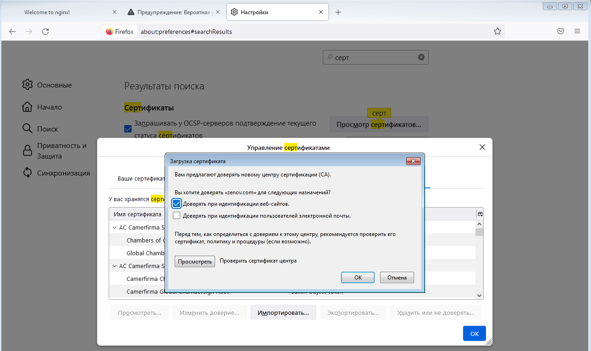
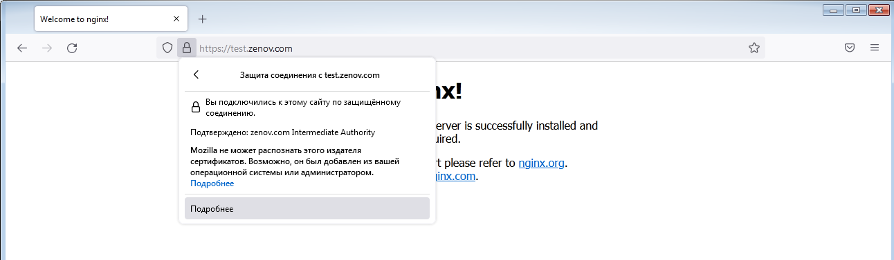
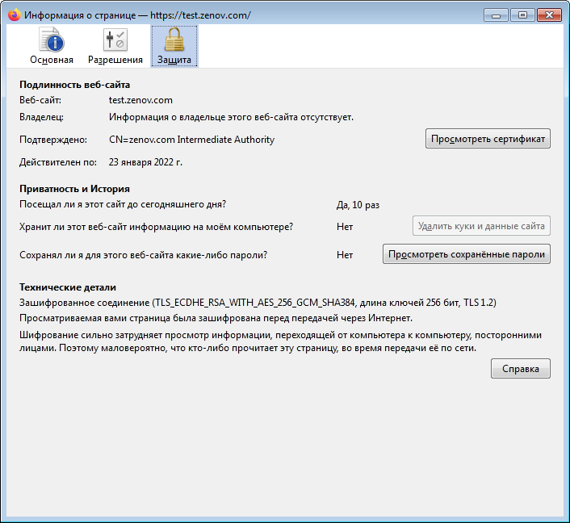
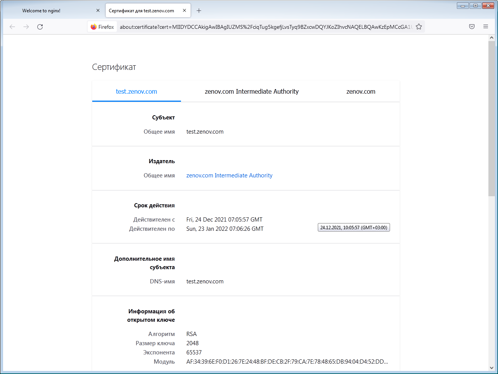
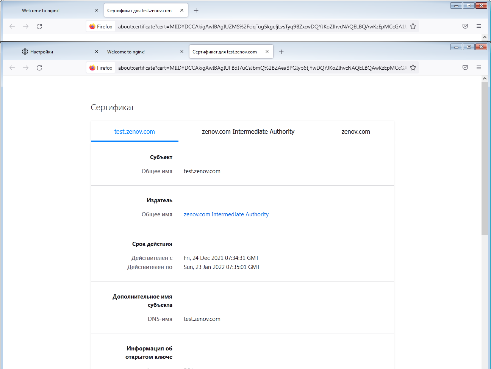

### Курсовая работа по итогам модуля "DevOps и системное администрирование"

#### 1. Создайте виртуальную машину Linux.
```
% vagrant ssh

Welcome to Ubuntu 20.04.2 LTS (GNU/Linux 5.4.0-80-generic x86_64)

 * Documentation:  https://help.ubuntu.com
 * Management:     https://landscape.canonical.com
 * Support:        https://ubuntu.com/advantage

  System information as of Mon 20 Dec 2021 08:16:32 AM UTC

  System load:  0.07              Processes:             124
  Usage of /:   2.4% of 61.31GB   Users logged in:       1
  Memory usage: 16%               IPv4 address for eth0: 10.0.2.15
  Swap usage:   0%                IPv4 address for eth1: 192.168.1.100


This system is built by the Bento project by Chef Software
More information can be found at https://github.com/chef/bento
Last login: Mon Dec 20 08:14:56 2021 from 192.168.1.189
vagrant@test:~$

```
#### 2. Установите ufw и разрешите к этой машине сессии на порты 22 и 443, при этом трафик на интерфейсе localhost (lo) должен ходить свободно на все порты.
```
# переходим в режим суперпользователя
vagrant@test:~$ sudo su

#проверяем статус файервола
root@test:/home/vagrant# ufw status
Status: inactive

# устанавливаем настройки по умолчанию
root@test:/home/vagrant# ufw default deny incoming
root@test:/home/vagrant# ufw default allow outgoing

# разрешаем доступ в портам 22 и 443
root@test:/home/vagrant# ufw allow  22
Rules updated
Rules updated (v6)
root@test:/home/vagrant# ufw allow  433
Rules updated
Rules updated (v6)

# включаем файервол
root@test:~$ ufw enable
Command may disrupt existing ssh connections. Proceed with operation (y|n)? y
Firewall is active and enabled on system startup
# проверяем
root@test:/home/vagrant# ufw status
Status: active


To                         Action      From
--                         ------      ----
22                         ALLOW       Anywhere
443                        ALLOW       Anywhere
22 (v6)                    ALLOW       Anywhere (v6)
443 (v6)                   ALLOW       Anywhere (v6)
```
#### 3. Установите hashicorp vault 
```
# скачиваем  vault
root@test:/home/vagrant# curl -fsSL https://apt.releases.hashicorp.com/gpg | apt-key add -
OK
root@test:/home/vagrant# apt-add-repository "deb [arch=amd64] https://apt.releases.hashicorp.com $(lsb_release -cs) main"
Get:1 http://security.ubuntu.com/ubuntu focal-security InRelease [114 kB]
Hit:2 http://archive.ubuntu.com/ubuntu focal InRelease
Get:3 http://archive.ubuntu.com/ubuntu focal-updates InRelease [114 kB]
Get:4 https://apt.releases.hashicorp.com focal InRelease [9,495 B]
Get:5 http://archive.ubuntu.com/ubuntu focal-backports InRelease [108 kB]
Get:6 http://security.ubuntu.com/ubuntu focal-security/main i386 Packages [345 kB]
Get:7 http://archive.ubuntu.com/ubuntu focal-updates/main i386 Packages [574 kB]
Get:8 https://apt.releases.hashicorp.com focal/main amd64 Packages [40.5 kB]
Get:9 http://security.ubuntu.com/ubuntu focal-security/main amd64 Packages [1,069 kB]
Get:10 http://archive.ubuntu.com/ubuntu focal-updates/main amd64 Packages [1,400 kB]
Get:11 http://security.ubuntu.com/ubuntu focal-security/main Translation-en [197 kB]
Get:12 http://security.ubuntu.com/ubuntu focal-security/restricted amd64 Packages [566 kB]
Get:13 http://archive.ubuntu.com/ubuntu focal-updates/main Translation-en [283 kB]
Get:14 http://security.ubuntu.com/ubuntu focal-security/restricted i386 Packages [20.5 kB]
Get:15 http://security.ubuntu.com/ubuntu focal-security/restricted Translation-en [80.9 kB]
Get:16 http://security.ubuntu.com/ubuntu focal-security/universe i386 Packages [525 kB]
Get:17 http://archive.ubuntu.com/ubuntu focal-updates/restricted amd64 Packages [616 kB]
Get:18 http://security.ubuntu.com/ubuntu focal-security/universe amd64 Packages [668 kB]
Get:19 http://archive.ubuntu.com/ubuntu focal-updates/restricted i386 Packages [21.8 kB]
Get:20 http://archive.ubuntu.com/ubuntu focal-updates/restricted Translation-en [88.1 kB]
Get:21 http://archive.ubuntu.com/ubuntu focal-updates/universe i386 Packages [654 kB]
Get:22 http://security.ubuntu.com/ubuntu focal-security/universe Translation-en [112 kB]
Get:23 http://archive.ubuntu.com/ubuntu focal-updates/universe amd64 Packages [884 kB]
Get:24 http://security.ubuntu.com/ubuntu focal-security/multiverse amd64 Packages [21.9 kB]
Get:25 http://security.ubuntu.com/ubuntu focal-security/multiverse i386 Packages [7,212 B]
Get:26 http://security.ubuntu.com/ubuntu focal-security/multiverse Translation-en [4,948 B]
Get:27 http://archive.ubuntu.com/ubuntu focal-updates/universe Translation-en [193 kB]
Get:28 http://archive.ubuntu.com/ubuntu focal-updates/multiverse i386 Packages [8,456 B]
Get:29 http://archive.ubuntu.com/ubuntu focal-updates/multiverse amd64 Packages [24.8 kB]
Get:30 http://archive.ubuntu.com/ubuntu focal-updates/multiverse Translation-en [6,928 B]
Get:31 http://archive.ubuntu.com/ubuntu focal-backports/main i386 Packages [34.5 kB]
Get:32 http://archive.ubuntu.com/ubuntu focal-backports/main amd64 Packages [42.0 kB]
Get:33 http://archive.ubuntu.com/ubuntu focal-backports/main Translation-en [10.0 kB]
Get:34 http://archive.ubuntu.com/ubuntu focal-backports/universe amd64 Packages [18.9 kB]
Get:35 http://archive.ubuntu.com/ubuntu focal-backports/universe i386 Packages [10.5 kB]
Get:36 http://archive.ubuntu.com/ubuntu focal-backports/universe Translation-en [7,492 B]
Fetched 8,880 kB in 6s (1,484 kB/s)
Reading package lists... Done
root@test:/home/vagrant# apt-get update && apt-get install vault
Hit:1 http://archive.ubuntu.com/ubuntu focal InRelease
Hit:2 http://archive.ubuntu.com/ubuntu focal-updates InRelease
Hit:3 https://apt.releases.hashicorp.com focal InRelease
Hit:4 http://archive.ubuntu.com/ubuntu focal-backports InRelease
Hit:5 http://security.ubuntu.com/ubuntu focal-security InRelease
Reading package lists... Done
Reading package lists... Done
Building dependency tree
Reading state information... Done
The following NEW packages will be installed:
  vault
0 upgraded, 1 newly installed, 0 to remove and 108 not upgraded.
Need to get 69.4 MB of archives.
After this operation, 188 MB of additional disk space will be used.
Get:1 https://apt.releases.hashicorp.com focal/main amd64 vault amd64 1.9.1 [69.4 MB]
Fetched 69.4 MB in 20s (3,461 kB/s)
Selecting previously unselected package vault.
(Reading database ... 41552 files and directories currently installed.)
Preparing to unpack .../archives/vault_1.9.1_amd64.deb ...
Unpacking vault (1.9.1) ...
Setting up vault (1.9.1) ...
Generating Vault TLS key and self-signed certificate...
Generating a RSA private key
......................................................................................++++
...........................................................................++++
writing new private key to 'tls.key'
-----
Vault TLS key and self-signed certificate have been generated in '/opt/vault/tls'.

# проверяем статус сервиса
root@test:/home/vagrant# systemctl status vault
● vault.service - "HashiCorp Vault - A tool for managing secrets"
     Loaded: loaded (/lib/systemd/system/vault.service; disabled; vendor preset>
     Active: inactive (dead)
       Docs: https://www.vaultproject.io/docs/


```
#### 4. Создайте центр сертификации по инструкции, и выпустите сертификат для использования его в настройке веб-сервера nginx (срок жизни сертификата - месяц).


```
# запускаем сервер сертификации в демо режиме
root@test:/home/vagrant# vault server -dev
==> Vault server configuration:

             Api Address: http://127.0.0.1:8200
                     Cgo: disabled
         Cluster Address: https://127.0.0.1:8201
              Go Version: go1.17.2
              Listener 1: tcp (addr: "127.0.0.1:8200", cluster address: "127.0.0.1:8201", max_request_duration: "1m30s", max_request_size: "33554432", tls: "disabled")
               Log Level: info
                   Mlock: supported: true, enabled: false
           Recovery Mode: false
                 Storage: inmem
                 Version: Vault v1.9.1

==> Vault server started! Log data will stream in below:

2021-12-20T10:57:52.908Z [INFO]  proxy environment: http_proxy="\"\"" https_proxy="\"\"" no_proxy="\"\""
2021-12-20T10:57:52.908Z [WARN]  no `api_addr` value specified in config or in VAULT_API_ADDR; falling back to detection if possible, but this value should be manually set
2021-12-20T10:57:52.909Z [INFO]  core: Initializing VersionTimestamps for core
2021-12-20T10:57:52.912Z [INFO]  core: security barrier not initialized
2021-12-20T10:57:52.913Z [INFO]  core: security barrier initialized: stored=1 shares=1 threshold=1
2021-12-20T10:57:52.913Z [INFO]  core: post-unseal setup starting
2021-12-20T10:57:52.916Z [INFO]  core: loaded wrapping token key
2021-12-20T10:57:52.916Z [INFO]  core: Recorded vault version: vault version=1.9.1 upgrade time="2021-12-20 10:57:52.916685616 +0000 UTC m=+0.074866185"
2021-12-20T10:57:52.916Z [INFO]  core: successfully setup plugin catalog: plugin-directory="\"\""
2021-12-20T10:57:52.916Z [INFO]  core: no mounts; adding default mount table
2021-12-20T10:57:52.918Z [INFO]  core: successfully mounted backend: type=cubbyhole path=cubbyhole/
2021-12-20T10:57:52.919Z [INFO]  core: successfully mounted backend: type=system path=sys/
2021-12-20T10:57:52.919Z [INFO]  core: successfully mounted backend: type=identity path=identity/
2021-12-20T10:57:52.922Z [INFO]  core: successfully enabled credential backend: type=token path=token/
2021-12-20T10:57:52.922Z [INFO]  rollback: starting rollback manager
2021-12-20T10:57:52.923Z [INFO]  core: restoring leases
2021-12-20T10:57:52.924Z [INFO]  expiration: lease restore complete
2021-12-20T10:57:52.928Z [INFO]  identity: entities restored
2021-12-20T10:57:52.928Z [INFO]  identity: groups restored
2021-12-20T10:57:52.929Z [INFO]  core: post-unseal setup complete
2021-12-20T10:57:52.929Z [INFO]  core: root token generated
2021-12-20T10:57:52.929Z [INFO]  core: pre-seal teardown starting
2021-12-20T10:57:52.929Z [INFO]  rollback: stopping rollback manager
2021-12-20T10:57:52.929Z [INFO]  core: pre-seal teardown complete
2021-12-20T10:57:52.929Z [INFO]  core.cluster-listener.tcp: starting listener: listener_address=127.0.0.1:8201
2021-12-20T10:57:52.930Z [INFO]  core.cluster-listener: serving cluster requests: cluster_listen_address=127.0.0.1:8201
2021-12-20T10:57:52.930Z [INFO]  core: post-unseal setup starting
2021-12-20T10:57:52.930Z [INFO]  core: loaded wrapping token key
2021-12-20T10:57:52.930Z [INFO]  core: successfully setup plugin catalog: plugin-directory="\"\""
2021-12-20T10:57:52.930Z [INFO]  core: successfully mounted backend: type=system path=sys/
2021-12-20T10:57:52.931Z [INFO]  core: successfully mounted backend: type=identity path=identity/
2021-12-20T10:57:52.931Z [INFO]  core: successfully mounted backend: type=cubbyhole path=cubbyhole/
2021-12-20T10:57:52.932Z [INFO]  core: successfully enabled credential backend: type=token path=token/
2021-12-20T10:57:52.932Z [INFO]  rollback: starting rollback manager
2021-12-20T10:57:52.932Z [INFO]  core: restoring leases
2021-12-20T10:57:52.932Z [INFO]  expiration: lease restore complete
2021-12-20T10:57:52.932Z [INFO]  identity: entities restored
2021-12-20T10:57:52.932Z [INFO]  identity: groups restored
2021-12-20T10:57:52.932Z [INFO]  core: post-unseal setup complete
2021-12-20T10:57:52.932Z [INFO]  core: vault is unsealed
2021-12-20T10:57:52.935Z [INFO]  core: successful mount: namespace="\"\"" path=secret/ type=kv
2021-12-20T10:57:52.945Z [INFO]  secrets.kv.kv_bfec8efd: collecting keys to upgrade
2021-12-20T10:57:52.945Z [INFO]  secrets.kv.kv_bfec8efd: done collecting keys: num_keys=1
2021-12-20T10:57:52.945Z [INFO]  secrets.kv.kv_bfec8efd: upgrading keys finished
WARNING! dev mode is enabled! In this mode, Vault runs entirely in-memory
and starts unsealed with a single unseal key. The root token is already
authenticated to the CLI, so you can immediately begin using Vault.

You may need to set the following environment variable:

    $ export VAULT_ADDR='http://127.0.0.1:8200'

The unseal key and root token are displayed below in case you want to
seal/unseal the Vault or re-authenticate.

Unseal Key: paBYeW0jTQkq5YPZLtBOqoCSRuOHTnlfQEeK/POfTtA=
Root Token: s.HuCCuqJu9qZcVr0csX6qICX3

Development mode should NOT be used in production installations!

```

```
# переключаемся в другой терминал
# устанавливаем переменные окружения для доступа vault
root@test:/home/vagrant# export VAULT_ADDR='http://127.0.0.1:8200'
root@test:/home/vagrant# export VAULT_TOKEN="s.HuCCuqJu9qZcVr0csX6qICX3"
```

```
# проверяем статус
root@test:/home/vagrant# vault status
Key             Value
---             -----
Seal Type       shamir
Initialized     true
Sealed          false
Total Shares    1
Threshold       1
Version         1.9.1
Storage Type    inmem
Cluster Name    vault-cluster-f64fbb1b
Cluster ID      6d0de784-5251-53ec-1d10-6a072908da8c
HA Enabled      false


```

```
# создаем Root CA и Intermediate CA
root@test:/home/vagrant# mkdir ~/certificates/
root@test:/home/vagrant# cd ~/certificates/
# включаем pki
root@test:~/certificates/# vault secrets enable pki
Success! Enabled the pki secrets engine at: pki/
# устанавливаем максимальное время жизни сертификата
root@test:~/certificates/# vault secrets tune -max-lease-ttl=87600h pki
Success! Tuned the secrets engine at: pki/
# генерируем корневой сертификат
root@test:~/certificates/# vault write -field=certificate pki/root/generate/internal common_name="zenov.com" ttl=87600h > CA_cert.crt
# конфигурируем пути для сертификатов
root@test:~/certificates/# vault write pki/config/urls issuing_certificates="$VAULT_ADDR/v1/pki/ca" crl_distribution_points="$VAULT_ADDR/v1/pki/crl"
Success! Data written to: pki/config/urls
# включаем pki_int
root@test:~/certificates/# vault secrets enable -path=pki_int pki
Success! Enabled the pki secrets engine at: pki_int/
# устанавливаем время жизни промежуточных сертификатов
root@test:~/certificates/# vault secrets tune -max-lease-ttl=43800h pki_int
Success! Tuned the secrets engine at: pki_int/
# генерируем промежуточный сертификат
root@test:~/certificates/# vault write -format=json pki_int/intermediate/generate/internal common_name="zenov.com Intermediate Authority"  | jq -r '.data.csr' > pki_intermediate.csr
bash: jq: command not found
# устанавливаем jq
root@test:~/certificates/# apt install jq
Reading package lists... Done
Building dependency tree
Reading state information... Done
The following additional packages will be installed:
  libjq1 libonig5
The following NEW packages will be installed:
  jq libjq1 libonig5
0 upgraded, 3 newly installed, 0 to remove and 108 not upgraded.
Need to get 313 kB of archives.
After this operation, 1,062 kB of additional disk space will be used.
Do you want to continue? [Y/n] y
Get:1 http://archive.ubuntu.com/ubuntu focal/universe amd64 libonig5 amd64 6.9.4-1 [142 kB]
Get:2 http://archive.ubuntu.com/ubuntu focal-updates/universe amd64 libjq1 amd64 1.6-1ubuntu0.20.04.1 [121 kB]
Get:3 http://archive.ubuntu.com/ubuntu focal-updates/universe amd64 jq amd64 1.6-1ubuntu0.20.04.1 [50.2 kB]
Fetched 313 kB in 1s (385 kB/s)
Selecting previously unselected package libonig5:amd64.
(Reading database ... 41558 files and directories currently installed.)
Preparing to unpack .../libonig5_6.9.4-1_amd64.deb ...
Unpacking libonig5:amd64 (6.9.4-1) ...
Selecting previously unselected package libjq1:amd64.
Preparing to unpack .../libjq1_1.6-1ubuntu0.20.04.1_amd64.deb ...
Unpacking libjq1:amd64 (1.6-1ubuntu0.20.04.1) ...
Selecting previously unselected package jq.
Preparing to unpack .../jq_1.6-1ubuntu0.20.04.1_amd64.deb ...
Unpacking jq (1.6-1ubuntu0.20.04.1) ...
Setting up libonig5:amd64 (6.9.4-1) ...
Setting up libjq1:amd64 (1.6-1ubuntu0.20.04.1) ...
Setting up jq (1.6-1ubuntu0.20.04.1) ...
Processing triggers for man-db (2.9.1-1) ...
Processing triggers for libc-bin (2.31-0ubuntu9.2) ...

# генерируем промежуточный сертификат (пробуем еще раз)
root@test:~/certificates/# vault write -format=json pki_int/intermediate/generate/internal common_name="zenov.com Intermediate Authority"      | jq -r '.data.csr' > pki_intermediate.csr
# подписываем промежуточный сертификат приватным ключом root CA
root@test:~/certificates/# vault write -format=json pki/root/sign-intermediate csr=@pki_intermediate.csr format=pem_bundle ttl="43800h" | jq -r '.data.certificate' > intermediate.cert.pem
# импортируем промежуточный сертификат
root@test:~/certificates/# vault write pki_int/intermediate/set-signed certificate=@intermediate.cert.pem
Success! Data written to: pki_int/intermediate/set-signed
# создаём роль для домена со сроком жизни сертификата в месяц 
root@test:~/certificates/# vault write pki_int/roles/zenov-dot-com allowed_domains="zenov.com" allow_subdomains=true max_ttl="720h"
Success! Data written to: pki_int/roles/example-dot-com


# Создание сертификатов для test.zenov.com
root@test:~/certificates/# vault write -format=json pki_int/issue/zenov-dot-com common_name="test.zenov.com" ttl="720h" > test.zenov.com.crt

#делаем распарсинг сертификата
root@test:~/certificates/# cat test.zenov.com.crt | jq -r .data.private_key > test.zenov.com.crt.key
root@test:~/certificates/# cat test.zenov.com.crt | jq -r .data.certificate > test.zenov.com.crt.pem
root@test:~/certificates/# cat test.zenov.com.crt | jq -r .data.issuing_ca >> test.zenov.com.crt.pem

```
#### 5. Установите корневой сертификат созданного центра сертификации в доверенные в хостовой системе.
```
# копируем корневой сертификат на хостовую машину
root@test:~/certificates/# cp CA_cert.crt /vagrant/
# устанавливаем сертификат на хостовой машине, добавляя в доверенные сертификаты браузера (firefox)
```



#### 6. Установите nginx.
```
# устанавливаем nginx
root@test:~/certificates# apt install nginx
Reading package lists... Done
Building dependency tree
Reading state information... Done
The following additional packages will be installed:
  fontconfig-config fonts-dejavu-core libfontconfig1 libgd3 libjbig0 libjpeg-turbo8 libjpeg8 libnginx-mod-http-image-filter libnginx-mod-http-xslt-filter
  libnginx-mod-mail libnginx-mod-stream libtiff5 libwebp6 libx11-6 libx11-data libxcb1 libxpm4 nginx-common nginx-core
Suggested packages:
  libgd-tools fcgiwrap nginx-doc ssl-cert
The following NEW packages will be installed:
  fontconfig-config fonts-dejavu-core libfontconfig1 libgd3 libjbig0 libjpeg-turbo8 libjpeg8 libnginx-mod-http-image-filter libnginx-mod-http-xslt-filter
  libnginx-mod-mail libnginx-mod-stream libtiff5 libwebp6 libx11-6 libx11-data libxcb1 libxpm4 nginx nginx-common nginx-core
0 upgraded, 20 newly installed, 0 to remove and 108 not upgraded.
Need to get 3,165 kB of archives.
After this operation, 11.1 MB of additional disk space will be used.
Do you want to continue? [Y/n] y
Get:1 http://archive.ubuntu.com/ubuntu focal/main amd64 libxcb1 amd64 1.14-2 [44.7 kB]
Get:2 http://archive.ubuntu.com/ubuntu focal-updates/main amd64 libx11-data all 2:1.6.9-2ubuntu1.2 [113 kB]
Get:3 http://archive.ubuntu.com/ubuntu focal-updates/main amd64 libx11-6 amd64 2:1.6.9-2ubuntu1.2 [575 kB]
Get:4 http://archive.ubuntu.com/ubuntu focal/main amd64 fonts-dejavu-core all 2.37-1 [1,041 kB]
Get:5 http://archive.ubuntu.com/ubuntu focal/main amd64 fontconfig-config all 2.13.1-2ubuntu3 [28.8 kB]
Get:6 http://archive.ubuntu.com/ubuntu focal/main amd64 libfontconfig1 amd64 2.13.1-2ubuntu3 [114 kB]
Get:7 http://archive.ubuntu.com/ubuntu focal-updates/main amd64 libjpeg-turbo8 amd64 2.0.3-0ubuntu1.20.04.1 [117 kB]
Get:8 http://archive.ubuntu.com/ubuntu focal/main amd64 libjpeg8 amd64 8c-2ubuntu8 [2,194 B]
Get:9 http://archive.ubuntu.com/ubuntu focal/main amd64 libjbig0 amd64 2.1-3.1build1 [26.7 kB]
Get:10 http://archive.ubuntu.com/ubuntu focal-updates/main amd64 libwebp6 amd64 0.6.1-2ubuntu0.20.04.1 [185 kB]
Get:11 http://archive.ubuntu.com/ubuntu focal-updates/main amd64 libtiff5 amd64 4.1.0+git191117-2ubuntu0.20.04.2 [162 kB]
Get:12 http://archive.ubuntu.com/ubuntu focal/main amd64 libxpm4 amd64 1:3.5.12-1 [34.0 kB]
Get:13 http://archive.ubuntu.com/ubuntu focal-updates/main amd64 libgd3 amd64 2.2.5-5.2ubuntu2.1 [118 kB]
Get:14 http://archive.ubuntu.com/ubuntu focal-updates/main amd64 nginx-common all 1.18.0-0ubuntu1.2 [37.5 kB]
Get:15 http://archive.ubuntu.com/ubuntu focal-updates/main amd64 libnginx-mod-http-image-filter amd64 1.18.0-0ubuntu1.2 [14.4 kB]
Get:16 http://archive.ubuntu.com/ubuntu focal-updates/main amd64 libnginx-mod-http-xslt-filter amd64 1.18.0-0ubuntu1.2 [12.7 kB]
Get:17 http://archive.ubuntu.com/ubuntu focal-updates/main amd64 libnginx-mod-mail amd64 1.18.0-0ubuntu1.2 [42.5 kB]
Get:18 http://archive.ubuntu.com/ubuntu focal-updates/main amd64 libnginx-mod-stream amd64 1.18.0-0ubuntu1.2 [67.3 kB]
Get:19 http://archive.ubuntu.com/ubuntu focal-updates/main amd64 nginx-core amd64 1.18.0-0ubuntu1.2 [425 kB]
Get:20 http://archive.ubuntu.com/ubuntu focal-updates/main amd64 nginx all 1.18.0-0ubuntu1.2 [3,620 B]
Fetched 3,165 kB in 4s (896 kB/s)
Preconfiguring packages ...
Selecting previously unselected package libxcb1:amd64.
(Reading database ... 41575 files and directories currently installed.)
Preparing to unpack .../00-libxcb1_1.14-2_amd64.deb ...
Unpacking libxcb1:amd64 (1.14-2) ...
Selecting previously unselected package libx11-data.
Preparing to unpack .../01-libx11-data_2%3a1.6.9-2ubuntu1.2_all.deb ...
Unpacking libx11-data (2:1.6.9-2ubuntu1.2) ...
Selecting previously unselected package libx11-6:amd64.
Preparing to unpack .../02-libx11-6_2%3a1.6.9-2ubuntu1.2_amd64.deb ...
Unpacking libx11-6:amd64 (2:1.6.9-2ubuntu1.2) ...
Selecting previously unselected package fonts-dejavu-core.
Preparing to unpack .../03-fonts-dejavu-core_2.37-1_all.deb ...
Unpacking fonts-dejavu-core (2.37-1) ...
Selecting previously unselected package fontconfig-config.
Preparing to unpack .../04-fontconfig-config_2.13.1-2ubuntu3_all.deb ...
Unpacking fontconfig-config (2.13.1-2ubuntu3) ...
Selecting previously unselected package libfontconfig1:amd64.
Preparing to unpack .../05-libfontconfig1_2.13.1-2ubuntu3_amd64.deb ...
Unpacking libfontconfig1:amd64 (2.13.1-2ubuntu3) ...
Selecting previously unselected package libjpeg-turbo8:amd64.
Preparing to unpack .../06-libjpeg-turbo8_2.0.3-0ubuntu1.20.04.1_amd64.deb ...
Unpacking libjpeg-turbo8:amd64 (2.0.3-0ubuntu1.20.04.1) ...
Selecting previously unselected package libjpeg8:amd64.
Preparing to unpack .../07-libjpeg8_8c-2ubuntu8_amd64.deb ...
Unpacking libjpeg8:amd64 (8c-2ubuntu8) ...
Selecting previously unselected package libjbig0:amd64.
Preparing to unpack .../08-libjbig0_2.1-3.1build1_amd64.deb ...
Unpacking libjbig0:amd64 (2.1-3.1build1) ...
Selecting previously unselected package libwebp6:amd64.
Preparing to unpack .../09-libwebp6_0.6.1-2ubuntu0.20.04.1_amd64.deb ...
Unpacking libwebp6:amd64 (0.6.1-2ubuntu0.20.04.1) ...
Selecting previously unselected package libtiff5:amd64.
Preparing to unpack .../10-libtiff5_4.1.0+git191117-2ubuntu0.20.04.2_amd64.deb ...
Unpacking libtiff5:amd64 (4.1.0+git191117-2ubuntu0.20.04.2) ...
Selecting previously unselected package libxpm4:amd64.
Preparing to unpack .../11-libxpm4_1%3a3.5.12-1_amd64.deb ...
Unpacking libxpm4:amd64 (1:3.5.12-1) ...
Selecting previously unselected package libgd3:amd64.
Preparing to unpack .../12-libgd3_2.2.5-5.2ubuntu2.1_amd64.deb ...
Unpacking libgd3:amd64 (2.2.5-5.2ubuntu2.1) ...
Selecting previously unselected package nginx-common.
Preparing to unpack .../13-nginx-common_1.18.0-0ubuntu1.2_all.deb ...
Unpacking nginx-common (1.18.0-0ubuntu1.2) ...
Selecting previously unselected package libnginx-mod-http-image-filter.
Preparing to unpack .../14-libnginx-mod-http-image-filter_1.18.0-0ubuntu1.2_amd64.deb ...
Unpacking libnginx-mod-http-image-filter (1.18.0-0ubuntu1.2) ...
Selecting previously unselected package libnginx-mod-http-xslt-filter.
Preparing to unpack .../15-libnginx-mod-http-xslt-filter_1.18.0-0ubuntu1.2_amd64.deb ...
Unpacking libnginx-mod-http-xslt-filter (1.18.0-0ubuntu1.2) ...
Selecting previously unselected package libnginx-mod-mail.
Preparing to unpack .../16-libnginx-mod-mail_1.18.0-0ubuntu1.2_amd64.deb ...
Unpacking libnginx-mod-mail (1.18.0-0ubuntu1.2) ...
Selecting previously unselected package libnginx-mod-stream.
Preparing to unpack .../17-libnginx-mod-stream_1.18.0-0ubuntu1.2_amd64.deb ...
Unpacking libnginx-mod-stream (1.18.0-0ubuntu1.2) ...
Selecting previously unselected package nginx-core.
Preparing to unpack .../18-nginx-core_1.18.0-0ubuntu1.2_amd64.deb ...
Unpacking nginx-core (1.18.0-0ubuntu1.2) ...
Selecting previously unselected package nginx.
Preparing to unpack .../19-nginx_1.18.0-0ubuntu1.2_all.deb ...
Unpacking nginx (1.18.0-0ubuntu1.2) ...
Setting up libxcb1:amd64 (1.14-2) ...
Setting up nginx-common (1.18.0-0ubuntu1.2) ...
Created symlink /etc/systemd/system/multi-user.target.wants/nginx.service → /lib/systemd/system/nginx.service.
Setting up libjbig0:amd64 (2.1-3.1build1) ...
Setting up libnginx-mod-http-xslt-filter (1.18.0-0ubuntu1.2) ...
Setting up libx11-data (2:1.6.9-2ubuntu1.2) ...
Setting up libwebp6:amd64 (0.6.1-2ubuntu0.20.04.1) ...
Setting up fonts-dejavu-core (2.37-1) ...
Setting up libjpeg-turbo8:amd64 (2.0.3-0ubuntu1.20.04.1) ...
Setting up libx11-6:amd64 (2:1.6.9-2ubuntu1.2) ...
Setting up libjpeg8:amd64 (8c-2ubuntu8) ...
Setting up libnginx-mod-mail (1.18.0-0ubuntu1.2) ...
Setting up libxpm4:amd64 (1:3.5.12-1) ...
Setting up fontconfig-config (2.13.1-2ubuntu3) ...
Setting up libnginx-mod-stream (1.18.0-0ubuntu1.2) ...
Setting up libtiff5:amd64 (4.1.0+git191117-2ubuntu0.20.04.2) ...
Setting up libfontconfig1:amd64 (2.13.1-2ubuntu3) ...
Setting up libgd3:amd64 (2.2.5-5.2ubuntu2.1) ...
Setting up libnginx-mod-http-image-filter (1.18.0-0ubuntu1.2) ...
Setting up nginx-core (1.18.0-0ubuntu1.2) ...
Setting up nginx (1.18.0-0ubuntu1.2) ...
Processing triggers for ufw (0.36-6) ...
Processing triggers for systemd (245.4-4ubuntu3.11) ...
Processing triggers for man-db (2.9.1-1) ...
Processing triggers for libc-bin (2.31-0ubuntu9.2) ...
root@test:~/certificates# systemctl status nginx
● nginx.service - A high performance web server and a reverse proxy server
     Loaded: loaded (/lib/systemd/system/nginx.service; enabled; vendor preset: enabled)
     Active: active (running) since Mon 2021-12-20 12:28:01 UTC; 39s ago
       Docs: man:nginx(8)
   Main PID: 8580 (nginx)
      Tasks: 3 (limit: 1071)
     Memory: 4.5M
     CGroup: /system.slice/nginx.service
             ├─8580 nginx: master process /usr/sbin/nginx -g daemon on; master_process on;
             ├─8581 nginx: worker process
             └─8582 nginx: worker process

Dec 20 12:28:00 test systemd[1]: Starting A high performance web server and a reverse proxy server...
Dec 20 12:28:01 test systemd[1]: Started A high performance web server and a reverse proxy server.


```
#### 7. По инструкции настройте nginx на https, используя ранее подготовленный сертификат:

```
#правим настройки nginx
root@test:~/certificates# nano /etc/nginx/sites-available/default
server {

        # SSL configuration
        #
        server_name test.zenov.com;

        listen 443 ssl;
        listen [::]:443 ssl;
        ssl_certificate /root/certificates/test.zenov.com.crt.pem;
        ssl_certificate_key /root/certificates/test.zenov.com.crt.key;
        ssl_protocols       TLSv1 TLSv1.1 TLSv1.2;
        ssl_ciphers         HIGH:!aNULL:!MD5;

        root /var/www/html;

        index index.html index.htm index.nginx-debian.html;

        server_name _;

        location / {
                try_files $uri $uri/ =404;
        }


}

#проверяем конфигурацию nginx
root@test:~/certificates# nginx -t
nginx: the configuration file /etc/nginx/nginx.conf syntax is ok
nginx: configuration file /etc/nginx/nginx.conf test is successful
# перезапускаем nginx
root@test:~/certificates# systemctl restart nginx


```
#### 8. Откройте в браузере на хосте https адрес страницы, которую обслуживает сервер nginx.





#### 9. Создайте скрипт, который будет генерировать новый сертификат в vault:
- генерируем новый сертификат так, чтобы не переписывать конфиг nginx;
- перезапускаем nginx для применения нового сертификата.
```

root@test:~/certificates# nano resert.sh

#!/bin/bash
export VAULT_ADDR='http://127.0.0.1:8200'
export VAULT_TOKEN="s.HuCCuqJu9qZcVr0csX6qICX3"
vault write -format=json pki_int/issue/zenov-dot-com common_name="test.zenov.com" ttl=120h > /root/certificates/test.zenov.com.crt
cat /root/certificates/test.zenov.com.crt | jq -r .data.certificate > /root/certificates/test.zenov.com.crt.pem
cat /root/certificates/test.zenov.com.crt | jq -r .data.issuing_ca >> /root/certificates/test.zenov.com.crt.pem
cat /root/certificates/test.zenov.com.crt | jq -r .data.private_key > /root/certificates/test.zenov.com.crt.key
systemctl resload nginx
#устанавливаем права доступа
root@test:~/certificates# chmod +x resert.sh
```

#### 10. Поместите скрипт в crontab, чтобы сертификат обновлялся какого-то числа каждого месяца в удобное для вас время.
```
# ставим задачу в расписание
root@test:~/certificates# crontab -e
no crontab for root - using an empty one

35 10 * * * /root/certificates/resert.sh


crontab: installing new crontab
# перезапускаем сервис 
root@test:~/certificates# systemctl restart cron
# проверяем текущее время
root@test:~/certificates# date
Fri 24 Dec 2021 10:35:02 AM MSK
# убедимся что файлы обновлены
root@test:~/certificates# ll
total 40
drwxr-xr-x 2 root root 4096 Dec 24 10:22 ./
drwx------ 6 root root 4096 Dec 24 10:02 ../
-rw-r--r-- 1 root root 1163 Dec 24 10:03 CA_cert.crt
-rw-r--r-- 1 root root 1322 Dec 24 10:04 intermediate.cert.pem
-rw-r--r-- 1 root root  924 Dec 24 10:04 pki_intermediate.csr
-rwxr-xr-x 1 root root  595 Dec 24 10:20 resert.sh*
-rw-r--r-- 1 root root 6041 Dec 24 10:35 test.zenov.com.crt
-rw-r--r-- 1 root root 1675 Dec 24 10:35 test.zenov.com.crt.key
-rw-r--r-- 1 root root 2555 Dec 24 10:35 test.zenov.com.crt.pem


```
